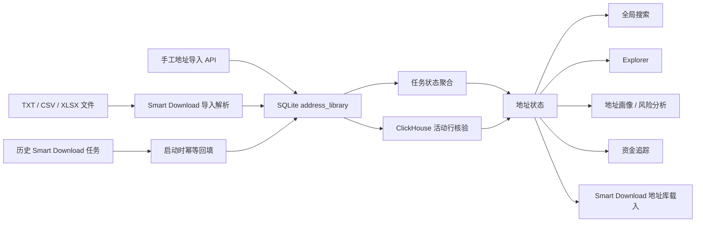

# 地址资产导入与跨功能复用——全功能验收测试用例

> 文档版本：1.0  
> 编写日期：2026-08-15  
> 适用项目：`E:\codex\etl`  
> 默认访问地址：`http://127.0.0.1:8000`  
> 测试对象：地址文件导入、地址资产库、状态判定、全局搜索、Explorer、地址画像、风险分析、资金追踪及其 ClickHouse 数据链路。

## 1. 测试目标

本测试不是“接口返回 200 即通过”的连通性测试。每个用例必须同时验证：

1. 用户操作能够完成，并产生符合需求的页面状态。
2. 页面展示的地址、链、状态、行数、交易、节点和关系与后端实际数据一致。
3. 刷新、重启、切链和跨页面跳转后，地址资产仍可复用且不会串链。
4. `FAILED`、`PARTIAL`、`CERTIFIED` 不得伪装成 `AVAILABLE`。
5. 缺数据时必须展示真实的空状态、失败状态或补数入口，不得生成虚假统计、虚假节点或虚假交易。
6. 浏览器不得出现相关 console error、框架错误覆盖层、未处理 Promise 或 HTTP 4xx/5xx。
7. 所有金额、历史估值和聚合结果必须通过有限值、范围和明细抽样检查；不能只确认 JSON 可解析。

## 2. 测试范围与非范围

### 2.1 本文覆盖的功能

| 功能域 | 覆盖内容 |
|---|---|
| 地址文件导入 | TXT、CSV、XLSX/XLSM，列识别、去重、无效行、链归属、持久化、清除临时结果 |
| 地址资产库 | 新增、重复导入、查询、关键词、分页、链隔离、重启恢复、历史任务回填、数量上限 |
| 地址状态 | `IMPORTED`、`DOWNLOADING`、`PARTIAL`、`FAILED`、`CERTIFIED`、`AVAILABLE` 及优先级 |
| Smart Download | “使用地址资产库”、预检地址集合、建批次地址集合、切链清理、超过 5,000 条分页载入 |
| 统一地址输入框 | 自动完成、状态标签、活动行数、清空、键盘操作、防抖、竞态与失败降级 |
| 全局搜索 | 从地址库选中后按资产所属链跳转到 Explorer；保留交易哈希 Enter 搜索 |
| Explorer | 地址库与链上搜索合并、去重、地址页数据、活动分页、估值范围、失败/无数据状态 |
| 地址画像 | Profile、Risk、Flows、Paths 的并行加载、局部失败、数据一致性 |
| 风险分析 | 地址选择、风险分值、规则证据、无数据边界、跨链隔离 |
| 资金追踪 | 地址级图扩展、画布节点/关系、Inspector、统计、活动、缓存、方向/深度、智能补数判定 |
| 安全与鲁棒性 | 非法地址、非法链、超长查询、请求体上限、SQL/XSS 输入、并发重复导入 |
| 响应式与可访问性 | 桌面、390px 移动端、键盘选择、ARIA、遮挡、横向溢出 |

### 2.2 本文不覆盖的功能

- 银行、支付宝、微信流水 ETL 清洗与 33 列标准表头。
- OKLink 邮件投递、代理池、签名器和浏览器抓取本身的完整供应商验收。
- 非 EVM 地址格式。
- BSC、Ethereum、Base、Arbitrum 之外的网络。
- 对历史上从未形成任务记录、也未写入地址资产库的旧临时导入做恢复。

## 3. 需求判定口径

### 3.1 地址资产数据流



### 3.2 状态含义和优先级

状态必须按下表理解，不允许自行扩大语义：

| 状态 | 页面标签 | 必要证据 | 允许得出的结论 | 禁止得出的结论 |
|---|---|---|---|---|
| `AVAILABLE` | 可分析 | 当前链 ClickHouse `address_activity` 中该地址 `count() > 0` | 至少存在可查询活动数据 | 数据集完整、所有下载成功、所有时间范围完整 |
| `DOWNLOADING` | 下载中 | 存在非终态地址任务，且当前无 ClickHouse 活动覆盖该状态 | 地址正在处理 | 已有可分析数据、最终一定成功 |
| `CERTIFIED` | 已认证 | 至少一个结果集认证为 `CERTIFIED`，且当前 ClickHouse 活动行为 0 | 某结果集通过认证 | 已入 ClickHouse、地址页一定有数据、全部数据集完整 |
| `PARTIAL` | 部分完成 | 至少一个地址任务为 `PARTIAL`，且无更高优先级状态 | 任务只完成一部分 | 可以按完整数据做结论 |
| `FAILED` | 下载失败 | 至少一个失败或取消任务，且无更高优先级状态 | 存在失败任务 | 地址非法、链上一定没有活动 |
| `IMPORTED` | 仅已导入 | 只存在地址资产记录，没有上述任务或数据证据 | 地址已持久化，可供后续功能选择 | 地址已经下载或可分析 |

状态优先级为：

`AVAILABLE > DOWNLOADING > CERTIFIED > PARTIAL > FAILED > IMPORTED`

特别说明：`include_status=false` 用于快速载入地址集合，不查询 ClickHouse 活动行，因此返回结果不能用来最终判定 `AVAILABLE`。

## 4. Agent 执行规则

### 4.1 浏览器工具选择

1. 先检查 Browser 插件及其 browser skill 是否可用。
2. 可用时必须优先使用 Browser，并记录会话名、URL、DOM、console 和截图。
3. Browser 不可用时才使用 Playwright，并在报告中写明：`Browser plugin not available; regular Playwright fallback used.`
4. 不得只运行构建或单元测试就宣称 UI 功能通过。

### 4.2 并行与互斥

- 标记为“只读”的用例可并行。
- 导入、创建批次、启动/暂停任务、重启服务、50,000 地址边界和并发写入用例必须串行。
- 多 Agent 并行时，每个 Agent 使用唯一 `RUN_ID`，例如 `20260815-A03`。
- 禁止多个 Agent 同时执行 `run.ps1`。
- 禁止直接删除或修改 `etl_control.sqlite`、Smart Download 任务文件或 ClickHouse 表。

### 4.3 证据目录

证据不得写入源码目录。建议：

```powershell
$qaRunId = "20260815-A03"
$qaEvidenceRoot = Join-Path $env:TEMP "etl-address-library-qa-$qaRunId"
New-Item -ItemType Directory -Force -Path $qaEvidenceRoot | Out-Null
```

每条用例至少保存：

- `before.json`：操作前地址资产或业务数据快照。
- `after.json`：操作后地址资产或业务数据快照。
- `network.json`：相关请求 URL、方法、状态码、响应摘要和耗时。
- `console.txt`：浏览器 error/warn；没有错误也要记录 `none`。
- `screenshot.png`：能证明业务结果的页面截图。
- `result.md`：PASS/FAIL/BLOCKED、逐条断言和失败证据。

### 4.4 结果等级

| 结果 | 含义 |
|---|---|
| PASS | 所有 UI、状态、数据和错误行为断言均满足 |
| FAIL | 任一关键业务断言失败；即使 HTTP 200 也必须 FAIL |
| BLOCKED | 外部前置条件缺失，且已证明无法继续；不得写成 PASS |
| PARTIAL | 仅用于整轮汇总，表示部分用例 PASS、部分 FAIL/BLOCKED；单条用例不用 PARTIAL |

## 5. 测试数据基线

### 5.1 每轮开始时动态获取

```powershell
$qaBaseUrl = "http://127.0.0.1:8000"
$qaLibrary = Invoke-RestMethod -Uri "$qaBaseUrl/api/address-library?chain_key=bsc&limit=100&include_status=true"
$qaLibrary | ConvertTo-Json -Depth 8
```

以下地址是 2026-08-15 的当前基线，只用于快速选择。行数和任务数可能随数据同步变化，执行时必须重新取值，不得把本文快照当作实时证据。

| Fixture | 地址 | 当前预期状态 | 当前活动行 | 用途 |
|---|---|---:|---:|---|
| `A_AVAILABLE` | `0xf43ba0b50028b8873fd4d6daac4bb7c4d5523906` | AVAILABLE | 291 | 跨页面、图扩展、活动分页 |
| `A_AVAILABLE_HIGH` | `0x55d398326f99059ff775485246999027b3197955` | AVAILABLE | 10,583 | 大活动量、分页和性能 |
| `A_CERTIFIED` | `0x1111111111111111111111111111111111111111` | CERTIFIED | 0 | 认证但未入活动库的边界 |
| `A_PARTIAL` | `0x64a319e29d72f15cc4030f927e31540e2cd9bfbf` | PARTIAL | 0 | 部分完成的真实性 |
| `A_FAILED` | `0x0000000000000000000000000000000000000011` | FAILED | 0 | 失败状态和补数入口 |
| `A_DUP_UPPER` | `0XF43BA0B50028B8873FD4D6DAAC4BB7C4D5523906` | 与 `A_AVAILABLE` 同地址 | 同上 | 大小写归一、重复导入 |
| `A_INVALID_SHORT` | `0x1234` | 非法 | 不适用 | 输入拒绝 |
| `A_INVALID_TEXT` | `not-an-address` | 非法 | 不适用 | 输入拒绝、XSS/SQL 注入 |

### 5.2 测试文件

#### TXT-MIXED

```text
address
0xf43ba0b50028b8873fd4d6daac4bb7c4d5523906
0XF43BA0B50028B8873FD4D6DAAC4BB7C4D5523906
not-an-address

```

预期：原始数据行按导入器口径计数；最终有效唯一地址只能有 1 个；无效至少 1 个；大小写重复至少 1 个。

#### CSV-MULTICOL

```csv
name,wallet,remark
alpha,0xf43ba0b50028b8873fd4d6daac4bb7c4d5523906,available
beta,0x0000000000000000000000000000000000000011,failed-fixture
gamma,invalid,invalid-row
```

预期：选择 `wallet` 地址列；不能把 `name`、`remark` 当地址。

#### XLSX-MULTISHEET

- Sheet1：无地址列的说明页。
- Sheet2：列名 `address`，包含 `A_AVAILABLE`、`A_PARTIAL`、一个重复和一个非法值。

预期：能找到实际地址列；最终唯一地址集合与手工计算一致；不得把说明页文本识别为地址。

## 6. 环境与基础健康检查

### ENV-001 服务与页面真实可用

**优先级**：P0；只读；可并行。

**步骤**：

1. 请求 `/api/health`。
2. 打开首页。
3. 记录 URL、title、首个有意义 DOM。
4. 检查是否存在 Vite/React 错误覆盖层。
5. 收集 console error/warn。

**业务断言**：

- `status=ok`。
- `control_plane.ok=true`，且路径指向当前工作区控制库。
- 页面不为空，能看到应用导航和至少一个业务页面。
- 8000 端口由当前工作区的 `etl-server.exe` 监听。
- 无框架错误覆盖层、白屏、无限加载。

**失败判定**：仅 `/api/health` 返回 200、但控制面不可用或页面白屏，仍为 FAIL。

### ENV-002 地址资产基线可审计

**优先级**：P0；只读。

**步骤**：

1. 请求 `GET /api/address-library?chain_key=bsc&limit=100&include_status=true`。
2. 按 `state` 汇总数量。
3. 对每条记录检查地址格式、链、时间、导入次数、任务汇总和活动行数。
4. 保存完整 JSON。

**业务断言**：

- `total` 等于过滤条件下的真实总数，不是当前页长度的别名。
- `items.length <= limit`。
- 地址均为小写 `0x` + 40 位十六进制。
- `chain_key=bsc` 时每条 `chain_id=56`。
- `import_count >= 1`，且 `last_imported_at >= first_imported_at`。
- `AVAILABLE` 的 `activity_rows > 0`；非 `AVAILABLE` 不得凭空出现正活动行。

### ENV-003 ClickHouse 业务基线

**优先级**：P0；只读。

**步骤**：

1. 请求 Explorer 首页。
2. 请求全局 Graph。
3. 请求全局 Flow Stats。
4. 对 `A_AVAILABLE` 请求地址活动、地址统计和 Graph Expansion。

**业务断言**：

- Explorer 首页包含真实 `transaction_count`、最新交易或明确的空数据说明。
- 全局 Graph 的节点和边数组均非空；边的 source/target 为合法地址。
- Flow Stats 是全量聚合，不得等于“当前画布 500 条边”的简单复制。
- `A_AVAILABLE` 地址活动非空，地址统计交易数为正，Graph Expansion 至少包含根节点和真实对手关系。

## 7. 地址资产库 API 与持久化

### ALIB-001 列表、总数与分页无重叠

**优先级**：P0；只读。

**步骤**：

1. 分别请求 `limit=3&offset=0`、`limit=3&offset=3`、`limit=3&offset=6`。
2. 保存各页地址集合。
3. 合并并去重。

**业务断言**：

- 三页 `total` 相同。
- 不同页地址不得重叠。
- 排序在同一数据快照下稳定。
- 当 `offset >= total` 时 `items=[]`，但 `total` 保持真实总数。
- `limit>5000` 实际按 5000 封顶，不得返回无限结果。

### ALIB-002 关键词查询

**优先级**：P0；只读。

**步骤**：

1. 用 `A_AVAILABLE` 的前 12 个字符查询。
2. 用中间片段查询。
3. 用不存在的片段查询。
4. 用 129 字符查询。

**业务断言**：

- 前缀和中间片段只返回地址或标签/来源中真实匹配的记录。
- 不存在片段返回空集合且 `total=0`。
- 超过 128 字符必须明确拒绝，不能截断后误匹配。

### ALIB-003 链隔离

**优先级**：P0；只读。

**步骤**：分别查询 `bsc`、`eth`、`base`、`arbitrum` 和非法链。

**业务断言**：

- 每页记录的 `chain_key/chain_id` 与查询链一致。
- 同一地址在不同链是不同资产记录，不得相互覆盖状态或活动行数。
- 非法链明确失败，不得默认为 BSC。

### ALIB-004 混合有效、重复、非法的手工导入

**优先级**：P0；会增加现有地址 `import_count`；串行。

**输入**：`A_AVAILABLE`、`A_DUP_UPPER`、`A_INVALID_TEXT`。

**步骤**：

1. 导入前记录该地址的 `import_count`、source、source_name 和时间。
2. `POST /api/address-library/import`，链为 BSC，source 使用本轮 `RUN_ID`。
3. 再次查询地址资产。
4. 刷新浏览器并重新查询。

**业务断言**：

- 只持久化 1 个唯一合法地址。
- `duplicates=1`，`invalid` 精确包含非法原值。
- 地址仍为小写。
- `import_count` 只增加 1，不按重复输入增加。
- `first_imported_at` 不变，`last_imported_at` 前进。
- 刷新后仍存在。

**禁止判定**：不能只看响应里的 `persisted=1`；必须检查刷新后的资产记录。

### ALIB-005 全非法导入无副作用

**优先级**：P0；串行。

**输入**：`A_INVALID_SHORT`、`A_INVALID_TEXT`、空字符串。

**业务断言**：

- 请求失败并说明没有有效 EVM 地址。
- 地址库总数、任何现有记录的 `import_count` 和时间均不变化。
- 不得产生 `IMPORTED` 脏记录。

### ALIB-006 空集合、非法链与格式错误

**优先级**：P0。

逐一验证：

- `addresses=[]`。
- 缺少 `addresses`。
- `chain_key=bitcoin`。
- 非 JSON 请求体。
- 请求字段类型错误。

每种情况都必须：明确拒绝、给出可理解错误、控制库无变化、服务不崩溃。

### ALIB-007 50,000 地址与 8 MiB 边界

**优先级**：P1；必须在隔离环境或维护窗口串行执行。

**步骤与断言**：

1. 50,001 个输入：必须在写库前拒绝。
2. 超过 8 MiB 请求体：必须被限制，不得耗尽内存或写入部分数据。
3. 恰好 50,000 个相同的既有合法地址：规范化后只写一个唯一地址，重复数为 49,999。
4. 执行期间记录进程内存、响应耗时和服务可用性。

**失败判定**：发生部分写入、服务退出、内存持续增长或请求结束后健康检查失败，均为 FAIL。

### ALIB-008 并发重复导入不丢更新

**优先级**：P1；串行准备、并发执行。

**步骤**：

1. 记录 `A_AVAILABLE.import_count=N`。
2. 同时发送 10 个只包含该地址的合法导入请求。
3. 等全部请求结束后重新查询。

**业务断言**：

- 地址库仍只有一个 `(bsc,address)` 记录。
- 最终 `import_count=N+10`。
- 无 `database is locked`、部分失败或丢更新。
- `last_imported_at` 是并发操作后的时间。

### ALIB-009 服务重启后持久化

**优先级**：P0；必须独占服务。

**步骤**：

1. 完成一次既有地址导入并记录记录内容。
2. 执行 `run.ps1`。
3. 等健康检查恢复。
4. 重新查询同一记录。

**业务断言**：

- 地址记录、首次导入时间和导入次数保留。
- 重启本身不得增加手工/文件导入次数。
- 状态可因实时任务或 ClickHouse 数据变化而变化，但必须能由证据解释。

### ALIB-010 历史任务回填幂等

**优先级**：P1；必须独占服务。

**步骤**：

1. 选一个 `source=smart-download-history` 的记录，记录 `import_count`。
2. 连续重启两次。
3. 每次重启后查询该记录。

**业务断言**：

- 历史任务地址存在。
- 两次重启都不增加 `import_count`。
- 不生成重复行。

## 8. Smart Download 文件导入与地址库载入

### SD-IMP-001 TXT 混合文件导入

**优先级**：P0；会更新导入次数。

**操作路径**：`智能下载 -> 创建下载 -> 网络 BSC -> 上传 CSV / XLSX / TXT -> 选择 TXT-MIXED`。

**UI 断言**：

- 上传按钮进入 loading，结束后恢复。
- 成功消息包含识别列、原始行、任务地址、持久化、重复、无效数量。
- 蓝色摘要标签中的各计数与响应和手工计算一致。
- “最终任务地址”只能有 1 个。
- “已持久化”不能为 0。

**数据断言**：

- 地址库中 `A_AVAILABLE` 的 source_name 更新为测试文件名。
- `import_count` 增加 1。
- 页面刷新后临时摘要可消失，但“使用 BSC 地址资产库（N）”中的 N 不减少，地址仍可搜索。

### SD-IMP-002 CSV 地址列识别

**优先级**：P0。

**输入**：CSV-MULTICOL。

**业务断言**：

- `selected_column=wallet` 或等价真实地址列。
- 最终地址集合精确等于两个合法唯一地址。
- 非地址列不得进入最终集合。
- 非法行计数正确。
- 两个地址均按当前页面所选链持久化。

### SD-IMP-003 XLSX 多 Sheet 识别

**优先级**：P1。

**业务断言**：

- 能从实际数据 Sheet 找到地址列。
- 不把说明页识别为数据。
- 去重、非法行和最终地址集合正确。
- 文件处理后无页面卡死、空白或 console error。

### SD-IMP-004 不支持文件与坏文件

**优先级**：P0。

逐一测试：PDF、空 TXT、损坏 XLSX、只有表头的 CSV、无地址列文件。

**业务断言**：

- 显示明确失败提示。
- 不显示成功摘要。
- 不增加地址库总数或导入次数。
- 上传控件退出 loading，可继续选择下一文件。

### SD-IMP-005 “清除导入”只清临时选择

**优先级**：P0。

**步骤**：成功导入后点击“清除导入”。

**业务断言**：

- 蓝色导入摘要消失。
- 预检/Planner 旧结果清除。
- 手工地址输入重新可用。
- 已持久化地址不能被删除；刷新后仍可从地址资产库载入。

### SD-IMP-006 切链清除旧导入结果

**优先级**：P0。

**步骤**：

1. BSC 下导入 TXT。
2. 切换到 Ethereum。
3. 再切回 BSC。

**业务断言**：

- 切到 ETH 后 BSC 的临时 `importResult`、预检和 Planner 结果清除。
- ETH 地址库数量独立显示。
- 不得把 BSC 文件地址悄悄作为 ETH 任务地址。
- 切回 BSC 后资产仍在库中，但不会自动恢复为未确认的任务输入；需要明确点击地址库载入。

### SD-LIB-001 使用当前链地址资产库

**优先级**：P0。

**步骤**：点击“使用 BSC 地址资产库（N）”。

**UI 断言**：

- loading 正常结束。
- 成功消息显示载入 N 个地址。
- 摘要列名为“地址资产库”。
- 原始、有效、最终任务地址均为 N；重复和无效为 0。

**业务断言**：

- 最终集合与 `GET /api/address-library?chain_key=bsc&include_status=false` 全分页合并后的地址集合完全一致。
- 不因状态为 FAILED/PARTIAL 就悄悄删除地址；地址库按钮负责“复用地址集合”，后续任务数据完整性由预检和任务状态负责。

### SD-LIB-002 超过 5,000 地址的全分页载入

**优先级**：P2；仅隔离环境。

**业务断言**：

- 前端按 `offset=5000` 继续加载，最终数量等于 `total`。
- 不遗漏、不重复、不只加载第一页。
- 任一分页失败时整体明确失败，不得以部分地址冒充完整地址库。

### SD-LIB-003 地址库载入后的预检

**优先级**：P0。

**步骤**：

1. 载入当前链地址库。
2. 选择最小安全数据集和范围。
3. 执行预检，但不要立刻启动大规模任务。

**业务断言**：

- 预检请求的地址集合与摘要最终集合一致。
- 预检展示预计行数、范围、数据源和预算依据；不能只有“可创建”。
- 已有覆盖、缺口、回退和预算限制要真实展示。
- 地址数不一致、预检忽略部分地址或使用旧链结果均为 FAIL。

### SD-LIB-004 创建批次后的地址任务集合

**优先级**：P1；会创建任务；串行。

**步骤**：使用仅含 1 个既有地址的导入文件完成预检并创建批次。

**业务断言**：

- 批次包含且只包含该地址及当前链。
- AddressJob 数量与最终任务地址数量相等。
- 任务创建后地址库状态能反映任务运行/终态，不因创建成功就直接变 `AVAILABLE`。
- 若不启动任务，状态不得伪装为已完成。

## 9. 地址状态真实性

### STATE-001 AVAILABLE 必须有活动行

**优先级**：P0；只读。

对所有 `state=AVAILABLE` 记录：

- `activity_rows > 0`。
- 地址活动接口至少返回一条或提供可继续分页的真实数据。
- 抽样行的 `address`、`chain_id` 与资产一致。
- 交易哈希、区块、方向、金额等关键字段不能全部为空。

### STATE-002 CERTIFIED 不等于 AVAILABLE

**优先级**：P0；只读。

对 `A_CERTIFIED`：

- `certified_datasets > 0`。
- `activity_rows=0` 时标签只能为“已认证”，不能为“可分析”。
- 进入分析页后不得展示伪造交易或沿用上一个地址的数据。
- 页面应显示真实空状态、缺数据说明或补数入口。

### STATE-003 PARTIAL 的数据边界

**优先级**：P0；只读。

对 `A_PARTIAL`：

- `partial_jobs > 0`。
- 标签为“部分完成”。
- 页面不得显示“完整”“全量”或 100% 覆盖，除非另有独立、可审计的数据集证据。
- 若能显示部分数据，必须展示范围或完整性边界。

### STATE-004 FAILED 可复用地址但不可伪装数据

**优先级**：P0；只读。

对 `A_FAILED`：

- 地址仍出现在地址库建议中，标签为“下载失败”。
- 选中后允许进入目标功能，便于重新下载或调查。
- 不得出现虚假交易、虚假关系或正活动行。
- 资金追踪无本地关系时应打开智能补数，而不是显示空白成功图。

### STATE-005 状态优先级

**优先级**：P0；只读。

使用同时存在完成、部分、失败任务且 ClickHouse 有数据的 `A_AVAILABLE`：

- 最终状态必须是 `AVAILABLE`。
- 任务汇总仍保留 completed/partial/failed 数量，不能因 `AVAILABLE` 丢失失败证据。
- 页面可以标记“可分析”，但不得把失败任务从详情中抹去。

### STATE-006 DOWNLOADING 生命周期

**优先级**：P1；需要一个可控的小任务；串行。

**步骤**：创建并启动一个无现有活动行的测试地址任务，观察 CREATED/RUNNING 到终态。

**业务断言**：

- 非终态时 `running_jobs > 0` 且状态为 `DOWNLOADING`。
- 完成后根据真实证据转为 CERTIFIED/AVAILABLE/PARTIAL/FAILED 之一。
- 任务 HTTP 创建成功但没有实际运行时，不能长期伪装为下载中。

## 10. 统一地址输入框

以下用例要在全局顶部、地址画像、风险分析和资金追踪四个位置分别执行，不能只测一个组件实例。

### INPUT-001 聚焦与空查询建议

**优先级**：P0。

**业务断言**：

- 聚焦输入框后显示当前链最多 30 条地址建议。
- 每条包含完整地址、状态标签、链；有活动行时显示“X 行”。
- 不显示其他链地址。
- 下拉层不被卡片、侧栏或 Modal 遮挡。

### INPUT-002 部分地址搜索与选择

**优先级**：P0。

**步骤**：输入 `A_AVAILABLE` 前 12 位，选择建议。

**业务断言**：

- 180ms 防抖后出现正确地址。
- 选择结果是完整地址，不是输入的前缀。
- 下拉关闭，目标页面开始加载该地址。
- 状态标签和活动行数与基线一致。

### INPUT-003 清空输入

**优先级**：P0。

- 点击清除图标后输入值为空。
- 不保留上次地址的隐藏选择状态。
- 不自动发起旧地址分析。
- 再次聚焦可重新查询。

### INPUT-004 快速输入竞态

**优先级**：P1。

**步骤**：快速依次输入三个不同前缀，最后停在 `A_FAILED` 前缀。

**业务断言**：

- 只显示最后一次查询结果。
- 慢返回的旧请求不得覆盖新结果。
- 不出现闪回、选择错误地址或 console error。

### INPUT-005 键盘与 ARIA

**优先级**：P1。

- 输入框具有对应页面的可读 `aria-label`。
- Tab 可聚焦；方向键可选择；Enter 可确认；Esc 可关闭下拉。
- 键盘选择与鼠标选择产生相同业务结果。

### INPUT-006 地址库查询失败降级

**优先级**：P1；需拦截地址库请求为 500/超时。

**业务断言**：

- 页面不崩溃、不白屏。
- 建议清空，不显示过期结果。
- 其他页面功能仍可操作。
- 测试报告必须记录被注入的失败，不能把该 500 当成产品缺陷之外的“通过”。

## 11. 全局搜索

### GSEARCH-001 选择地址资产并按所属链跳转

**优先级**：P0。

**步骤**：在非 Explorer/资金追踪页的顶部全局搜索框输入 `A_AVAILABLE` 前缀并选择。

**业务断言**：

- 跳转到 Explorer 地址详情。
- Analysis Context 的链等于所选资产 `chain_key`，地址为完整小写地址。
- 页面显示的地址、活动和统计属于所选地址，不是搜索前地址。
- 刷新页面后不能跳回错误链。

### GSEARCH-002 Enter 搜索不破坏交易哈希路径

**优先级**：P1。

**步骤**：输入合法交易哈希并按 Enter，不从地址建议中选择。

**业务断言**：

- 仍按既有全局搜索逻辑进入 Explorer 搜索。
- 不把交易哈希误当地址资产。
- 地址库建议失败不应阻止交易哈希搜索。

### GSEARCH-003 FAILED/PARTIAL 标签保持

**优先级**：P0。

分别搜索 `A_FAILED` 和 `A_PARTIAL`：建议标签必须与状态一致；选择后不得升级为“可分析”。

## 12. Explorer

### EXP-001 Explorer 与地址库搜索合并去重

**优先级**：P0。

**步骤**：输入 `A_AVAILABLE` 前缀。

**业务断言**：

- Explorer 搜索与地址库请求并行完成。
- 同一地址若两侧都命中，只显示一个 ADDRESS 结果。
- 地址库补充结果包含状态和活动行数。
- 选择后进入正确地址详情。

### EXP-002 地址库独有地址可发现

**优先级**：P0。

搜索 `A_FAILED` 或 `A_PARTIAL`：即使链上搜索无结果，地址库结果仍必须出现；状态不得被 Explorer 默认值覆盖。

### EXP-003 AVAILABLE 地址详情数据完整性

**优先级**：P0。

对 `A_AVAILABLE` 验证：

- Header 地址和链正确。
- Financial Summary、Counterparties、Daily Stats 各自有真实数据或明确空状态。
- 活动行中的地址/对手、方向、区块、交易哈希和金额语义一致。
- 页面不沿用上一个地址的内容。
- 局部接口失败时只标记相应区域，不得清空已成功区域或显示全页成功。

### EXP-004 活动分页稳定性

**优先级**：P0。

**步骤**：请求第一页 200 条，再用返回 cursor 请求第二页。

**业务断言**：

- 第一页 `items<=200`；有更多数据时 `has_more=true` 且 cursor 非空。
- 两页 `(block_time,block_number,tx_hash,event_index)` 无重复。
- 排序严格递减且翻页无跳回。
- 抽样交易可在地址活动总表中按哈希/事件索引复核。

### EXP-005 历史估值溢出回归

**优先级**：P0。

对首页大额交易和 `A_AVAILABLE` 活动抽样：

- `historical_value_usdt` 为 null 或有限数。
- 地址活动单行绝对估值不得超过 `1e15`；首页大额交易必须在 `100000..1e15`。
- 不得出现 `NaN`、`Inf`、科学计数异常超大值或 Decimal overflow。
- 排除异常值后页面仍有真实交易，不能通过“全部过滤为空”伪装修复。

### EXP-006 无数据/失败地址不污染

**优先级**：P0。

依次打开 `A_AVAILABLE -> A_FAILED -> A_AVAILABLE`：

- 中间失败地址不得显示前一个地址的交易或统计。
- 返回 AVAILABLE 后数据恢复。
- loading、空状态和错误提示转换清晰，无闪烁残留。

## 13. 地址画像

### PROFILE-001 地址库选择后四类数据并行加载

**优先级**：P0。

**操作路径**：`地址画像 -> 输入 A_AVAILABLE 前缀 -> 选择建议`。

**业务断言**：

- Profile、Risk、Flows、Paths 均被请求。
- Profile 地址与输入一致，交易数、活跃天数、首末时间合理。
- Flows 每条对手地址合法，方向为 incoming/outgoing/self 之一，金额可解析。
- Paths 的节点包含合法地址，跳数与节点关系一致。
- Risk 分数在 0..100，结论附带规则或方法说明。

### PROFILE-002 多源一致性

**优先级**：P0。

- Profile 交易数与地址统计/活动唯一交易数必须可解释；若口径不同，报告明确口径，不得静默写成一致。
- Flows 抽样项能在活动列表中找到同交易哈希或对应聚合证据。
- 首次时间 <= 最后时间。
- 入/出方向与活动行一致。

### PROFILE-003 局部接口失败

**优先级**：P1；逐一拦截 Profile、Risk、Flows、Paths 中一个请求失败。

**业务断言**：

- Promise.allSettled 语义生效：其他成功区域仍展示。
- 页面显示明确局部错误或空状态。
- 不将失败区域填成 0 后宣称成功。

### PROFILE-004 CERTIFIED/FAILED 地址边界

**优先级**：P0。

- 可从地址库选择。
- 无 ClickHouse 数据时不得显示 AVAILABLE 地址的旧数据。
- 零交易、零路径必须有证据边界；不能推导“链上从未活动”。

## 14. 风险分析

### RISK-001 AVAILABLE 地址风险结果

**优先级**：P0。

**业务断言**：

- 选中地址后风险请求使用完整地址和当前链。
- `risk_score` 在 0..100。
- 风险等级与分数阈值一致。
- `risk_reason`、规则列表和方法不为空。
- 规则必须基于可观察交易频率、活跃天数或对手集中度；不得声称身份已确认。

### RISK-002 风险结果可重复

**优先级**：P1。

同一数据快照连续查询 3 次：分数、等级、规则应一致。若后台数据在测试中变化，应记录变化时间和来源。

### RISK-003 无数据地址

**优先级**：P0。

对 `A_FAILED`：

- 不得因为无数据自动判定“低风险”。
- 应显示数据不足、空状态或明确的确定性筛查边界。
- 不得继承上一地址风险分数。

## 15. 资金追踪

### GRAPH-001 任意 AVAILABLE 地址不依赖全局 Top-500

**优先级**：P0；本次缺陷的核心回归。

**步骤**：

1. 打开资金追踪，等待全局 Graph 完成。
2. 在地址搜索输入 `A_AVAILABLE` 前缀。
3. 选择“可分析 · BSC · X 行”的建议。
4. 等地址统计、图统计、图扩展和活动请求结束。

**业务断言**：

- 即使该地址不在全局有界 Graph 中，也必须调用地址级 `/api/graph/expand`。
- 地址级结果有关系时，不得弹出“本地暂无数据/智能补充”。
- 画布根节点为所选地址。
- 至少一个真实对手节点和一条关系可见。
- 可见对手必须来自 Graph Expansion 返回结果。
- 页面不得只显示根节点后宣称图加载成功。

### GRAPH-002 图扩展结果与画布一致

**优先级**：P0。

**步骤**：保存 `/api/graph/expand` 完整响应，并读取画布 DOM/节点详情。

**业务断言**：

- 根地址存在。
- 每个画布对手地址均在扩展结果 nodes/edges 中。
- IN 边方向为“对手 -> 根”，OUT 边为“根 -> 对手”。
- 相同对手多 Token/多方向可在画布聚合；因此可见边数可以小于原始扩展边数，但不得大于或出现无来源边。
- 画布金额与聚合 inflow/outflow 可核算。
- 当前基线 `A_AVAILABLE` 应能形成多节点、多关系图；具体数量以本轮扩展数据为准。

### GRAPH-003 地址统计与交易 Inspector

**优先级**：P0。

**业务断言**：

- 地址详情显示所选完整地址。
- 统计页交易数、流入/流出、直接上游/下游和活跃天数来自当前地址。
- 交易记录页有数据时不少于一条，抽样项可在地址活动接口复核。
- 相关地址数与画布直接对手集合可解释。
- 不出现前一地址残留。

### GRAPH-004 全局图统计不是当前 500 边的假全量

**优先级**：P0。

**业务断言**：

- `/api/analytics/flow-stats` 使用 ClickHouse 全量聚合。
- 全局 node/edge/tx 统计通常大于当前画布可见数量。
- 完整性标签与后端 `complete/truncated` 一致。
- 不能把 500 条全局 Graph 限制当作全库边数。

### GRAPH-005 Graph Cache 版本与命中一致性

**优先级**：P1。

**步骤**：同一地址、方向、深度请求两次扩展。

**业务断言**：

- Key 的 `aggregation_version=2`。
- 首次可为 rebuilt，第二次应为 cache-hit。
- 两次 nodes、edges、总流入/流出和覆盖信息一致。
- 缓存不得返回旧 DuckDB 结果或错误交易数。

### GRAPH-006 方向控制

**优先级**：P1。

分别选择“上游”“下游”“前后/全部”：

- 上游只显示进入根地址的关系。
- 下游只显示从根地址出去的关系。
- 前后显示双向关系。
- 切换后请求方向、画布箭头、Inspector 方向一致。

### GRAPH-007 深度控制

**优先级**：P1。

分别选择 1 层、2 层、全部：

- UI 选择状态正确。
- 请求 depth 正确。
- 当前后端只提供直接聚合时，不得用复制节点伪造二跳；应按真实能力展示并记录边界。

### GRAPH-008 关系类型筛选

**优先级**：P1。

测试全部关系、Transfer、Interaction、Relation：

- 过滤只改变视图，不修改源数据。
- 清除过滤后原关系恢复。
- 空筛选结果显示明确空状态，不报错。

### GRAPH-009 FAILED 地址触发智能补数

**优先级**：P0。

选择 `A_FAILED`：

- 地址可选中并成为当前焦点。
- 若地址级扩展无关系，打开智能补数面板。
- 面板地址和链正确。
- 不显示伪造关系或沿用 AVAILABLE 地址图。
- 关闭面板后页面仍可继续操作。

### GRAPH-010 智能补数已有数据判定

**优先级**：P0。

选择 `A_AVAILABLE`：已有地址级关系时智能补数面板不得自动打开。用户手工点击“智能补充”仍应能打开，且不能误称地址完全无数据。

### GRAPH-011 返回全局与清除焦点

**优先级**：P1。

- 点击“返回全局”后焦点和地址级图清除。
- 不保留地址 Inspector 的旧统计。
- 再次选择地址可重新加载。
- 全局视图仍受有界 Graph 限制，页面需保持完整性说明。

### GRAPH-012 保存快照、加入调查、地址画像入口

**优先级**：P1；部分操作会写调查数据。

- 保存快照后出现可追踪记录，快照地址、链、余额和时间正确。
- 加入调查后对象出现在对应调查中，不得加入错误地址。
- 从图中打开地址画像时，目标地址与当前节点一致。
- 操作失败必须提示，不得只关闭弹窗。

### GRAPH-013 估值和大数显示

**优先级**：P0。

- 图查询和地址活动不得出现 Decimal overflow。
- 大整数金额不能被 JS 显示为 `Infinity`、`NaN` 或负数翻转。
- 页面缩写可接受，但复制/详情应保留原始值。
- 净流量的符号必须等于流入减流出。

## 16. 跨链测试

### CHAIN-001 同一地址分链保存

**优先级**：P1；隔离环境或维护窗口。

将同一合法地址分别导入 BSC 和 ETH：

- 形成两个不同 `(chain_key,address)` 记录。
- 各自 `import_count`、source、任务状态和活动行独立。
- 查询 BSC 不返回 ETH 记录，反之亦然。

### CHAIN-002 地址文件链语义

**优先级**：P0。

- 文件导入统一使用页面所选网络。
- 文件中的额外链文本不得被错误解释成逐地址覆盖，除非导入器明确支持并返回该语义。
- 手工文本区支持的 `地址 + 链名` 语义要与页面说明一致，并与文件导入区别记录。

### CHAIN-003 跨链搜索跳转

**优先级**：P1。

在全局搜索选择非当前链资产：目标页面链必须切换到资产链；不得继续使用旧链请求同一地址。

## 17. 安全、错误和恢复

### SEC-001 SQL 注入输入

**优先级**：P0。

测试：

```text
0x' OR 1=1 --
x; DROP TABLE address_library
%27 UNION SELECT
```

**业务断言**：

- 导入时作为非法地址拒绝。
- 查询时作为普通关键词或非法输入处理，不扩大结果集。
- 地址库和 ClickHouse 表保持可查询。
- 错误响应不泄露 SQL、文件系统密钥或完整堆栈。

### SEC-002 XSS/source_name

**优先级**：P1；隔离环境。

使用 `` 作为 source_name：

- 页面以文本展示或不展示。
- 不执行脚本、不插入危险 HTML。
- console 无 CSP/XSS 异常。

### ERR-001 ClickHouse 暂不可用

**优先级**：P1；受控故障注入。

- 地址资产基础记录仍可读取。
- 不得把所有地址错误升级为 AVAILABLE。
- 分析页明确显示数据源不可用。
- ClickHouse 恢复后重新查询能恢复状态，无需重新导入地址。

### ERR-002 控制库不可用

**优先级**：P1；只在隔离环境。

- 地址库接口明确 503。
- 文件解析成功但持久化失败时，整个导入必须显示“地址已识别但持久化失败”。
- 不得显示“已持久化 N”成功消息。
- 恢复控制库后可重新导入。

### ERR-003 浏览器刷新和返回

**优先级**：P0。

- 地址库资产刷新后存在。
- 临时文件摘要、未提交预检可以清除，这是预期 UI 状态；不得误认为资产丢失。
- 浏览器前进/后退不能把地址和链错配。

## 18. 响应式、视觉和可访问性

### UI-001 桌面 1440x1000

检查全局输入、Smart Download、Explorer、地址画像、风险分析、资金追踪：

- 地址完整值或合理省略；Tooltip/详情可查看完整值。
- 状态标签不与地址、链、行数重叠。
- 下拉不被裁剪。
- Modal、Drawer、Tooltip 层级正确。
- 无横向滚动陷阱、不可点击遮挡或布局跳动。

### UI-002 移动端 390x844

**优先级**：P0。

- `document.documentElement.scrollWidth <= viewport width`，除明确可横向滚动的数据表。
- 导航、输入、状态建议和主要按钮可触达。
- 图 Inspector 使用 Drawer/全屏模式，不遮死画布。
- 地址建议可滚动和选择。
- 页面没有文字溢出导致控制不可用。

### UI-003 空状态、loading 和错误状态

**优先级**：P0。

每个页面至少截图三类状态：loading、成功、无数据/失败。状态转换后旧状态内容必须清除。

## 19. 性能与请求行为

### PERF-001 自动完成请求节流

**优先级**：P1。

连续输入 10 个字符：

- 不应产生 10 个同时在途的地址库请求。
- 停止输入约 180ms 后请求最终关键词。
- 慢响应不覆盖最新结果。

### PERF-002 大地址库载入

**优先级**：P2；隔离环境。

- 5,000 条单页载入期间 UI 有 loading。
- 多页合并后地址无重复遗漏。
- 页面不冻结超过可接受交互时间。
- 记录响应耗时、峰值内存和最终 DOM 数量；地址库只载入任务集合，不应渲染 50,000 条下拉 DOM。

### PERF-003 高活动地址

**优先级**：P1。

使用 `A_AVAILABLE_HIGH`：

- Explorer 首屏只取有界页，不一次性下载全部活动。
- Graph 全局接口有边数上限，地址级扩展有 Flow Limit/聚合。
- UI 可在 30 秒内进入可操作状态；超时要记录最慢接口和阶段。

## 20. 自动化断言建议

### 20.1 页面通用断言

```text
URL/标题正确
DOM 非空
无框架错误覆盖层
console error = 0（故障注入用例除外）
目标操作后有可观察状态变化
页面地址 = 请求地址 = 数据地址
页面链 = 请求链 = 地址资产链
HTTP 成功后继续校验 payload 和页面，不以 200 结束
```

### 20.2 Graph 自动化断言

```text
GET /api/analytics/graph -> 200 且 nodes/edges 非空
选择地址建议
GET /api/analytics/address-stats -> 200 且 address 对应统计非空或真实空状态
GET /api/analytics/flow-stats -> 200 且全量统计大于等于可见统计
POST /api/graph/expand -> 200 且 root 与选择地址一致
GET /api/v1/explorer/{chain}/address/{address}/activity -> 200 且行地址一致
AVAILABLE 且 expand.edges>0 -> ReactFlow 可见 node>1、edge>0、SmartFill 未自动打开
FAILED 且 expand.edges=0 -> 无伪造边、SmartFill 打开
```

### 20.3 数据有限值断言

对所有可转换成数字的金额/估值：

```text
Number.isFinite(value) == true
historical_value_usdt 为 null 或 abs(value) <= 1e15
首页 large_transfers: 100000 <= value <= 1e15
流入 - 流出 = 净流量（按原始精度核算，不用 JS Number 核算超大整数）
```

超大整数必须使用字符串或 BigInt/Decimal 工具核算，禁止用浮点近似结果做精确相等判断。

## 21. 推荐执行顺序

### P0 阻断级

1. ENV-001..003
2. ALIB-001..006、009
3. SD-IMP-001、002、004..006
4. SD-LIB-001、003
5. STATE-001..005
6. INPUT-001..003
7. GSEARCH-001、003
8. EXP-001..006
9. PROFILE-001、002、004
10. RISK-001、003
11. GRAPH-001..004、009、010、013
12. CHAIN-002
13. SEC-001
14. UI-001..003

P0 任一 FAIL，则整轮不能结论为“地址跨功能复用通过”。

### P1 重要级

并发、重启幂等、生命周期、键盘、局部失败、缓存、筛选、快照、跨链、故障恢复和高活动性能。

### P2 容量级

超过 5,000/50,000 地址的大容量测试，只能在隔离环境执行。

## 22. 总体验收门槛

只有同时满足以下条件，整轮才可判定 PASS：

1. 所有 P0 用例 PASS。
2. P1 无未解释的地址错链、数据串用、状态误报、数据伪造、写入丢失或崩溃。
3. `AVAILABLE` 地址至少在全局搜索、Explorer、地址画像、风险分析、资金追踪五个功能中完成真实操作闭环。
4. 资金追踪画布必须出现真实地址级节点/关系，不能只证明接口 200。
5. `FAILED/PARTIAL/CERTIFIED` 三类地址分别验证，不得只测 AVAILABLE。
6. 刷新和服务重启后地址资产仍存在。
7. Explorer、Graph 和地址活动不存在 Decimal overflow、NaN、Inf 或异常超大估值。
8. 桌面和 390px 移动端均无阻断交互问题。
9. 测试报告包含原始 JSON、页面截图、console、网络请求和数据抽样证据。

## 23. 单条用例报告模板

```markdown
# [CASE-ID] 用例标题

- Agent：
- RUN_ID：
- 时间：
- Git commit / worktree：
- 服务 PID：
- Base URL：
- 浏览器与 viewport：
- Browser 状态：Available / Absent / Invocation failed
- 数据 Fixture：
- 是否产生写入：是 / 否

## 前置快照

- 地址库记录：
- 任务状态：
- ClickHouse 活动行：
- 页面初始状态：

## 操作步骤

1.
2.
3.

## 断言结果

| 断言 | 期望 | 实际 | PASS/FAIL | 证据文件 |
|---|---|---|---|---|
| 页面地址与链 | | | | |
| 状态标签 | | | | |
| 数据内容 | | | | |
| 刷新/重启 | | | | |
| console/network | | | | |

## 数据核对

- API 总数：
- ClickHouse 明细/聚合：
- UI 展示：
- 差异及口径解释：

## 结论

- 结果：PASS / FAIL / BLOCKED
- 失败根因：
- 可稳定复现步骤：
- 截图：
- 原始响应：
- 未测试边界：
```

## 24. 整轮汇总模板

```markdown
# 地址资产跨功能验收汇总

## 结论

PASS / FAIL / PARTIAL

## 环境

- commit：
- PID：
- ClickHouse 数据时间：
- 地址库基线：
- Browser/Playwright：

## 结果矩阵

| 功能域 | PASS | FAIL | BLOCKED | 结论 |
|---|---:|---:|---:|---|
| 地址资产库 | | | | |
| 文件导入 | | | | |
| 状态真实性 | | | | |
| 全局搜索 | | | | |
| Explorer | | | | |
| 地址画像 | | | | |
| 风险分析 | | | | |
| 资金追踪 | | | | |
| 跨链 | | | | |
| 安全/恢复 | | | | |
| 响应式 | | | | |

## 阻断问题

按严重度列出复现步骤、业务影响和证据。禁止用“接口返回正常”覆盖数据或 UI 失败。

## 数据边界

明确区分：已导入、下载中、部分、失败、已认证、可分析、完整覆盖。
```

