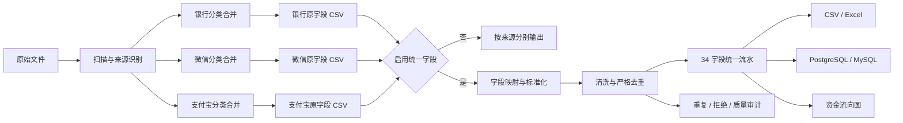

# Funds ETL

> 面向资金调查、交易审计与关系研判的多源资金数据智能分析平台。


Funds ETL 将银行、微信、支付宝等异构资金数据转化为结构一致、来源可追溯、过程可复核的分析资产。平台覆盖文件识别、分类合并、字段标准化、数据清洗、严格去重、质量审计、数据库入库与资金流向可视化，适用于大规模交易流水整理和后续资金关系分析。

它并不只是“把表格拼在一起”。系统在每个处理阶段保留源文件和中间产物，并通过独立进度、实时速度、已用时间及预计剩余时间呈现执行状态，使数据从原始材料到分析结果的转换过程清晰、可验证、可复现。

## 核心能力

### 多源数据接入

- 自动识别银行、微信、支付宝流水及相关账户资料。
- 支持 CSV、TSV、TXT、XLSX、XLSM、XLS 等常见文件格式。
- 按数据来源并行解析，降低大量文件连续处理的等待时间。
- 支持列签名识别、自定义字段映射和方向规则持久化。

### 分阶段合并

平台采用可审计的分层处理策略：

1. 完整保留用户提交的源文件。
2. 同类来源先合并为各自的原字段大 CSV。
3. 启用“统一来源字段”后，为每类来源生成标准字段 CSV，同时保留原字段 CSV。
4. 将各来源标准字段 CSV 合并为最终统一流水。
5. 输出清洗、重复、拒绝记录等审计产物。

未启用统一合并时，不同来源分别形成结果，不强行改变原始字段语义。

### 标准化清洗

- 统一日期时间、金额、币种和收付方向。
- 处理 BOM、全角空格、货币符号、千分位及常见脏值。
- 校验交易时间、交易金额、收付标志等关键字段。
- 基于来源、主体、流水号与完整业务指纹执行严格去重。
- 对无法通过质量规则的记录单独输出，不静默丢弃。

### 资金流分析

- 以本方账户、交易对手和收付方向构建资金关系图。
- 支持主体、对手、时间、金额、方向和标签的组合筛选。
- 支持路径分析、环形关系识别、关键节点观察和交易明细追溯。
- 支持图层管理、人工标注、节点审核和样式配置。
- 可导出 PNG、JPEG、WebP、SVG、Mermaid、DOT、GraphML、draw.io、XMind、CSV 及完整 ZIP。

### 一键导入数据库

- 支持 PostgreSQL 与 MySQL。
- 数据库连接配置可在界面中维护并进行连接测试。
- 支持追加导入或清空重建。
- 支持中文字段名或英文 `snake_case` 字段名。
- 支持跳过重复记录或保留重复记录。
- PostgreSQL 使用暂存表与批量导入，MySQL 使用分批写入。
- 追加到旧版目标表时，可自动补充新增加的统一业务字段。

## 处理流程



## 统一数据模型

最终统一流水采用 34 个业务字段。`商户流水号`位于`交易流水号`之后，用于区分平台交易编号和商户侧订单编号。

| 分组 | 字段 |
|---|---|
| 本方主体 | 交易卡号、交易账号、交易户名、交易证件号码、交易方开户行、账户性质 |
| 交易事实 | 交易时间、交易金额、交易余额、收付标志 |
| 交易对手 | 交易对手账卡号、对手账户性质、现金标志、对手户名、对手身份证号、对手开户银行 |
| 交易描述 | 摘要说明、交易币种、交易网点名称、交易发生地、交易是否成功 |
| 技术与凭证 | 传票号、IP地址、MAC地址、对手交易余额、交易流水号、商户流水号、日志号、凭证种类、凭证号、交易柜员号 |
| 反馈与来源 | 备注、查询反馈结果原因、数据来源 |

以支付宝账户明细为例：

| 支付宝原字段 | 统一字段 |
|---|---|
| 用户信息中的支付宝账号 | 交易账号、交易卡号 |
| 用户信息中的姓名 | 交易户名 |
| 固定来源 | 交易方开户行 = 支付宝 |
| 交易创建时间 | 交易时间 |
| 金额（元） | 交易金额 |
| 收/支 | 收付标志 |
| 交易对方信息 | 交易对手账卡号、对手户名、对手开户银行 |
| 消费名称 | 摘要说明 |
| 交易号 | 交易流水号 |
| 商户订单号 | 商户流水号 |
| 交易状态 | 交易是否成功 |

支付宝余额明细转统一流水的能力予以保留，但默认关闭；源文件和原字段 CSV 始终保留。

## 可审计性设计

资金数据的可信度不仅取决于最终结果，也取决于结果能否回到原始证据。Funds ETL 因此将可审计性作为核心约束：

- 源文件、中间文件和最终文件分阶段保存。
- 每个阶段使用独立进度状态，不以单一百分比掩盖处理过程。
- 重复记录和不合格记录生成独立审计文件。
- 数据来源字段保留来源身份，内部处理同时维护来源文件、来源表及行级证据。
- 数据库导入增加任务标识、行指纹和导入时间，支持重复控制与结果核对。

## 技术架构

| 层级 | 技术 |
|---|---|
| 后端 | Go、Gin、Excelize、zerolog |
| 前端 | React、TypeScript、Vite、Ant Design |
| 图分析 | React Flow、Dagre |
| 分析存储 | DuckDB、SQLite |
| 外部数据库 | PostgreSQL、MySQL |
| 部署方式 | 单后端进程托管 API 与前端静态资源 |

```text
cmd/server/                  服务入口
internal/api/               HTTP API 与任务进度
internal/scanner/           文件扫描和来源识别
internal/parser/            支付宝、微信及通用解析
internal/provider/          银行等数据来源处理
internal/etl/               清洗、去重、合并、导出与流图构建
internal/dbimport/          PostgreSQL / MySQL 数据导入
internal/rules/             内置规则和自定义规则
internal/storage/           会话及文件存储
frontend/src/features/      清洗、导入与资金流分析界面
backend/data/               运行时上传、输出、日志和分析数据
```

## 快速开始

### 环境要求

- Windows 10/11 或 Windows Server
- Go 1.25+
- Node.js 与 npm

### 安装与构建

```powershell
git clone https://github.com/Euxripides/euripidessss.git
cd euripidessss

cd frontend
npm install
npm run build
cd ..

.\run.ps1
```

服务启动后访问：

```text
http://127.0.0.1:8000
```

健康检查：

```powershell
Invoke-RestMethod http://127.0.0.1:8000/api/health
```

### 开发模式

后端：

```powershell
go run .\cmd\server\
```

前端：

```powershell
cd frontend
npm run dev
```

前端开发服务器默认运行于 `http://127.0.0.1:5173`，并将 `/api` 请求代理到后端。

## 配置

| 环境变量 | 默认值 | 说明 |
|---|---:|---|
| `PORT` | `8000` | 后端监听端口 |
| `DEBUG` | `0` | 设置为`1`启用调试模式 |
| `DUCKDB_PATH` | 自动检测 | DuckDB 可执行文件路径 |
| `DUCKDB_DATABASE` | 自动配置 | DuckDB 分析数据库路径 |

单文件默认上限为 500 MB。数据库连接配置、字段映射规则和方向规则可通过界面维护。

## 测试与质量检查

```powershell
go test ./internal/...
go vet ./...
go build -o bin\etl-server.exe .\cmd\server\

cd frontend
npm run build
```

性能基准：

```powershell
go test -bench=. ./internal/etl/ -benchmem
```

## 运行时数据

```text
backend/data/
├── uploads/          上传文件与导入会话
├── outputs/          分阶段产物和最终导出
├── logs/             运行日志
├── analysis/         分析数据库
└── rule_samples/     规则识别样本
```

运行时目录可能包含敏感资金数据。将项目提交到公开仓库前，请确认上传文件、输出结果、数据库配置、日志和调查样本均未被纳入版本控制。

## 使用边界

Funds ETL 提供数据整理、质量控制和关系分析能力，不替代调查人员对证据来源、主体身份、交易性质及分析结论的专业判断。用于正式调查或审计时，应保留原始材料、处理参数、审计产物和人工复核记录。
