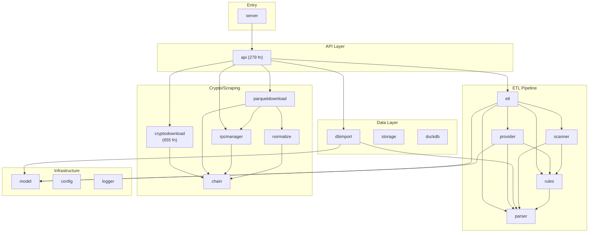

# Funds ETL — Code Property Graph

> Auto-generated. **30 packages, 1888 functions, 412 types.**

Use this as a **project map** before reading source code.

## 1. Architecture Layers

### Entry Point (1 pkgs, 1 funcs, 0 types)

- **`server`** — 1 fn, 0s/0i, uses: api, config, logger, rules

### API / HTTP (1 pkgs, 280 funcs, 43 types)

- **`api`** — 280 fn, 41s/0i, uses: analysis/duckdb, config, cryptodownload, datasourcemanager, used-by: 1 pkg(s)

### ETL Pipeline (30 pkgs, 1888 funcs, 412 types)

- **`cryptodownload`** — 655 fn, 132s/1i, uses: cryptodownload/useragent, used-by: 1 pkg(s)
- **`api`** — 280 fn, 41s/0i, uses: analysis/duckdb, config, cryptodownload, datasourcemanager, used-by: 1 pkg(s)
- **`parquetdownload`** — 186 fn, 28s/0i, uses: analysis/duckdb, chain, datasource, datasource/aws, used-by: 1 pkg(s)
- **`dbimport`** — 110 fn, 27s/1i, uses: model, parser, used-by: 1 pkg(s)
- **`rpcmanager`** — 110 fn, 21s/0i, uses: chain, used-by: 3 pkg(s)
- **`etl`** — 99 fn, 10s/0i, uses: model, parser, provider, rules, used-by: 1 pkg(s)
- **`dunetools`** — 88 fn, 16s/3i, used-by: 1 pkg(s)
- **`parser`** — 85 fn, 7s/0i, used-by: 6 pkg(s)
- **`datasourcemanager`** — 44 fn, 13s/0i, uses: chain, datasource/aws, datasource/sqd, rpcmanager, used-by: 2 pkg(s)
- **`datasource/sqd`** — 34 fn, 14s/0i, uses: chain, used-by: 3 pkg(s)
- **`rules`** — 27 fn, 1s/0i, uses: parser, used-by: 5 pkg(s)
- **`provider`** — 25 fn, 5s/1i, uses: model, parser, rules, used-by: 1 pkg(s)
- **`analysis/duckdb`** — 21 fn, 4s/0i, used-by: 2 pkg(s)
- **`datasource/rpc`** — 17 fn, 3s/0i, uses: chain, normalize, used-by: 1 pkg(s)
- **`downloader`** — 17 fn, 6s/0i, uses: writer, used-by: 1 pkg(s)
- **`scanner`** — 17 fn, 2s/0i, uses: parser, rules, used-by: 2 pkg(s)
- **`datasource/sqd/scheduler`** — 12 fn, 4s/0i
- **`normalize`** — 12 fn, 12s/0i, uses: chain, datasource/sqd, used-by: 3 pkg(s)
- **`storage/control`** — 9 fn, 2s/0i, used-by: 1 pkg(s)
- **`storage`** — 8 fn, 2s/0i, used-by: 1 pkg(s)
- **`writer`** — 8 fn, 1s/1i, used-by: 2 pkg(s)
- **`logger`** — 6 fn, 1s/0i, used-by: 1 pkg(s)
- **`cryptodownload/browser_stealth`** — 5 fn, 1s/0i
- **`datasource/aws`** — 5 fn, 2s/0i, uses: chain, datasource, used-by: 2 pkg(s)
- **`config`** — 3 fn, 2s/0i, used-by: 2 pkg(s)
- **`chain`** — 2 fn, 1s/0i, used-by: 8 pkg(s)
- **`cryptodownload/useragent`** — 2 fn, 0s/0i, used-by: 1 pkg(s)
- **`server`** — 1 fn, 0s/0i, uses: api, config, logger, rules
- **`datasource`** — 0 fn, 1s/3i, uses: chain, normalize, used-by: 2 pkg(s)
- **`model`** — 0 fn, 13s/1i, used-by: 4 pkg(s)

### Storage & IO (5 pkgs, 152 funcs, 41 types)

- **`dbimport`** — 110 fn, 27s/1i, uses: model, parser, used-by: 1 pkg(s)
- **`downloader`** — 17 fn, 6s/0i, uses: writer, used-by: 1 pkg(s)
- **`storage/control`** — 9 fn, 2s/0i, used-by: 1 pkg(s)
- **`storage`** — 8 fn, 2s/0i, used-by: 1 pkg(s)
- **`writer`** — 8 fn, 1s/1i, used-by: 2 pkg(s)

### Crypto / Blockchain (13 pkgs, 1160 funcs, 268 types)

- **`cryptodownload`** — 655 fn, 132s/1i, uses: cryptodownload/useragent, used-by: 1 pkg(s)
- **`parquetdownload`** — 186 fn, 28s/0i, uses: analysis/duckdb, chain, datasource, datasource/aws, used-by: 1 pkg(s)
- **`rpcmanager`** — 110 fn, 21s/0i, uses: chain, used-by: 3 pkg(s)
- **`dunetools`** — 88 fn, 16s/3i, used-by: 1 pkg(s)
- **`datasourcemanager`** — 44 fn, 13s/0i, uses: chain, datasource/aws, datasource/sqd, rpcmanager, used-by: 2 pkg(s)
- **`datasource/sqd`** — 34 fn, 14s/0i, uses: chain, used-by: 3 pkg(s)
- **`datasource/rpc`** — 17 fn, 3s/0i, uses: chain, normalize, used-by: 1 pkg(s)
- **`datasource/sqd/scheduler`** — 12 fn, 4s/0i
- **`cryptodownload/browser_stealth`** — 5 fn, 1s/0i
- **`datasource/aws`** — 5 fn, 2s/0i, uses: chain, datasource, used-by: 2 pkg(s)
- **`chain`** — 2 fn, 1s/0i, used-by: 8 pkg(s)
- **`cryptodownload/useragent`** — 2 fn, 0s/0i, used-by: 1 pkg(s)
- **`datasource`** — 0 fn, 1s/3i, uses: chain, normalize, used-by: 2 pkg(s)

### Infrastructure (4 pkgs, 30 funcs, 22 types)

- **`analysis/duckdb`** — 21 fn, 4s/0i, used-by: 2 pkg(s)
- **`logger`** — 6 fn, 1s/0i, used-by: 1 pkg(s)
- **`config`** — 3 fn, 2s/0i, used-by: 2 pkg(s)
- **`model`** — 0 fn, 13s/1i, used-by: 4 pkg(s)

## 2. Coupling Hotspots

Sorted by **instability** (outgoing deps / total deps). High = fragile.

| Package | Out | In | Instability | Funcs |
|---------|-----|----|-------------|-------|
| `api` | 15 | 1 | 0.94 █████████ | 280 |
| `parquetdownload` | 11 | 1 | 0.92 █████████ | 186 |
| `etl` | 5 | 1 | 0.83 ████████ | 99 |
| `server` | 4 | 0 | 1.00 ██████████ | 1 |
| `datasourcemanager` | 4 | 2 | 0.67 ██████ | 44 |
| `provider` | 3 | 1 | 0.75 ███████ | 25 |
| `datasource` | 2 | 2 | 0.50 █████ | 0 |
| `datasource/aws` | 2 | 2 | 0.50 █████ | 5 |
| `datasource/rpc` | 2 | 1 | 0.67 ██████ | 17 |
| `dbimport` | 2 | 1 | 0.67 ██████ | 110 |
| `normalize` | 2 | 3 | 0.40 ████ | 12 |
| `scanner` | 2 | 2 | 0.50 █████ | 17 |
| `cryptodownload` | 1 | 1 | 0.50 █████ | 655 |
| `datasource/sqd` | 1 | 3 | 0.25 ██ | 34 |
| `downloader` | 1 | 1 | 0.50 █████ | 17 |

**Key**: `parquetdownload` (11 out) and `api` (15 out) are the most coupled.

## 3. Cycle Detection

✅ No circular dependencies.

## 4. Interface Inventory

**11 interfaces**:

| Interface | Package | Methods |
|-----------|---------|--------|
| `csvBrowserEmailRequester` | `cryptodownload` | Request |
| `LogsSource` | `datasource` | ProbeSchema |
| `TransactionSource` | `datasource` | DiscoverTransactions |
| `LinkVerifier` | `dunetools` | VerifyEmailLink |
| `Mailbox` | `dunetools` | WaitForVerificationLink |
| `SQLExecutor` | `writer` | ExecSQLJSON |
| `ReceiptSource` | `datasource` | Probe, Receipts |
| `exportSchemaExecutor` | `dbimport` | ExecContext, QueryContext |
| `BrowserClient` | `dunetools` | Register, VerifyEmail, LoginAndExtract |
| `Provider` | `provider` | Name, ProcessDirectory, ProcessFile |
| `Storage` | `model` | CreateSession, GetSession, ListSessions, SaveTransactions, LoadTransactions, SaveOutput +2 |

## 5. Key Call Paths

HTTP handlers down to data layer:

- **BuildFlowGraph** ← `api`.HandleBuildImportedFlow ← `etl`.BuildFlowGraph
- **StartTask** ← `dbimport`.StartTask
- **CollectAddress** ← `cryptodownload`.CollectAddress
- **FetchTokenTransfersByTimeWindow** ← `cryptodownload`.FetchTokenTransfersByTimeWindow

## 6. Package Risk Matrix

Size × coupling = maintenance risk.

| Package | Size | Coupling | Risk | Level |
|---------|------|----------|------|-------|
| `api` | 323 | 16 | 5491 | 🔴 HIGH |
| `parquetdownload` | 217 | 12 | 2821 | 🔴 HIGH |
| `cryptodownload` | 805 | 2 | 2415 | 🔴 HIGH |
| `etl` | 109 | 6 | 763 | 🔴 HIGH |
| `rpcmanager` | 131 | 4 | 655 | 🔴 HIGH |
| `parser` | 92 | 6 | 644 | 🔴 HIGH |
| `dbimport` | 139 | 3 | 556 | 🔴 HIGH |
| `datasourcemanager` | 57 | 6 | 399 | 🟡 MED |
| `datasource/sqd` | 49 | 4 | 245 | 🟡 MED |
| `dunetools` | 109 | 1 | 218 | 🟡 MED |
| `rules` | 28 | 6 | 196 | 🟢 LOW |
| `provider` | 31 | 4 | 155 | 🟢 LOW |
| `normalize` | 24 | 5 | 144 | 🟢 LOW |
| `scanner` | 19 | 4 | 95 | 🟢 LOW |
| `datasource/rpc` | 20 | 3 | 80 | 🟢 LOW |

## 7. Dependency Diagram

## 8. Agent Quick-Start

**Before modifying code**, check:

1. **Which layer?** See Section 1.
2. **Who depends on it?** See Section 2 coupling table.
3. **Any cycles?** See Section 3.
4. **Which interface?** See Section 4.
5. **Full data**: `cpg.json` has per-function CFG stats, param types, exact call sites.

**Common tasks & where to look**:

| Task | Primary Package(s) |
|------|-------------------|
| Add new data source format | `parser`, `provider`, `rules` |
| Add API endpoint | `api/router.go`, `api/handlers.go` |
| Modify ETL pipeline | `etl/etl.go` |
| Database import logic | `dbimport/` |
| Crypto download / scraping | `cryptodownload/` (655 fn!) |
| Flow graph visualization | `etl/flow_graph.go` + `frontend/` |
| Config / env vars | `config/config.go` |

**Biggest files**: `api/handlers.go`, `etl/etl.go`, all of `cryptodownload/`, `parquetdownload/`.

---
*Generated by `tools/cpg/` (Go) + `tools/cpg/enhance_summary.py`.*
