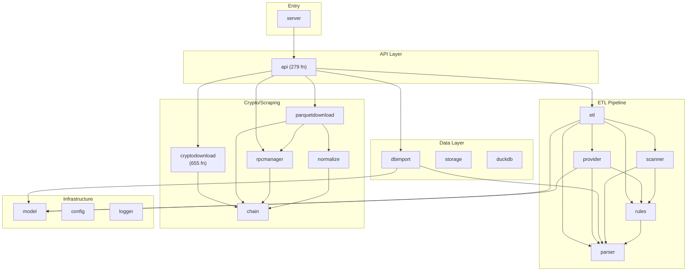

# Funds ETL — Code Property Graph

> Auto-generated. **83 packages, 4988 functions, 1457 types.**

Use this as a **project map** before reading source code.

## 1. Architecture Layers

### Entry Point (2 pkgs, 2 funcs, 0 types)

- **`ledgerimport`** — 1 fn, 0s/0i, uses: ledgerimport
- **`server`** — 1 fn, 0s/0i, uses: api, config, logger, rules

### API / HTTP (1 pkgs, 577 funcs, 67 types)

- **`api`** — 577 fn, 65s/0i, uses: analysis/duckdb, analyticsapi, canonicalapi, canonicalregistry, used-by: 1 pkg(s)

### ETL Pipeline (83 pkgs, 4988 funcs, 1457 types)

- **`cryptodownload`** — 676 fn, 134s/2i, uses: cryptodownload/useragent, used-by: 1 pkg(s)
- **`api`** — 577 fn, 65s/0i, uses: analysis/duckdb, analyticsapi, canonicalapi, canonicalregistry, used-by: 1 pkg(s)
- **`smartdownload`** — 501 fn, 102s/11i, uses: analysis/duckdb, chain, cloudruntime, datasource/sqd, used-by: 3 pkg(s)
- **`intelligence`** — 335 fn, 89s/4i, uses: analyticsapi, dynamicinvestigation, investigationstore, logger, used-by: 1 pkg(s)
- **`parquetdownload`** — 201 fn, 33s/0i, uses: analysis/duckdb, chain, datasource, datasource/aws, used-by: 4 pkg(s)
- **`downloadengine`** — 166 fn, 67s/5i, used-by: 1 pkg(s)
- **`downloadscheduler`** — 161 fn, 34s/9i, uses: chain, cloudruntime, datasetsync, logger, used-by: 2 pkg(s)
- **`rpcmanager`** — 127 fn, 23s/0i, uses: chain, used-by: 6 pkg(s)
- **`dbimport`** — 110 fn, 27s/1i, uses: model, parser, used-by: 1 pkg(s)
- **`investigation/prefetch`** — 104 fn, 24s/0i, uses: graphcache, investigation/cache, smartdownload, used-by: 1 pkg(s)
- **`etl`** — 99 fn, 10s/0i, uses: model, parser, provider, rules, used-by: 1 pkg(s)
- **`dynamicinvestigation`** — 98 fn, 21s/2i, uses: analyticsapi, chain, logger, parquetdownload, used-by: 2 pkg(s)
- **`datasource/sqd`** — 95 fn, 25s/0i, uses: chain, used-by: 5 pkg(s)
- **`dunetools`** — 88 fn, 16s/3i, used-by: 1 pkg(s)
- **`parser`** — 85 fn, 7s/0i, used-by: 6 pkg(s)
- **`reportengine`** — 84 fn, 21s/2i, uses: entityintel, fundflow, investigation/cache, used-by: 1 pkg(s)
- **`pricing`** — 83 fn, 36s/7i, uses: config, used-by: 1 pkg(s)
- **`entityintel`** — 68 fn, 17s/1i, uses: analyticsapi, used-by: 3 pkg(s)
- **`fundflow`** — 54 fn, 23s/2i, uses: analyticsapi, entityintel, used-by: 2 pkg(s)
- **`cloudruntime`** — 49 fn, 5s/0i, uses: logger, s3store, used-by: 3 pkg(s)
- **`canonicalregistry`** — 47 fn, 10s/1i, used-by: 1 pkg(s)
- **`datasourcemanager`** — 44 fn, 13s/0i, uses: chain, datasource/aws, datasource/sqd, rpcmanager, used-by: 2 pkg(s)
- **`downloadengine/provider`** — 44 fn, 12s/0i, uses: analysis/duckdb, chain, datasource, datasource/aws
- **`ledgerimport`** — 44 fn, 7s/0i, uses: clickhouse, used-by: 1 pkg(s)
- **`analyticsapi`** — 41 fn, 16s/0i, uses: analysis/duckdb, logger, used-by: 11 pkg(s)
- **`investigationstore`** — 37 fn, 13s/1i, used-by: 3 pkg(s)
- **`canonicalapi`** — 36 fn, 14s/1i, used-by: 1 pkg(s)
- **`datasetsync`** — 35 fn, 8s/1i, uses: analysis/duckdb, logger, s3store, used-by: 3 pkg(s)
- **`financialpnl`** — 34 fn, 13s/1i, used-by: 1 pkg(s)
- **`contractintelligence`** — 32 fn, 6s/3i, used-by: 1 pkg(s)
- **`eventdecoder`** — 32 fn, 14s/1i, used-by: 2 pkg(s)
- **`explorer`** — 31 fn, 13s/2i, used-by: 1 pkg(s)
- **`datawarehouse`** — 30 fn, 2s/4i, uses: eventdecoder, smartdownload, used-by: 1 pkg(s)
- **`graphcache`** — 30 fn, 9s/2i, uses: analyticsapi, used-by: 2 pkg(s)
- **`smartdownload/validation`** — 30 fn, 9s/0i, used-by: 1 pkg(s)
- **`flow`** — 29 fn, 11s/1i, uses: chain, investigationstore, normalize, rpcmanager, used-by: 1 pkg(s)
- **`rules`** — 27 fn, 1s/0i, uses: parser, used-by: 5 pkg(s)
- **`smartdownload/cloudplanner`** — 26 fn, 5s/0i, used-by: 2 pkg(s)
- **`analysis/duckdb`** — 25 fn, 4s/0i, used-by: 11 pkg(s)
- **`provider`** — 25 fn, 5s/1i, uses: model, parser, rules, used-by: 1 pkg(s)
- **`clickhouseanalytics`** — 24 fn, 18s/1i, used-by: 1 pkg(s)
- **`clickhouseinvestigation`** — 24 fn, 4s/1i, uses: analyticsapi, investigation, used-by: 1 pkg(s)
- **`smartdownload/discovery`** — 24 fn, 8s/1i, used-by: 1 pkg(s)
- **`s3store`** — 23 fn, 5s/1i, used-by: 3 pkg(s)
- **`semanticanalytics`** — 23 fn, 13s/1i, used-by: 1 pkg(s)
- **`semanticjobs`** — 22 fn, 5s/4i, used-by: 1 pkg(s)
- **`financialintegration`** — 21 fn, 12s/2i, used-by: 1 pkg(s)
- **`clickhouse`** — 19 fn, 5s/0i, uses: config, used-by: 2 pkg(s)
- **`financialanalytics`** — 19 fn, 11s/1i, used-by: 1 pkg(s)
- **`smartdownload/progress`** — 19 fn, 10s/0i, used-by: 1 pkg(s)
- **`casefile`** — 18 fn, 12s/0i, uses: analysis/duckdb, analyticsapi, balance, investigation
- **`financialflow`** — 18 fn, 12s/1i, used-by: 1 pkg(s)
- **`semanticquality`** — 18 fn, 10s/1i, used-by: 1 pkg(s)
- **`clickhouseexport`** — 17 fn, 8s/1i, used-by: 1 pkg(s)
- **`datasource/rpc`** — 17 fn, 3s/0i, uses: chain, normalize, used-by: 1 pkg(s)
- **`downloader`** — 17 fn, 6s/0i, uses: writer, used-by: 1 pkg(s)
- **`scanner`** — 17 fn, 2s/0i, uses: parser, rules, used-by: 2 pkg(s)
- **`smartdownload/feedback`** — 17 fn, 5s/0i, used-by: 1 pkg(s)
- **`clickhousegraph`** — 15 fn, 6s/1i, used-by: 1 pkg(s)
- **`smartdownload/registry`** — 15 fn, 9s/0i, used-by: 1 pkg(s)
- **`config`** — 14 fn, 6s/0i, uses: writer, used-by: 4 pkg(s)
- **`datasetevents`** — 13 fn, 2s/0i, used-by: 1 pkg(s)
- **`investigation`** — 13 fn, 8s/0i, uses: analysis/duckdb, analyticsapi, used-by: 2 pkg(s)
- **`datasource/sqd/scheduler`** — 12 fn, 4s/0i
- **`investigation/cache`** — 12 fn, 5s/0i, used-by: 3 pkg(s)
- **`normalize`** — 12 fn, 12s/0i, uses: chain, datasource/sqd, used-by: 5 pkg(s)
- **`balance`** — 10 fn, 11s/0i, uses: analysis/duckdb, analyticsapi, used-by: 1 pkg(s)
- **`graphincrement`** — 10 fn, 3s/0i, uses: analysis/duckdb, datasetsync, used-by: 1 pkg(s)
- **`storage/control`** — 9 fn, 2s/0i, used-by: 1 pkg(s)
- **`graphintel`** — 8 fn, 5s/0i, uses: analysis/duckdb, analyticsapi
- **`storage`** — 8 fn, 2s/0i, used-by: 1 pkg(s)
- **`writer`** — 8 fn, 1s/1i, used-by: 6 pkg(s)
- **`financialquality`** — 7 fn, 9s/1i, used-by: 1 pkg(s)
- **`logger`** — 6 fn, 1s/0i, used-by: 9 pkg(s)
- **`cryptodownload/browser_stealth`** — 5 fn, 1s/0i
- **`datasource/aws`** — 5 fn, 2s/0i, uses: chain, datasource, used-by: 3 pkg(s)
- **`objectiveplanner`** — 3 fn, 5s/0i, used-by: 2 pkg(s)
- **`chain`** — 2 fn, 1s/0i, used-by: 14 pkg(s)
- **`cryptodownload/useragent`** — 2 fn, 0s/0i, used-by: 1 pkg(s)
- **`ledgerimport`** — 1 fn, 0s/0i, uses: ledgerimport
- **`server`** — 1 fn, 0s/0i, uses: api, config, logger, rules
- **`datasource`** — 0 fn, 1s/3i, uses: chain, normalize, used-by: 3 pkg(s)
- **`model`** — 0 fn, 13s/1i, used-by: 4 pkg(s)

### Storage & IO (5 pkgs, 152 funcs, 41 types)

- **`dbimport`** — 110 fn, 27s/1i, uses: model, parser, used-by: 1 pkg(s)
- **`downloader`** — 17 fn, 6s/0i, uses: writer, used-by: 1 pkg(s)
- **`storage/control`** — 9 fn, 2s/0i, used-by: 1 pkg(s)
- **`storage`** — 8 fn, 2s/0i, used-by: 1 pkg(s)
- **`writer`** — 8 fn, 1s/1i, used-by: 6 pkg(s)

### Crypto / Blockchain (13 pkgs, 1274 funcs, 291 types)

- **`cryptodownload`** — 676 fn, 134s/2i, uses: cryptodownload/useragent, used-by: 1 pkg(s)
- **`parquetdownload`** — 201 fn, 33s/0i, uses: analysis/duckdb, chain, datasource, datasource/aws, used-by: 4 pkg(s)
- **`rpcmanager`** — 127 fn, 23s/0i, uses: chain, used-by: 6 pkg(s)
- **`datasource/sqd`** — 95 fn, 25s/0i, uses: chain, used-by: 5 pkg(s)
- **`dunetools`** — 88 fn, 16s/3i, used-by: 1 pkg(s)
- **`datasourcemanager`** — 44 fn, 13s/0i, uses: chain, datasource/aws, datasource/sqd, rpcmanager, used-by: 2 pkg(s)
- **`datasource/rpc`** — 17 fn, 3s/0i, uses: chain, normalize, used-by: 1 pkg(s)
- **`datasource/sqd/scheduler`** — 12 fn, 4s/0i
- **`cryptodownload/browser_stealth`** — 5 fn, 1s/0i
- **`datasource/aws`** — 5 fn, 2s/0i, uses: chain, datasource, used-by: 3 pkg(s)
- **`chain`** — 2 fn, 1s/0i, used-by: 14 pkg(s)
- **`cryptodownload/useragent`** — 2 fn, 0s/0i, used-by: 1 pkg(s)
- **`datasource`** — 0 fn, 1s/3i, uses: chain, normalize, used-by: 3 pkg(s)

### Infrastructure (4 pkgs, 45 funcs, 26 types)

- **`analysis/duckdb`** — 25 fn, 4s/0i, used-by: 11 pkg(s)
- **`config`** — 14 fn, 6s/0i, uses: writer, used-by: 4 pkg(s)
- **`logger`** — 6 fn, 1s/0i, used-by: 9 pkg(s)
- **`model`** — 0 fn, 13s/1i, used-by: 4 pkg(s)

## 2. Coupling Hotspots

Sorted by **instability** (outgoing deps / total deps). High = fragile.

| Package | Out | In | Instability | Funcs |
|---------|-----|----|-------------|-------|
| `api` | 58 | 1 | 0.98 █████████ | 577 |
| `smartdownload` | 14 | 3 | 0.82 ████████ | 501 |
| `parquetdownload` | 11 | 4 | 0.73 ███████ | 201 |
| `downloadengine/provider` | 9 | 0 | 1.00 ██████████ | 44 |
| `downloadscheduler` | 7 | 2 | 0.78 ███████ | 161 |
| `etl` | 5 | 1 | 0.83 ████████ | 99 |
| `server` | 4 | 0 | 1.00 ██████████ | 1 |
| `casefile` | 4 | 0 | 1.00 ██████████ | 18 |
| `datasourcemanager` | 4 | 2 | 0.67 ██████ | 44 |
| `dynamicinvestigation` | 4 | 2 | 0.67 ██████ | 98 |
| `flow` | 4 | 1 | 0.80 ████████ | 29 |
| `intelligence` | 4 | 1 | 0.80 ████████ | 335 |
| `datasetsync` | 3 | 3 | 0.50 █████ | 35 |
| `investigation/prefetch` | 3 | 1 | 0.75 ███████ | 104 |
| `provider` | 3 | 1 | 0.75 ███████ | 25 |

**Key**: `parquetdownload` (11 out) and `api` (15 out) are the most coupled.

## 3. Cycle Detection

✅ No circular dependencies.

## 4. Interface Inventory

**90 interfaces**:

| Interface | Package | Methods |
|-----------|---------|--------|
| `Runner` | `semanticjobs` |  |
| `QueryClient` | `canonicalapi` | QueryJSON |
| `QueryClient` | `clickhouseanalytics` | QueryJSON |
| `QueryClient` | `clickhouseexport` | QueryCSV |
| `QueryClient` | `clickhousegraph` | QueryJSON |
| `BeaconResolver` | `contractintelligence` | BeaconImplementation |
| `QueryClient` | `contractintelligence` | QueryJSON |
| `csvBrowserEmailRequester` | `cryptodownload` | Request |
| `csvBrowserEngineNamer` | `cryptodownload` | BrowserEngine |
| `ParquetValidator` | `datasetsync` | Validate |
| `LogsSource` | `datasource` | ProbeSchema |
| `TransactionSource` | `datasource` | DiscoverTransactions |
| `AnalyticsRefresher` | `datawarehouse` | RefreshAddressAnalytics |
| `ClickHouseSink` | `datawarehouse` | InsertCSV |
| `DuckDBQuery` | `datawarehouse` | ExecSQL |
| `clickHouseQuery` | `datawarehouse` | QueryJSON |
| `FirstSeenResolver` | `downloadengine` | ResolveFirstSeen |
| `CoverageSource` | `downloadscheduler` | AddressTxCount |
| `HealthSource` | `downloadscheduler` | SQDHealth |
| `RPCClient` | `downloadscheduler` | Call |
| `jobPoller` | `downloadscheduler` | JobProgress |
| `LinkVerifier` | `dunetools` | VerifyEmailLink |
| `Mailbox` | `dunetools` | WaitForVerificationLink |
| `AcquisitionExecutor` | `dynamicinvestigation` | Execute |
| `Registry` | `eventdecoder` | LookupEvent |
| `ExecuteClient` | `explorer` | Exec |
| `QueryClient` | `explorer` | QueryJSON |
| `QueryClient` | `financialanalytics` | QueryJSON |
| `CSVQueryClient` | `financialflow` | QueryCSV |
| `QueryClient` | `financialquality` | QueryJSON |
| `AssetStore` | `flow` | AddressAssets |
| `EntityIntelligence` | `fundflow` | Resolve |
| `CoverageQuerier` | `graphcache` | QueryCoverage |
| `Expander` | `intelligence` | Expand |
| `FlowSource` | `intelligence` | Flows |
| `PriceResolver` | `pricing` | ResolvePrice |
| `clickHouseExecutor` | `pricing` | Exec |
| `EntityResolver` | `reportengine` | Resolve |
| `NarrativePolisher` | `reportengine` | Polish |
| `QueryClient` | `semanticanalytics` | QueryJSON |
| `CanonicalSource` | `semanticjobs` | Reparse |
| `EnrichmentRunner` | `semanticjobs` | Reenrich |
| `QueryClient` | `semanticquality` | QueryJSON |
| `IndexedWriter` | `smartdownload` | WriteIndexed |
| `RPCClient` | `smartdownload` | Call |
| `RPCPoolMetricsSource` | `smartdownload` | SmartDownloadRPCPoolSnapshot |
| `RangeCoverageSource` | `smartdownload` | CoveredRanges |
| `ThroughputMetricsSource` | `smartdownload` | SmartDownloadThroughput |
| `V32ResourceMetricsSource` | `smartdownload` | SmartDownloadResourceMetrics |
| `MetadataSource` | `smartdownload/discovery` | TotalRows |
| `SQLExecutor` | `writer` | ExecSQLJSON |
| `Client` | `canonicalregistry` | InsertCSV, QueryJSON |
| `QueryClient` | `clickhouseinvestigation` | QueryJSON, QueryCSV |
| `EvidenceReader` | `contractintelligence` | RuntimeCode, StorageAt |
| `ReceiptSource` | `datasource` | Probe, Receipts |
| `exportSchemaExecutor` | `dbimport` | ExecContext, QueryContext |
| `RecoveryWriter` | `downloadscheduler` | WriteTokenTransfers, MergeTokenTransfers |
| `SQDEngine` | `downloadscheduler` | Start, Get |
| `StateProvider` | `downloadscheduler` | State, StateReasons |
| `DiscoverySource` | `dynamicinvestigation` | Flows, Profile |
| `QueryClient` | `financialintegration` | QueryJSON, QueryCSV |
| `Client` | `financialpnl` | QueryJSON, InsertCSV |
| `FlowSource` | `fundflow` | Flows, AddressStats |
| `FlowSource` | `graphcache` | Flows, Profile |
| `AIChatter` | `intelligence` | Chat, Configured |
| `BackfillJobStore` | `pricing` | SaveJob, SaveGaps |
| `BackfillSource` | `pricing` | Name, Fetch |
| `ClickHouseClient` | `pricing` | QueryJSON, InsertCSV |
| `SwapDecoder` | `pricing` | Match, Decode |
| `PartWriter` | `smartdownload` | WritePart, Extension |
| `turboRPCClient` | `smartdownload` | CallTurbo, HasAnyConfigured |
| `Provider` | `downloadengine` | Name, Capabilities, Health |
| `BrowserClient` | `dunetools` | Register, VerifyEmail, LoginAndExtract |
| `FeatureSource` | `entityintel` | AddressStats, Profile, Flows |
| `Executor` | `intelligence` | Type, Execute, Validate |
| `PriceRepository` | `pricing` | Candidates, Buckets, PutPrices |
| `Provider` | `provider` | Name, ProcessDirectory, ProcessFile |
| `Store` | `semanticjobs` | Save, Get, List |
| `GroupProviderAdapter` | `smartdownload` | MaxAddressGroupSize, SupportedDatasetBundles, ExecuteGroupRange |
| `LookupProvider` | `downloadengine` | Name, Capabilities, Health, ExecuteLookup |
| `CloudRuntime` | `downloadscheduler` | SubmitJob, JobStatus, CancelJob, Status |
| `FinancialAnalytics` | `financialintegration` | FinancialSummary, Retention, PassThrough, PnL |
| `CloudRuntime` | `smartdownload` | SubmitJob, JobStatus, CancelJob, Status |
| `ObjectProvider` | `downloadengine` | Name, Capabilities, Health, Estimate, ExecuteObject |
| `StreamingProvider` | `downloadengine` | Name, Capabilities, Health, Estimate, ExecuteStream |
| `Store` | `investigationstore` | Save, Get, List, Delete, Exists |
| `ObjectStore` | `s3store` | Get, Put, Exists, Delete, List |
| `ProviderAdapter` | `smartdownload` | Name, Supports, Available, Probe, ExecuteRange |
| `Provider` | `downloadscheduler` | Kind, Name, Tier, CanHandle, Available, ManualOnly +2 |
| `Storage` | `model` | CreateSession, GetSession, ListSessions, SaveTransactions, LoadTransactions, SaveOutput +2 |

## 5. Key Call Paths

HTTP handlers down to data layer:

- **BuildFlowGraph** ← `api`.HandleBuildImportedFlow ← `etl`.BuildFlowGraph
- **StartTask** ← `dbimport`.StartTask
- **CollectAddress** ← `cryptodownload`.CollectAddress
- **FetchTokenTransfersByTimeWindow** ← `cryptodownload`.FetchTokenTransfersByTimeWindow

## 6. Package Risk Matrix

Size × coupling = maintenance risk.

| Package | Size | Coupling | Risk | Level |
|---------|------|----------|------|-------|
| `api` | 644 | 59 | 38640 | 🔴 HIGH |
| `smartdownload` | 629 | 17 | 11322 | 🔴 HIGH |
| `parquetdownload` | 237 | 15 | 3792 | 🔴 HIGH |
| `intelligence` | 443 | 5 | 2658 | 🔴 HIGH |
| `cryptodownload` | 829 | 2 | 2487 | 🔴 HIGH |
| `downloadscheduler` | 210 | 9 | 2100 | 🔴 HIGH |
| `rpcmanager` | 150 | 7 | 1200 | 🔴 HIGH |
| `dynamicinvestigation` | 126 | 6 | 882 | 🔴 HIGH |
| `datasource/sqd` | 123 | 6 | 861 | 🔴 HIGH |
| `analyticsapi` | 57 | 13 | 798 | 🔴 HIGH |
| `etl` | 109 | 6 | 763 | 🔴 HIGH |
| `investigation/prefetch` | 131 | 4 | 655 | 🔴 HIGH |
| `parser` | 92 | 6 | 644 | 🔴 HIGH |
| `downloadengine/provider` | 56 | 9 | 560 | 🔴 HIGH |
| `dbimport` | 139 | 3 | 556 | 🔴 HIGH |

## 7. Dependency Diagram

## 8. Agent Quick-Start

**Before modifying code**, check:

1. **Which layer?** See Section 1.
2. **Who depends on it?** See Section 2 coupling table.
3. **Any cycles?** See Section 3.
4. **Which interface?** See Section 4.
5. **Full data**: `cpg.json` has per-function CFG stats, param types, exact call sites.

**Common tasks & where to look**:

| Task | Primary Package(s) |
|------|-------------------|
| Add new data source format | `parser`, `provider`, `rules` |
| Add API endpoint | `api/router.go`, `api/handlers.go` |
| Modify ETL pipeline | `etl/etl.go` |
| Database import logic | `dbimport/` |
| Crypto download / scraping | `cryptodownload/` (655 fn!) |
| Flow graph visualization | `etl/flow_graph.go` + `frontend/` |
| Config / env vars | `config/config.go` |

**Biggest files**: `api/handlers.go`, `etl/etl.go`, all of `cryptodownload/`, `parquetdownload/`.

---
*Generated by `tools/cpg/` (Go) + `tools/cpg/enhance_summary.py`.*
