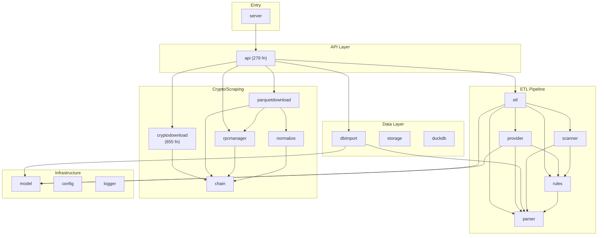

# Funds ETL — Code Property Graph

> Auto-generated. **41 packages, 2764 functions, 750 types.**

Use this as a **project map** before reading source code.

## 1. Architecture Layers

### Entry Point (1 pkgs, 1 funcs, 0 types)

- **`server`** — 1 fn, 0s/0i, uses: api, config, logger, rules

### API / HTTP (1 pkgs, 296 funcs, 44 types)

- **`api`** — 296 fn, 42s/0i, uses: analysis/duckdb, analyticsapi, chain, config, used-by: 1 pkg(s)

### ETL Pipeline (41 pkgs, 2764 funcs, 750 types)

- **`cryptodownload`** — 655 fn, 132s/1i, uses: cryptodownload/useragent, used-by: 1 pkg(s)
- **`intelligence`** — 334 fn, 89s/4i, uses: analyticsapi, dynamicinvestigation, investigationstore, logger, used-by: 1 pkg(s)
- **`api`** — 296 fn, 42s/0i, uses: analysis/duckdb, analyticsapi, chain, config, used-by: 1 pkg(s)
- **`parquetdownload`** — 192 fn, 31s/0i, uses: analysis/duckdb, chain, datasource, datasource/aws, used-by: 3 pkg(s)
- **`downloadengine`** — 166 fn, 67s/5i, used-by: 1 pkg(s)
- **`dbimport`** — 110 fn, 27s/1i, uses: model, parser, used-by: 1 pkg(s)
- **`rpcmanager`** — 110 fn, 21s/0i, uses: chain, used-by: 5 pkg(s)
- **`etl`** — 99 fn, 10s/0i, uses: model, parser, provider, rules, used-by: 1 pkg(s)
- **`dynamicinvestigation`** — 98 fn, 21s/2i, uses: analyticsapi, chain, logger, parquetdownload, used-by: 2 pkg(s)
- **`datasource/sqd`** — 90 fn, 25s/0i, uses: chain, used-by: 4 pkg(s)
- **`dunetools`** — 88 fn, 16s/3i, used-by: 1 pkg(s)
- **`parser`** — 85 fn, 7s/0i, used-by: 6 pkg(s)
- **`datasourcemanager`** — 44 fn, 13s/0i, uses: chain, datasource/aws, datasource/sqd, rpcmanager, used-by: 2 pkg(s)
- **`downloadengine/provider`** — 44 fn, 12s/0i, uses: analysis/duckdb, chain, datasource, datasource/aws
- **`analyticsapi`** — 37 fn, 16s/0i, uses: analysis/duckdb, logger, used-by: 7 pkg(s)
- **`investigationstore`** — 37 fn, 13s/1i, used-by: 3 pkg(s)
- **`flow`** — 29 fn, 11s/1i, uses: chain, investigationstore, normalize, rpcmanager, used-by: 1 pkg(s)
- **`rules`** — 27 fn, 1s/0i, uses: parser, used-by: 5 pkg(s)
- **`analysis/duckdb`** — 25 fn, 4s/0i, used-by: 8 pkg(s)
- **`provider`** — 25 fn, 5s/1i, uses: model, parser, rules, used-by: 1 pkg(s)
- **`casefile`** — 18 fn, 12s/0i, uses: analysis/duckdb, analyticsapi, balance, investigation
- **`datasource/rpc`** — 17 fn, 3s/0i, uses: chain, normalize, used-by: 1 pkg(s)
- **`downloader`** — 17 fn, 6s/0i, uses: writer, used-by: 1 pkg(s)
- **`scanner`** — 17 fn, 2s/0i, uses: parser, rules, used-by: 2 pkg(s)
- **`investigation`** — 13 fn, 8s/0i, uses: analysis/duckdb, analyticsapi, used-by: 1 pkg(s)
- **`datasource/sqd/scheduler`** — 12 fn, 4s/0i
- **`normalize`** — 12 fn, 12s/0i, uses: chain, datasource/sqd, used-by: 4 pkg(s)
- **`balance`** — 10 fn, 11s/0i, uses: analysis/duckdb, analyticsapi, used-by: 1 pkg(s)
- **`storage/control`** — 9 fn, 2s/0i, used-by: 1 pkg(s)
- **`graphintel`** — 8 fn, 5s/0i, uses: analysis/duckdb, analyticsapi
- **`storage`** — 8 fn, 2s/0i, used-by: 1 pkg(s)
- **`writer`** — 8 fn, 1s/1i, used-by: 3 pkg(s)
- **`logger`** — 6 fn, 1s/0i, used-by: 4 pkg(s)
- **`cryptodownload/browser_stealth`** — 5 fn, 1s/0i
- **`datasource/aws`** — 5 fn, 2s/0i, uses: chain, datasource, used-by: 3 pkg(s)
- **`config`** — 3 fn, 2s/0i, used-by: 2 pkg(s)
- **`chain`** — 2 fn, 1s/0i, used-by: 12 pkg(s)
- **`cryptodownload/useragent`** — 2 fn, 0s/0i, used-by: 1 pkg(s)
- **`server`** — 1 fn, 0s/0i, uses: api, config, logger, rules
- **`datasource`** — 0 fn, 1s/3i, uses: chain, normalize, used-by: 3 pkg(s)
- **`model`** — 0 fn, 13s/1i, used-by: 4 pkg(s)

### Storage & IO (5 pkgs, 152 funcs, 41 types)

- **`dbimport`** — 110 fn, 27s/1i, uses: model, parser, used-by: 1 pkg(s)
- **`downloader`** — 17 fn, 6s/0i, uses: writer, used-by: 1 pkg(s)
- **`storage/control`** — 9 fn, 2s/0i, used-by: 1 pkg(s)
- **`storage`** — 8 fn, 2s/0i, used-by: 1 pkg(s)
- **`writer`** — 8 fn, 1s/1i, used-by: 3 pkg(s)

### Crypto / Blockchain (13 pkgs, 1222 funcs, 284 types)

- **`cryptodownload`** — 655 fn, 132s/1i, uses: cryptodownload/useragent, used-by: 1 pkg(s)
- **`parquetdownload`** — 192 fn, 31s/0i, uses: analysis/duckdb, chain, datasource, datasource/aws, used-by: 3 pkg(s)
- **`rpcmanager`** — 110 fn, 21s/0i, uses: chain, used-by: 5 pkg(s)
- **`datasource/sqd`** — 90 fn, 25s/0i, uses: chain, used-by: 4 pkg(s)
- **`dunetools`** — 88 fn, 16s/3i, used-by: 1 pkg(s)
- **`datasourcemanager`** — 44 fn, 13s/0i, uses: chain, datasource/aws, datasource/sqd, rpcmanager, used-by: 2 pkg(s)
- **`datasource/rpc`** — 17 fn, 3s/0i, uses: chain, normalize, used-by: 1 pkg(s)
- **`datasource/sqd/scheduler`** — 12 fn, 4s/0i
- **`cryptodownload/browser_stealth`** — 5 fn, 1s/0i
- **`datasource/aws`** — 5 fn, 2s/0i, uses: chain, datasource, used-by: 3 pkg(s)
- **`chain`** — 2 fn, 1s/0i, used-by: 12 pkg(s)
- **`cryptodownload/useragent`** — 2 fn, 0s/0i, used-by: 1 pkg(s)
- **`datasource`** — 0 fn, 1s/3i, uses: chain, normalize, used-by: 3 pkg(s)

### Infrastructure (4 pkgs, 34 funcs, 22 types)

- **`analysis/duckdb`** — 25 fn, 4s/0i, used-by: 8 pkg(s)
- **`logger`** — 6 fn, 1s/0i, used-by: 4 pkg(s)
- **`config`** — 3 fn, 2s/0i, used-by: 2 pkg(s)
- **`model`** — 0 fn, 13s/1i, used-by: 4 pkg(s)

## 2. Coupling Hotspots

Sorted by **instability** (outgoing deps / total deps). High = fragile.

| Package | Out | In | Instability | Funcs |
|---------|-----|----|-------------|-------|
| `api` | 21 | 1 | 0.95 █████████ | 296 |
| `parquetdownload` | 11 | 3 | 0.79 ███████ | 192 |
| `downloadengine/provider` | 9 | 0 | 1.00 ██████████ | 44 |
| `etl` | 5 | 1 | 0.83 ████████ | 99 |
| `server` | 4 | 0 | 1.00 ██████████ | 1 |
| `casefile` | 4 | 0 | 1.00 ██████████ | 18 |
| `datasourcemanager` | 4 | 2 | 0.67 ██████ | 44 |
| `dynamicinvestigation` | 4 | 2 | 0.67 ██████ | 98 |
| `flow` | 4 | 1 | 0.80 ████████ | 29 |
| `intelligence` | 4 | 1 | 0.80 ████████ | 334 |
| `provider` | 3 | 1 | 0.75 ███████ | 25 |
| `analyticsapi` | 2 | 7 | 0.22 ██ | 37 |
| `balance` | 2 | 1 | 0.67 ██████ | 10 |
| `datasource` | 2 | 3 | 0.40 ████ | 0 |
| `datasource/aws` | 2 | 3 | 0.40 ████ | 5 |

**Key**: `parquetdownload` (11 out) and `api` (15 out) are the most coupled.

## 3. Cycle Detection

✅ No circular dependencies.

## 4. Interface Inventory

**24 interfaces**:

| Interface | Package | Methods |
|-----------|---------|--------|
| `csvBrowserEmailRequester` | `cryptodownload` | Request |
| `LogsSource` | `datasource` | ProbeSchema |
| `TransactionSource` | `datasource` | DiscoverTransactions |
| `FirstSeenResolver` | `downloadengine` | ResolveFirstSeen |
| `LinkVerifier` | `dunetools` | VerifyEmailLink |
| `Mailbox` | `dunetools` | WaitForVerificationLink |
| `AcquisitionExecutor` | `dynamicinvestigation` | Execute |
| `AssetStore` | `flow` | AddressAssets |
| `Expander` | `intelligence` | Expand |
| `FlowSource` | `intelligence` | Flows |
| `SQLExecutor` | `writer` | ExecSQLJSON |
| `ReceiptSource` | `datasource` | Probe, Receipts |
| `exportSchemaExecutor` | `dbimport` | ExecContext, QueryContext |
| `DiscoverySource` | `dynamicinvestigation` | Flows, Profile |
| `AIChatter` | `intelligence` | Chat, Configured |
| `Provider` | `downloadengine` | Name, Capabilities, Health |
| `BrowserClient` | `dunetools` | Register, VerifyEmail, LoginAndExtract |
| `Executor` | `intelligence` | Type, Execute, Validate |
| `Provider` | `provider` | Name, ProcessDirectory, ProcessFile |
| `LookupProvider` | `downloadengine` | Name, Capabilities, Health, ExecuteLookup |
| `ObjectProvider` | `downloadengine` | Name, Capabilities, Health, Estimate, ExecuteObject |
| `StreamingProvider` | `downloadengine` | Name, Capabilities, Health, Estimate, ExecuteStream |
| `Store` | `investigationstore` | Save, Get, List, Delete, Exists |
| `Storage` | `model` | CreateSession, GetSession, ListSessions, SaveTransactions, LoadTransactions, SaveOutput +2 |

## 5. Key Call Paths

HTTP handlers down to data layer:

- **BuildFlowGraph** ← `api`.HandleBuildImportedFlow ← `etl`.BuildFlowGraph
- **StartTask** ← `dbimport`.StartTask
- **CollectAddress** ← `cryptodownload`.CollectAddress
- **FetchTokenTransfersByTimeWindow** ← `cryptodownload`.FetchTokenTransfersByTimeWindow

## 6. Package Risk Matrix

Size × coupling = maintenance risk.

| Package | Size | Coupling | Risk | Level |
|---------|------|----------|------|-------|
| `api` | 340 | 22 | 7820 | 🔴 HIGH |
| `parquetdownload` | 226 | 14 | 3390 | 🔴 HIGH |
| `intelligence` | 442 | 5 | 2652 | 🔴 HIGH |
| `cryptodownload` | 805 | 2 | 2415 | 🔴 HIGH |
| `rpcmanager` | 131 | 6 | 917 | 🔴 HIGH |
| `dynamicinvestigation` | 126 | 6 | 882 | 🔴 HIGH |
| `etl` | 109 | 6 | 763 | 🔴 HIGH |
| `datasource/sqd` | 118 | 5 | 708 | 🔴 HIGH |
| `parser` | 92 | 6 | 644 | 🔴 HIGH |
| `downloadengine/provider` | 56 | 9 | 560 | 🔴 HIGH |
| `dbimport` | 139 | 3 | 556 | 🔴 HIGH |
| `analyticsapi` | 53 | 9 | 530 | 🔴 HIGH |
| `downloadengine` | 254 | 1 | 508 | 🔴 HIGH |
| `datasourcemanager` | 57 | 6 | 399 | 🟡 MED |
| `analysis/duckdb` | 29 | 8 | 261 | 🟡 MED |

## 7. Dependency Diagram

## 8. Agent Quick-Start

**Before modifying code**, check:

1. **Which layer?** See Section 1.
2. **Who depends on it?** See Section 2 coupling table.
3. **Any cycles?** See Section 3.
4. **Which interface?** See Section 4.
5. **Full data**: `cpg.json` has per-function CFG stats, param types, exact call sites.

**Common tasks & where to look**:

| Task | Primary Package(s) |
|------|-------------------|
| Add new data source format | `parser`, `provider`, `rules` |
| Add API endpoint | `api/router.go`, `api/handlers.go` |
| Modify ETL pipeline | `etl/etl.go` |
| Database import logic | `dbimport/` |
| Crypto download / scraping | `cryptodownload/` (655 fn!) |
| Flow graph visualization | `etl/flow_graph.go` + `frontend/` |
| Config / env vars | `config/config.go` |

**Biggest files**: `api/handlers.go`, `etl/etl.go`, all of `cryptodownload/`, `parquetdownload/`.

---
*Generated by `tools/cpg/` (Go) + `tools/cpg/enhance_summary.py`.*
