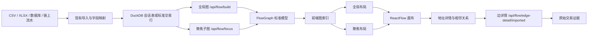

# 加密货币交互式资金流向图技术设计与实施指南

> 文档版本：v1.0  
> 编写日期：2026-08-02  
> 目标仓库：`E:\codex\etl`  
> 目标效果：在 ETL 现有资金流向图中实现“全局关系 + 点击任一地址后，以该地址为中心同时展示上游来源、下游去向、完整地址、金额、笔数、交易明细及流向动画”的交互效果。  
> 技术约束：复用现有 React 19、TypeScript 6、Vite 8、Ant Design 5、`@xyflow/react` 12 和 Go/Gin/DuckDB，不为这一功能引入新的图形库。

---

## 1. 文档目的

本文不是概念说明，而是可直接交给开发人员实施、测试人员验收的工程设计。它回答以下问题：

1. 页面每个区域如何布局，尺寸、颜色和交互是什么。
2. 点击一个完整地址后，如何准确找到它的所有上游、下游和交易证据。
3. 现有 ETL 哪些文件直接复用，哪些文件需要修改，哪些文件需要新增。
4. 前端如何做到放大、缩小、平移时地址和线条不闪烁。
5. 600 条边截断时，如何避免把被选地址的真实邻接关系错误截断。
6. 图上金额、笔数和方向如何与边明细及原始流水形成审计闭环。
7. 功能、性能和视觉验收应如何执行。

本文只设计和指导该功能的实现，不在本文提交中修改 ETL 业务代码。

---

## 2. 目标体验与验收口径

### 2.1 全局模式

进入资金流向图后，默认显示经过筛选和金额排序的全局关系：

- 顶部显示完整地址/交易哈希搜索框。
- 右侧显示方向筛选：全部、上游、下游、前后。
- 右侧显示深度筛选：1 层、2 层、全部。
- 画布显示当前节点数和关系数。
- 地址在节点内完整显示，不以 `0x1234...abcd` 代替。
- 鼠标悬停边时显示金额、笔数、首笔时间、末笔时间。
- 点击节点后进入聚焦模式。

### 2.2 聚焦模式

点击任一地址后，页面必须立即完成以下变化：

- 被选地址固定在画布视觉中心。
- 所有可见上游来源排在左侧，使用蓝色。
- 所有可见下游去向排在右侧，使用橙色。
- 公开交易所标记地址使用金色，但不得在没有调证材料时写成“用户充值地址”或“归集钱包”。
- 与当前地址无关的节点从主视图隐藏，或仅以极弱的背景点表示。
- 资金沿真实方向运动，箭头指向接收方。
- 右侧抽屉显示完整地址、标签、图边流入、图边流出、交易笔数、相邻地址和交易记录。
- 点击相邻地址后，以新地址为中心重新计算关系。
- 点击“退出聚焦”回到全局图。

### 2.3 地址和证据

图形显示必须遵守：

- 节点主文本始终保存并显示完整地址。
- 搜索、复制、接口参数和节点 ID 都使用完整地址。
- 允许在空间不足时换行，但不得改变地址原文。
- 边聚合金额必须等于对应明细金额之和。
- 边聚合笔数必须等于对应明细总数。
- 交易哈希、区块、时间、Token、金额、from、to 应可通过边详情查看。
- 图上的“上游/下游”是相对当前中心地址的图关系，不等于实体身份结论。

### 2.4 完成定义

以下条件全部满足才算完成：

1. 能从 ETL 已导入的数据生成全局资金图。
2. 能点击任一节点进入聚焦模式。
3. 1 层、2 层和全部深度结果正确。
4. 上游、下游、前后方向筛选正确。
5. 完整地址在图和详情中均不被截断。
6. 连续快速缩放 40 次，节点/边 DOM 数量不波动，不出现白屏、闪烁、重复动画重启。
7. 缩放时页面不随滚轮上下滚动。
8. 边详情与原始流水逐笔可核对。
9. 600 边全局截断不会造成聚焦地址关系错误；聚焦查询必须从完整数据集计算。
10. 前端构建、Go 测试和浏览器端验收通过。

---

## 3. ETL 现状与复用结论

### 3.1 当前技术栈

| 层 | 当前技术 | 本功能处理 |
|---|---|---|
| 前端框架 | React 19 + TypeScript 6 | 直接复用 |
| 构建 | Vite 8 | 直接复用 |
| 图形 | `@xyflow/react` 12.10 | 直接复用，不换库 |
| UI | Ant Design 5 | 搜索、分段选择、抽屉、表格继续复用 |
| 后端 | Go + Gin | 复用现有 `/api/flow/*` |
| 查询 | DuckDB 优先、文件读取降级 | 聚焦子图优先用 DuckDB |
| 建图 | `internal/etl/flow_graph.go` | 复用端点、方向、聚合规则 |
| 边详情 | `/api/flow/edge-detail/imported` | 继续按需加载 |

### 3.2 当前已有前端模块

| 文件 | 当前职责 | 本功能处理 |
|---|---|---|
| `FlowPanel.tsx` | 汇总页面状态并连接工作区 | 接入聚焦状态和顶栏参数 |
| `FlowGraphWorkspace.tsx` | 画布 + 右侧检查器布局 | 保留结构，增加聚焦详情区 |
| `FlowCanvas.tsx` | ReactFlow 画布、控制器、边点击 | 增加焦点事件和交互态 |
| `FlowGraphPrimitives.tsx` | 自定义节点、边 | 增加完整地址节点与动画边状态 |
| `FlowInspectorPanel.tsx` | 筛选、关系、分析 | 增加地址详情/相邻地址标签页 |
| `useFlowGraph.ts` | 图数据转换和状态 | 接入聚焦子图响应 |
| `useFlowPanelState.ts` | 可见图、选择、导出等状态 | 增加 focus/relation 索引 |
| `flowElements.ts` | 后端图转 ReactFlow 元素 | 透传 relation、fullAddress、evidence |
| `flowLayout.ts` | 图布局 | 增加确定性聚焦布局 |
| `flowGeometry.ts` | 节点几何与动态锚点 | 复用，调整节点尺寸后重新测量 |
| `flowEdges.ts` | 边样式和数据 | 增加上游/下游/交易所关系色 |
| `flowApi.ts` | `/api/flow/*` 请求 | 增加聚焦子图请求函数 |
| `flow-canvas.css` | 画布和边 | 增加暗色主题和交互降级样式 |
| `flow-nodes.css` | 节点 | 增加完整地址矩形节点样式 |

### 3.3 当前后端边界

当前 `BuildFlowGraph` 已经完成：

- `出`：本方为 source，对手为 target。
- `进`：对手为 source，本方为 target。
- 自环和未知方向跳过。
- 按 source + target 聚合金额和笔数。
- 计算平均金额、最大金额、首笔时间、末笔时间。
- 默认按金额排序，最多返回 600 条边。
- 返回 `total_edges`、`rendered_edges`、`truncated` 和 `edge_limit`。

这套规则必须继续作为唯一建图口径。新聚焦接口不能再写一套方向判断，否则全局图、聚焦图和边详情会发生方向不一致。

---

## 4. 总体架构



### 4.1 核心设计决定

1. 全局图仍使用 `/api/flow/build`，保持兼容。
2. 小图可以在浏览器内构建邻接索引并聚焦。
3. 当 `meta.truncated=true` 时，不允许仅用前端当前 600 条边计算聚焦结果，必须请求后端聚焦接口。
4. 聚焦布局使用确定性分层算法，不依赖随机力导向，避免每次点击后节点跳动。
5. 缩放和平移由 ReactFlow 自己的 viewport transform 驱动；业务 React state 不订阅每一个像素变化。
6. 动画只改变 stroke dash offset 或独立粒子层，不改变边 path、节点数组或布局。
7. 边明细按点击加载，不把所有交易记录一次性放入图响应。

---

## 5. 页面布局详细规范

### 5.1 桌面端总体布局

目标分辨率以 1440×900 为基准：

```text
┌──────────────────────────────────────────────────────────────────────────────┐
│ 品牌  │              完整地址 / 哈希搜索              │ 方向 │ 深度 │ 操作 │ 72
├──────────────────────────────────────────────────────────────┬───────────────┤
│                                                              │ 地址详情       │
│                                                              │               │
│                         ReactFlow 画布                         │ 概览统计       │
│                                                              │               │
│                                                              │ 相邻地址       │
│                                                              │ 交易记录       │
│                                                              │               │
├──────────────────────────────────────────────────────────────┤ 证据边界       │
│ 图例                                            退出聚焦       │               │
└──────────────────────────────────────────────────────────────┴───────────────┘
```

建议尺寸：

| 区域 | 尺寸 |
|---|---|
| 顶部工具栏 | 高 72px，最小高 64px |
| 右侧地址详情 | 宽 360px；大屏 390px；可折叠 |
| 主画布 | `calc(100vw - inspectorWidth)` |
| 画布最低高度 | 560px |
| 左下控制器 | 36×36px 单按钮，按钮间无空洞 |
| 底部图例 | 左右各 16px，高 36px |
| 节点 | 宽 390px，高 64px |
| 节点圆角 | 9px |
| 地址左内边距 | 31px |
| 关系标签 | 148×22px |

ETL 现有检查器宽度约 358px，可先保持不变；只需把目标视觉宽度控制在 358–390px。

### 5.2 顶部工具栏

从左到右：

1. 标识区：名称“资金流向追踪”，第二行显示当前数据集/Token/链。
2. 搜索区：占剩余宽度，输入完整地址或交易哈希。
3. “定位”按钮：查找成功后聚焦对应地址。
4. 方向分段按钮：全局视图、上游、下游、前后。
5. 深度分段按钮：1 层、2 层、全部。

交互规则：

- 搜索按 Enter 等同于点击定位。
- 未找到时显示明确错误，不清空现有视图。
- 从全局模式选择“上游/下游”时，应先要求有中心地址；如果已有上次中心地址则直接复用。
- 切换深度只重新计算可见子图，不清空中心地址。
- 顶栏的高度不能因提示文字变化而跳动。

### 5.3 画布

画布使用深色背景，包含低对比度点阵。建议色值：

| 语义 | 色值 |
|---|---|
| 页面背景 | `#06111e` |
| 画布背景 | `#071522` |
| 面板背景 | `#0a1725` |
| 面板边框 | `#19354e` |
| 主文字 | `#edf8ff` |
| 次文字 | `#7f9db5` |
| 选中地址 | `#26d9e8` |
| 上游来源 | `#3f97ff` |
| 下游去向 | `#f59e32` |
| 交易所公开标记 | `#d7b34d` |
| 非聚焦关系 | `#3a536c` |
| 危险/异常 | `#ef5b67` |

点阵建议：

```css
background-color: #071522;
background-image: radial-gradient(#17324a 1px, transparent 1px);
background-size: 22px 22px;
```

### 5.4 右侧地址详情

右侧面板分为：

1. 标题：地址详情 + 关闭按钮。
2. 完整地址：等宽字体，支持复制。
3. 角色/标签：证据来源必须明确。
4. 图边归因流入。
5. 图边归因流出。
6. 关联交易笔数。
7. 标签页：
   - 相邻地址；
   - 交易记录。
8. 证据边界说明。
9. 退出聚焦按钮。

相邻地址每项显示：

- 方向图标；
- 完整地址，可换行；
- 角色/标签；
- 交易笔数；
- 聚合金额；
- 点击后把该地址设为新中心。

交易记录每项或表格列：

- 交易哈希；
- 区块高度；
- 交易时间；
- source 完整地址；
- target 完整地址；
- Token 合约和符号；
- 金额；
- 状态；
- 来源文件/原始行号（如果有）。

### 5.5 响应式

| 宽度 | 行为 |
|---|---|
| ≥ 1280px | 右侧面板常驻 |
| 960–1279px | 右侧面板可折叠，默认宽 340px |
| 768–959px | 右侧变抽屉，画布占满 |
| < 768px | 顶栏分两行；方向和深度横向滚动；详情全屏抽屉 |

移动端仍必须保留完整地址复制能力，但节点可以用两行折行显示地址。

---

## 6. 数据模型

### 6.1 复用现有模型

现有 `FlowNode`、`FlowEdge`、`FlowGraph` 不应破坏性修改。新增字段应使用可选字段，以兼容旧任务和旧导出。

### 6.2 建议扩展的 TypeScript 类型

建议在 `frontend/src/features/flow/flowTypes.ts` 增加：

```ts
export type FlowRelation =
  | 'selected'
  | 'upstream'
  | 'downstream'
  | 'exchange'
  | 'cross'
  | 'global';

export type FocusDirection = 'both' | 'upstream' | 'downstream';
export type FocusDepth = 1 | 2 | 'all';

export type FlowEntityEvidence = {
  label?: string;
  labelSource?: string;
  labelUrl?: string;
  confidence?: 'confirmed' | 'public_label' | 'inferred' | 'unknown';
  evidenceNote?: string;
};

export type FocusNode = FlowNode & {
  fullAddress: string;
  relation: FlowRelation;
  depth: number;
  evidence?: FlowEntityEvidence;
};

export type FocusEdge = FlowEdge & {
  relation: Exclude<FlowRelation, 'selected'>;
  hashesPreview?: string[];
};

export type FocusGraphResponse = {
  center: string;
  direction: FocusDirection;
  depth: FocusDepth;
  nodes: FocusNode[];
  edges: FocusEdge[];
  meta: {
    total_nodes: number;
    total_edges: number;
    returned_nodes: number;
    returned_edges: number;
    truncated: boolean;
    complete_for_center: boolean;
    source: 'duckdb' | 'memory' | 'file';
  };
};
```

### 6.3 ReactFlow 节点数据

```ts
export type FocusNodeData = {
  fullAddress: string;
  displayAddress: string;
  role: string;
  relation: FlowRelation;
  amountIn: number;
  amountOut: number;
  txCount: number;
  depth: number;
  selected: boolean;
  evidence?: FlowEntityEvidence;
  onFocus: (address: string) => void;
  onCopy: (address: string) => void;
};
```

必须保证：

- ReactFlow `node.id === fullAddress`。
- `displayAddress` 默认也等于 `fullAddress`。
- 节点 key 不得拼接选中状态、颜色、金额或数组序号。
- 颜色变化通过 `node.data.relation` 或 class 完成，不能通过改变节点 ID 强制重挂载。

### 6.4 后端响应扩展

如果增加 Go 类型，使用可选字段：

```go
type FlowFocusRequest struct {
    SessionID       string            `json:"session_id"`
    Center          string            `json:"center"`
    Direction       string            `json:"direction"`
    Depth           interface{}       `json:"depth"`
    MaxEdges        int               `json:"max_edges"`
    Mapping         flowColumnMapping `json:"-"`
    // 同 /api/flow/build 的筛选字段
}

type FlowFocusMeta struct {
    TotalNodes        int    `json:"total_nodes"`
    TotalEdges        int    `json:"total_edges"`
    ReturnedNodes     int    `json:"returned_nodes"`
    ReturnedEdges     int    `json:"returned_edges"`
    Truncated         bool   `json:"truncated"`
    CompleteForCenter bool   `json:"complete_for_center"`
    Source            string `json:"source"`
}
```

`complete_for_center` 非常重要。只有在指定方向和深度内，后端确认没有因限制漏边，才能为 `true`。

---

## 7. 接口设计

### 7.1 保持现有接口

继续使用：

- `POST /api/flow/build`：全局图。
- `POST /api/flow/edge-detail/imported`：导入会话的边交易明细。
- `GET /api/flow/edge-detail`：已清洗任务的边交易明细。
- `POST /api/flow/values`：筛选值。
- `GET /api/flow/history/:job_id`：历史图。

### 7.2 新增聚焦接口

建议新增：

```http
POST /api/flow/focus
Content-Type: application/json
```

请求示例：

```json
{
  "session_id": "session-id",
  "center": "0x8894e0a0c962cb723c1976a4421c95949be2d4e3",
  "direction": "both",
  "depth": 1,
  "max_edges": 200,
  "source_column": "交易方账户",
  "target_column": "交易对手账卡号",
  "amount_column": "交易金额",
  "time_column": "交易时间",
  "direction_column": "收付标志",
  "start_date": "",
  "end_date": "",
  "source_filters": [],
  "target_filters": [],
  "detail_filters": []
}
```

响应示例：

```json
{
  "center": "0x8894e0a0c962cb723c1976a4421c95949be2d4e3",
  "direction": "both",
  "depth": 1,
  "nodes": [],
  "edges": [],
  "meta": {
    "total_nodes": 17,
    "total_edges": 16,
    "returned_nodes": 17,
    "returned_edges": 16,
    "truncated": false,
    "complete_for_center": true,
    "source": "duckdb"
  }
}
```

### 7.3 接口校验

- `session_id` 必填并限制长度。
- `center` 必填，链上地址可按链规则验证；普通银行账户仍允许非 EVM 字符串。
- `direction` 只允许 `both/upstream/downstream`。
- `depth` 只允许 `1/2/all`。
- `max_edges` 建议范围 1–500，默认 200。
- 所有列名必须存在于当前会话白名单，不能直接拼接未经校验的 SQL 标识符。
- 筛选规则必须复用 `/api/flow/build`。
- 返回地址必须为完整原文。

### 7.4 大图正确性

现有 `/api/flow/build` 会先按金额排序，再截取 600 条边。因此：

```text
禁止：
全量数据 → 先取 Top 600 → 在这 600 条内找中心地址的上下游

正确：
全量数据 → 应用同一筛选 → 从中心地址按方向/深度递归 → 对结果做上限控制
```

否则一个与大额地址存在 5 万 USDT 关系的中心地址，可能因为不在全局 Top 600 中而显示“无关系”，这是审计错误。

---

## 8. 聚焦子图算法

### 8.1 邻接索引

前端小图和后端内存降级均可使用以下索引：

```ts
type GraphIndex = {
  nodeById: Map<string, FlowNode>;
  incomingByNode: Map<string, FlowEdge[]>;
  outgoingByNode: Map<string, FlowEdge[]>;
};
```

构建复杂度为 `O(V + E)`，只在图数据变化时重建：

```ts
export function buildGraphIndex(graph: FlowGraph): GraphIndex {
  const nodeById = new Map(graph.nodes.map((node) => [node.id, node]));
  const incomingByNode = new Map<string, FlowEdge[]>();
  const outgoingByNode = new Map<string, FlowEdge[]>();

  for (const edge of graph.edges) {
    const incoming = incomingByNode.get(edge.target) ?? [];
    incoming.push(edge);
    incomingByNode.set(edge.target, incoming);

    const outgoing = outgoingByNode.get(edge.source) ?? [];
    outgoing.push(edge);
    outgoingByNode.set(edge.source, outgoing);
  }

  for (const edges of incomingByNode.values()) {
    edges.sort((a, b) => b.amount - a.amount || a.id.localeCompare(b.id));
  }
  for (const edges of outgoingByNode.values()) {
    edges.sort((a, b) => b.amount - a.amount || a.id.localeCompare(b.id));
  }
  return { nodeById, incomingByNode, outgoingByNode };
}
```

### 8.2 BFS 规则

从中心地址开始：

- 上游：沿 `edge.target -> edge.source` 反向查找。
- 下游：沿 `edge.source -> edge.target` 正向查找。
- 1 层：只返回中心的直接相邻节点。
- 2 层：继续查直接相邻节点的相邻节点。
- 全部：查完整连通范围，但受安全上限保护。
- 使用 `visitedNodeDepth` 防止环路。
- 同一节点如果同时出现在上游和下游，关系标记为 `cross`，不能复制两个节点。
- 同一条边只返回一次。

伪代码：

```ts
function traverse(
  center: string,
  side: 'upstream' | 'downstream',
  maxDepth: number,
  index: GraphIndex,
) {
  const queue = [{ id: center, depth: 0 }];
  const nodeDepth = new Map([[center, 0]]);
  const edgeIds = new Set<string>();

  while (queue.length) {
    const current = queue.shift()!;
    if (current.depth >= maxDepth) continue;
    const edges =
      side === 'upstream'
        ? index.incomingByNode.get(current.id) ?? []
        : index.outgoingByNode.get(current.id) ?? [];

    for (const edge of edges) {
      edgeIds.add(edge.id);
      const next = side === 'upstream' ? edge.source : edge.target;
      const nextDepth = current.depth + 1;
      const knownDepth = nodeDepth.get(next);
      if (knownDepth === undefined || nextDepth < knownDepth) {
        nodeDepth.set(next, nextDepth);
        queue.push({ id: next, depth: nextDepth });
      }
    }
  }
  return { nodeDepth, edgeIds };
}
```

### 8.3 后端 DuckDB 方案

1 层可以直接聚合：

```sql
WITH normalized AS (
  -- 必须复用现有方向归一化和端点生成表达式
  SELECT edge_source, edge_target, amount, trade_time, serial
  FROM session_table
  WHERE <现有筛选条件>
)
SELECT edge_source, edge_target,
       SUM(amount) AS amount,
       COUNT(*) AS tx_count,
       AVG(amount) AS avg_amount,
       MAX(amount) AS max_amount,
       MIN(trade_time) AS first_time,
       MAX(trade_time) AS last_time
FROM normalized
WHERE edge_source = ? OR edge_target = ?
GROUP BY edge_source, edge_target;
```

2 层和全部可使用递归 CTE，或分层查询：

1. 查第 1 层节点集合。
2. 将集合通过参数表/临时表传给第 2 次查询。
3. 合并、去重后聚合。

不要将几千个地址直接字符串拼接进 `IN (...)`；应使用 DuckDB 临时表或参数化 `unnest`。

### 8.4 结果上限

建议：

| 模式 | 默认边上限 | 处理 |
|---|---:|---|
| 全局 | 600 | 按金额 Top N |
| 聚焦 1 层 | 200 | 金额排序，返回完整性标记 |
| 聚焦 2 层 | 300 | 优先保留离中心更近的边 |
| 聚焦全部 | 500 | 超限必须提示 |

截断排序应为：

1. 距中心深度升序；
2. 聚合金额降序；
3. 笔数降序；
4. 边 ID 升序。

这样结果稳定、可复现，并优先保留中心直接关系。

---

## 9. 聚焦布局算法

### 9.1 坐标系

中心节点坐标设为 `(0, 0)`：

- 第 1 层上游：`x = -500`。
- 第 2 层上游：`x = -1000`。
- 第 1 层下游：`x = +500`。
- 第 2 层下游：`x = +1000`。
- cross 节点按最短深度及金额较大的方向放置。

节点宽 390px 时，水平间距 500px 可为曲线和标签留出空间。

### 9.2 垂直间距

```ts
function verticalGap(count: number) {
  if (count <= 8) return 116;
  if (count <= 16) return 94;
  return 76;
}
```

同一层节点按以下顺序：

1. 与中心或上一层的聚合金额降序。
2. 笔数降序。
3. 完整地址字典序。

第 `i` 个节点：

```ts
const y = (i - (count - 1) / 2) * gap;
```

### 9.3 布局稳定性

- 同样的数据、中心、方向和深度必须产生完全相同的坐标。
- 不使用 `Math.random()`。
- 不把当前缩放比例带入布局计算。
- 只在 `graph/focus/direction/depth` 变化时重新布局。
- 缩放、平移、边动画不得触发布局。
- 节点拖动后的手工坐标可按中心地址 + 模式保存，切换回该模式时恢复。

### 9.4 全局布局

全局模式继续使用现有 `flowLayout.ts` 的分层/Dagre 风格布局。聚焦模式单独使用 `layoutFocusedGraph`，不要修改现有全局布局规则。

---

## 10. 节点设计

### 10.1 节点结构

```tsx
const FocusAddressNode = memo(function FocusAddressNode({
  data,
}: NodeProps<Node<FocusNodeData>>) {
  return (
    <button
      type="button"
      className={`focus-address-node relation-${data.relation}`}
      onClick={() => data.onFocus(data.fullAddress)}
      title={data.fullAddress}
    >
      <span className="focus-address-dot" />
      <span className="focus-address-text">{data.fullAddress}</span>
      <span className="focus-address-role">{data.role}</span>
      {data.selected && <span className="focus-selected-label">已选择</span>}
    </button>
  );
});
```

### 10.2 必须遵守

- `FocusAddressNode` 使用 `React.memo`。
- `nodeTypes` 定义在组件外部：

```ts
const nodeTypes = { focusAddress: FocusAddressNode };
```

- 不允许在 `FlowCanvas` render 内创建 `nodeTypes = {...}`。
- 节点 click 回调应通过稳定函数引用或事件总线传递。
- 完整地址用 `ui-monospace, SFMono-Regular, Consolas, monospace`。
- 地址允许 `overflow-wrap:anywhere`，禁止省略号截断。
- 选中状态只改 class，不重建节点。

### 10.3 视觉样式

```css
.focus-address-node {
  width: 390px;
  height: 64px;
  padding: 10px 16px 9px 31px;
  border: 1px solid #2f5473;
  border-radius: 9px;
  background: #0a1725;
  color: #edf8ff;
  text-align: left;
  contain: layout paint;
}

.focus-address-text {
  display: block;
  font: 500 12px/1.35 ui-monospace, SFMono-Regular, Consolas, monospace;
  overflow-wrap: anywhere;
}

.relation-selected {
  border-color: #26d9e8;
  box-shadow: 0 0 0 1px #26d9e8, 0 0 18px rgb(38 217 232 / 24%);
}
```

---

## 11. 边设计与资金流动画

### 11.1 曲线路径

从 source 右侧到 target 左侧使用三次贝塞尔曲线：

```ts
const bend = Math.max(80, Math.abs(endX - startX) * 0.42);
const path = `M ${startX} ${startY}
  C ${startX + bend} ${startY},
    ${endX - bend} ${endY},
    ${endX} ${endY}`;
```

如果 target 在 source 左侧，则使用 source 左边界和 target 右边界，控制点方向反转。

### 11.2 边分层

每条边建议渲染：

1. 透明命中层：12–18px，方便点击。
2. 可见线层：1.8–2.3px。
3. 箭头 marker。
4. 聚焦模式下的流动粒子或虚线动画。
5. 金额/笔数标签。

### 11.3 关系色

- `upstream`：蓝色，箭头仍按真实 source → target 指向中心。
- `downstream`：橙色，箭头从中心指向下游。
- `exchange`：金色，仅当存在公开标签证据。
- `cross`：中性色，并在详情解释其同时存在流入和流出。
- `global`：低对比度蓝灰色。

### 11.4 动画

推荐优先使用 CSS `stroke-dashoffset`，粒子仅在聚焦模式开启：

```css
.focus-flow-edge {
  vector-effect: non-scaling-stroke;
  stroke-dasharray: 8 10;
  animation: flow-dash 1.7s linear infinite;
}

@keyframes flow-dash {
  to { stroke-dashoffset: -36; }
}
```

如使用 SVG `animateMotion`，必须在缩放和平移时暂停，空闲后恢复。

### 11.5 无障碍和减少动画

```css
@media (prefers-reduced-motion: reduce) {
  .focus-flow-edge {
    animation: none;
  }
  .flow-particle {
    display: none;
  }
}
```

用户系统设置减少动画后，方向仍通过颜色和箭头表达。

---

## 12. 放大时地址和线条闪烁：根因与强制修复

### 12.1 常见根因

闪烁通常不是单一 CSS 问题，而是以下因素叠加：

1. 每个 wheel 事件调用 React `setState`，导致整个 SVG/ReactFlow 子树重新 render。
2. 节点或边数组在每次 render 时 `map` 出全新对象。
3. `nodeTypes`、`edgeTypes` 在组件内部创建，ReactFlow 认为类型变化并重建节点。
4. 边 key 不稳定，或 key 包含选中状态。
5. 节点阴影、SVG filter、虚线动画和粒子动画在 transform 变化时反复栅格化。
6. 可见线宽随缩放变化，像素取整导致线条时隐时现。
7. 滚轮监听是 passive，页面滚动和图缩放同时发生。
8. `onMove` 把 viewport 写回业务 state，引发循环更新。
9. 地址文本的字体/行宽在缩放过程中被重新测量。

### 12.2 强制规则

实施时把以下规则作为 P0 前端约束：

- 禁止在 wheel/pointermove 的每次事件里更新业务 React state。
- 禁止把 viewport `{x,y,zoom}` 放入会驱动节点/边重算的 state。
- `nodeTypes`、`edgeTypes` 必须定义在模块级。
- 节点、边组件必须 `React.memo`。
- 节点和边 key 必须是稳定业务 ID。
- 缩放只改变 ReactFlow viewport transform。
- 可见边必须设置 `vector-effect: non-scaling-stroke`。
- 交互期间暂停流向动画并关闭高成本 filter。
- wheel 必须通过非被动监听或 ReactFlow 官方缩放机制处理，不能出现 passive 警告。
- 120–160ms 没有新的缩放/平移事件后再恢复动画。
- 动画恢复不能重新生成 nodes/edges。

### 12.3 ReactFlow 推荐实现

ReactFlow 本身已经对 viewport 使用 transform。ETL 中应优先让 ReactFlow处理缩放，不自行同步 camera state：

```tsx
<ReactFlow
  nodes={visibleGraph.nodes}
  edges={visibleGraph.edges}
  nodeTypes={flowNodeTypes}
  edgeTypes={flowEdgeTypes}
  minZoom={0.2}
  maxZoom={1.6}
  onlyRenderVisibleElements
  onMoveStart={beginViewportInteraction}
  onMoveEnd={endViewportInteraction}
/>
```

`onMove` 不应调用 `setViewportState`。只有需要把视图写入历史或导出时，在 `onMoveEnd` 获取最终值。

### 12.4 交互态控制器

建议新增 `flowViewportController.ts`：

```ts
export function createViewportInteractionController(
  root: HTMLElement,
  idleMs = 140,
) {
  let timer = 0;

  const begin = () => {
    window.clearTimeout(timer);
    root.classList.add('flow-viewport-interacting');
  };

  const end = () => {
    window.clearTimeout(timer);
    timer = window.setTimeout(() => {
      root.classList.remove('flow-viewport-interacting');
    }, idleMs);
  };

  const destroy = () => window.clearTimeout(timer);
  return { begin, end, destroy };
}
```

CSS：

```css
.flow-viewport-interacting .focus-flow-edge {
  animation-play-state: paused;
}

.flow-viewport-interacting .flow-particle {
  opacity: 0;
}

.flow-viewport-interacting .focus-address-node {
  filter: none;
  box-shadow: none;
}

.react-flow__edge-path,
.react-flow__connection-path {
  vector-effect: non-scaling-stroke;
}
```

### 12.5 必须稳定的引用

```ts
const graphIndex = useMemo(() => buildGraphIndex(graph), [graph]);

const focusGraph = useMemo(
  () => buildFocusedGraph(graphIndex, center, direction, depth),
  [graphIndex, center, direction, depth],
);

const nodeTypes = FLOW_NODE_TYPES; // 模块级常量
const edgeTypes = FLOW_EDGE_TYPES; // 模块级常量
```

禁止：

```ts
// 每次渲染都产生新对象，容易造成无效更新
const nodes = graph.nodes.map((node) => ({
  ...node,
  data: { ...node.data, selected: node.id === center },
}));
```

应当只在 graph 或 center 真实变化时转换，并通过结构共享保留未变化对象。

### 12.6 文字稳定

- 节点固定宽高，避免缩放时自动高度变化。
- 地址换行规则固定。
- 字体在应用启动时加载，不动态切字体。
- 避免在缩放过程中测量 `getBoundingClientRect()` 并回写节点尺寸。
- 使用 `text-rendering: geometricPrecision` 仅作为视觉优化，不能代替渲染架构修复。
- 不要给大批文本元素添加 `will-change: transform`，这会增加图层和显存压力。

### 12.7 线条稳定

- path 数据只在节点位置改变时重算。
- 缩放不重算 path。
- 设置 `vector-effect: non-scaling-stroke`。
- 命中层和可见层使用相同 path。
- marker ID 固定，不带 render 序号。
- 交互时禁用 `drop-shadow` 和模糊滤镜。
- 不使用随 zoom 取整的动态 strokeWidth。

---

## 13. 前端文件级实施方案

### 13.1 新增文件

| 文件 | 职责 |
|---|---|
| `frontend/src/features/flow/useFlowFocus.ts` | 中心地址、方向、深度、请求状态 |
| `frontend/src/features/flow/flowFocusGraph.ts` | 图索引、BFS、关系分类 |
| `frontend/src/features/flow/flowFocusLayout.ts` | 左中右确定性布局 |
| `frontend/src/features/flow/FlowFocusToolbar.tsx` | 搜索、方向、深度 |
| `frontend/src/features/flow/FlowFocusDetails.tsx` | 地址统计、相邻地址、交易证据 |
| `frontend/src/features/flow/flowViewportController.ts` | 缩放交互态、动画暂停 |
| `frontend/src/features/flow/flowFocus.css` | 暗色聚焦主题 |

### 13.2 修改 `FlowPanel.tsx`

- 创建 `useFlowFocus`。
- 将 `center/direction/depth` 传给工作区。
- 将全局图和聚焦图分开保存，不覆盖原始全局图。
- 退出聚焦时恢复全局图，而不是重新请求。
- 当 `meta.truncated=true` 时强制走后端聚焦接口。

### 13.3 修改 `FlowGraphWorkspace.tsx`

- 在画布上方挂载 `FlowFocusToolbar`。
- 右侧在聚焦模式优先显示 `FlowFocusDetails`。
- 非聚焦模式继续显示现有 `FlowInspectorPanel`。
- 保留右侧折叠按钮。

### 13.4 修改 `FlowCanvas.tsx`

- 增加 `onMoveStart/onMoveEnd`。
- 增加节点聚焦事件。
- 增加 `onlyRenderVisibleElements`，但导出时临时关闭或沿用现有全图导出方案。
- `minZoom` 建议由当前 `0.02` 提高到聚焦模式 `0.2`；全局超大图仍可保持更低值。
- 聚焦成功后调用 `fitView({ nodes: focusedNodes, padding: 0.16, duration: 260 })` 一次。
- `duration` 动画期间也进入 `flow-viewport-interacting` 状态。
- 不订阅每帧 viewport 到业务 state。

### 13.5 修改 `FlowGraphPrimitives.tsx`

- 保留现有节点用于普通银行/支付流水。
- 新增或扩展一个 `focusAddress` 节点变体。
- 边 data 增加 `relation` 和 `animated`。
- 动画边组件使用稳定 path 和非缩放线宽。
- 节点点击区域使用 ReactFlow 的 `nodrag nopan` 规则处理复制按钮。

### 13.6 修改 `flowApi.ts`

```ts
export function loadFocusedFlowGraph(
  sessionId: string,
  values: Record<string, unknown>,
) {
  return postJson<FocusGraphResponse>(
    '/api/flow/focus',
    { session_id: sessionId, ...values },
    '读取地址前后资金关系失败',
  );
}
```

### 13.7 修改 `flowElements.ts`

- `id` 使用完整地址。
- `data.fullAddress` 使用完整地址。
- `data.relation` 从聚焦响应透传。
- 位置来自 `flowFocusLayout.ts`。
- 不把颜色、选中状态编码到 ID。

---

## 14. 后端文件级实施方案

### 14.1 `internal/api/handlers.go`

- 注册 `POST /api/flow/focus`。
- 解析和校验请求。
- 复用 `flowColumnMappingFromPayload`。
- 复用现有 filter payload。
- DuckDB 可用时调用 `buildFocusedFlowFromDuckDB`。
- DuckDB 不可用时，读取标准交易行后调用 `BuildFocusedFlowGraph`。

### 14.2 `internal/api/duckdb_graph.go`

新增：

```go
func buildFocusedFlowFromDuckDB(
    sessionID string,
    mapping flowColumnMapping,
    payload map[string]interface{},
) (*model.FlowGraph, map[string]interface{}, error)
```

要求：

- 端点表达式与当前 `buildFlowFromDuckDB` 完全一致。
- 过滤表达式与 `/api/flow/build` 完全一致。
- 按中心和深度先取关系，再聚合。
- 返回 `complete_for_center`。
- SQL 参数化。

### 14.3 `internal/etl/flow_graph.go`

不要复制全部 `BuildFlowGraph`。应抽取可复用的标准化边行：

```go
type normalizedFlowRow struct {
    Source    string
    Target    string
    Amount    float64
    TradeTime string
    Serial    string
}
```

建议重构顺序：

1. `normalizeFlowRows(txns)`。
2. `dedupeFlowRows(rows)`。
3. `aggregateFlowRows(rows)`。
4. `BuildFlowGraph` 调用上述函数。
5. `BuildFocusedFlowGraph` 也调用上述函数。

这是必要的口径复用，不是泛化重构。

### 14.4 明细接口

继续使用现有边详情接口。聚焦图点击边时传：

- 当前 `session_id`；
- 当前完整 source；
- 当前完整 target；
- 当前全部筛选；
- 当前字段映射；
- `limit`。

必须确保聚焦图和边详情使用同一方向反转规则。图上 `source -> target` 不能再用原始文件“本方列 -> 对手列”直接匹配。

---

## 15. 状态管理

建议 `useFlowFocus` 状态：

```ts
type FlowFocusState = {
  center: string | null;
  direction: FocusDirection;
  depth: FocusDepth;
  status: 'idle' | 'loading' | 'ready' | 'error';
  graph: FocusGraphResponse | null;
  error: string | null;
};
```

### 15.1 请求竞态

快速连续点击地址时：

- 每次请求创建 `AbortController`。
- 新请求开始时取消旧请求。
- 响应返回后核对 request ID。
- 旧响应不得覆盖新中心地址。

### 15.2 缓存

缓存键：

```text
sessionId + center + direction + depth + filterSignature
```

缓存建议最多 30 个聚焦子图，LRU 淘汰。筛选条件变化时，不要误用旧缓存。

### 15.3 URL 状态

可选支持：

```text
?center=0x...&direction=both&depth=1
```

便于案件复核人员打开同一个视图。URL 不保存敏感身份信息，仅保存地址和图参数。

---

## 16. 数据审计与术语

### 16.1 图中金额的定义

必须显示为“当前筛选与当前图边口径下的聚合金额”，不能直接称为：

- 获利；
- 沉淀；
- 用户充值；
- 归集；
- 赃款；
- 套现。

这些词需要额外业务规则或调证材料。

### 16.2 交易所标签

推荐显示：

```text
Binance 公开标签关联地址
```

证据边界：

```text
公开标签可支持“与 Binance 公开标记地址发生资金关系”。
具体业务性质、是否构成用户充值或平台内部归集，应由交易所调证材料确认。
```

### 16.3 聚焦统计

右侧面板使用：

- 图边归因流入；
- 图边归因流出；
- 当前可见关系笔数；
- 当前筛选范围；
- 数据完整性状态。

当 `complete_for_center=false` 时，醒目标记“关系结果已截断”，不能把可见合计当成完整总额。

---

## 17. 性能预算

### 17.1 前端预算

| 指标 | 目标 |
|---|---|
| 聚焦 1 层响应 | 本地索引 < 50ms；接口 P95 < 800ms |
| 节点点击到视觉反馈 | < 100ms |
| wheel 事件处理 | 单次 < 4ms |
| 缩放帧率 | P95 帧 < 16.7ms |
| 快速缩放 DOM 数量 | 节点和边数量恒定 |
| 聚焦可见边 | 建议 ≤ 200 |
| 全局可见边 | ≤ 600 |
| 边明细首屏 | 100 行以内 |

### 17.2 优化措施

- `onlyRenderVisibleElements`。
- `React.memo` 自定义节点和边。
- 邻接索引使用 `Map`。
- 聚焦布局用 `useMemo`。
- 明细懒加载。
- 不在 render 中格式化大量金额；预生成或缓存 formatter。
- 大量边时关闭粒子，只保留虚线动画。
- 缩放时暂停动画和阴影。

---

## 18. 测试设计

### 18.1 单元测试

新增 `flowFocusGraph.test.ts` 或项目选定的前端测试框架后覆盖：

1. 一入一出。
2. 多上游、多下游。
3. A→B→C 的 1 层和 2 层。
4. A→B→C→A 环路。
5. 同一地址同时上游和下游。
6. 自环忽略。
7. 重复边聚合。
8. 同金额按地址稳定排序。
9. 方向仅上游。
10. 方向仅下游。
11. 全部方向。
12. 中心地址不存在。
13. 截断标记。
14. 完整地址保持。

### 18.2 Go 测试

建议新增：

- `TestBuildFocusedFlowGraphOneHop`
- `TestBuildFocusedFlowGraphTwoHops`
- `TestBuildFocusedFlowGraphCycle`
- `TestBuildFocusedFlowGraphBothDirections`
- `TestBuildFocusedFlowGraphKeepsCenterEdgesBeforeLimit`
- `TestFocusedFlowMatchesBuildFlowDirection`
- `TestFocusedFlowAmountMatchesEdgeDetails`
- `TestFlowFocusRejectsInvalidDirection`
- `TestFlowFocusRejectsUnknownColumns`

### 18.3 浏览器交互测试

必须有以下 Playwright 场景：

```ts
test('rapid zoom does not remount addresses or edges', async ({ page }) => {
  await page.goto('/#/graph');
  await page.getByText(fullAddress).click();

  const nodeCount = await page.locator('.react-flow__node').count();
  const edgeCount = await page.locator('.react-flow__edge').count();

  for (let i = 0; i < 40; i += 1) {
    await page.mouse.wheel(0, i < 20 ? -120 : 120);
  }

  await expect(page.locator('.react-flow__node')).toHaveCount(nodeCount);
  await expect(page.locator('.react-flow__edge')).toHaveCount(edgeCount);
  await expect(page.getByText(fullAddress)).toBeVisible();
  await expect(page.locator('.flow-viewport-interacting')).toHaveCount(0);
});
```

还要检查：

- 控制台无 passive listener 错误。
- transform 不含 `NaN` 或 `undefined`。
- 缩放期间页面 `scrollY` 不变化。
- 完整地址文本不变化。
- 交互结束动画恢复。
- 开启 `prefers-reduced-motion` 后没有粒子。

### 18.4 数据核对

抽取 Top 20 边和随机 20 边：

1. 调用聚焦接口。
2. 调用边详情接口取全部分页。
3. 比较 `edge.tx_count === detail.total_rows`。
4. 比较 `edge.amount === sum(detail.amount)`。
5. 对比 source/target 完整地址。
6. 记录交易哈希或原始行哈希。

金额允许误差必须与现有《资金流向图全面测试计划》一致，不得用“数字接近”通过测试。

---

## 19. 分阶段实施

### 阶段 0：基线与复现

- 截图现有页面。
- 记录当前全局图节点、边、金额。
- 用快速滚轮复现闪烁。
- 记录 React Profiler 和浏览器 Performance。

验收：存在可重复的基线和问题证据。

### 阶段 1：前端小图聚焦

- 新增图索引、BFS、聚焦布局。
- 增加搜索、方向、深度。
- 增加完整地址节点和右侧详情。
- 仅在 `meta.truncated=false` 时本地计算。

验收：小图所有测试通过。

### 阶段 2：抗闪烁

- 稳定 nodeTypes/edgeTypes。
- memo 节点和边。
- 加入交互态。
- 暂停动画/阴影。
- non-scaling stroke。
- 浏览器 40 次滚轮压力测试。

验收：无 DOM 波动、无控制台错误。

### 阶段 3：后端聚焦接口

- 实现 `/api/flow/focus`。
- DuckDB 查询。
- 文件降级。
- 正确性和截断元数据。

验收：全局图截断时仍能查到中心完整关系。

### 阶段 4：证据闭环

- 相邻地址点击。
- 边详情。
- 交易哈希/原始行证据。
- 聚合与明细核对。

验收：抽样边全部可核验。

### 阶段 5：回归与发布

- 前端构建。
- Go 测试。
- 真实会话浏览器测试。
- 导出测试。
- 更新 AI_HANDOFF 和 CHANGELOG。

---

## 20. 验证命令

前端：

```powershell
Set-Location -LiteralPath 'E:\codex\etl\frontend'
npm run build
```

后端：

```powershell
Set-Location -LiteralPath 'E:\codex\etl'
go test ./internal/etl ./internal/api
```

如果修改了后端 Go 代码，按仓库规则重启：

```powershell
Set-Location -LiteralPath 'E:\codex\etl'
.\run.ps1
```

重启后必须用真实会话做：

1. `/api/flow/build`。
2. `/api/flow/focus`。
3. `/api/flow/edge-detail/imported`。
4. 浏览器点击和快速缩放。

---

## 21. 风险与回滚

| 风险 | 预防 | 回滚 |
|---|---|---|
| 聚焦与全局方向不一致 | 共用标准化边行 | 关闭聚焦接口，保留全局图 |
| 600 边造成漏关系 | 聚焦从完整数据查询 | 暂时限制聚焦只用于未截断图 |
| 大图动画卡顿 | 限制粒子数量，交互时暂停 | 全局关闭粒子，仅保留箭头 |
| 地址节点过宽 | 聚焦模式专用 390px 节点 | 回退 300px 两行地址 |
| 导出受新样式影响 | 复用现有全图导出流程并专项测试 | 导出时切回静态主题 |
| 请求竞态 | AbortController + request ID | 禁用连续点击直到响应 |
| 标签被误写成身份结论 | 标签来源和证据边界字段 | 只显示“公开标签关联” |

---

## 22. 最终实施清单

### 前端

- [ ] 增加 `useFlowFocus`。
- [ ] 增加图索引和 BFS。
- [ ] 增加确定性聚焦布局。
- [ ] 增加完整地址节点。
- [ ] 增加上游/下游/交易所边样式。
- [ ] 增加搜索、方向、深度控件。
- [ ] 增加地址详情和相邻地址。
- [ ] 边点击接现有边详情。
- [ ] `nodeTypes/edgeTypes` 模块级稳定。
- [ ] 节点、边 `React.memo`。
- [ ] 缩放不更新业务 state。
- [ ] 交互时暂停动画和滤镜。
- [ ] 边使用 non-scaling stroke。
- [ ] 支持 reduced motion。

### 后端

- [ ] 注册 `/api/flow/focus`。
- [ ] 复用字段映射和筛选。
- [ ] 复用方向标准化。
- [ ] DuckDB 聚焦查询。
- [ ] 文件/内存降级。
- [ ] 返回完整性元数据。
- [ ] 聚焦优先保留近层关系。
- [ ] 边详情与聚焦方向一致。

### 测试

- [ ] BFS、环路、前后方向单测。
- [ ] 600 边截断正确性。
- [ ] 完整地址保留。
- [ ] 40 次快速缩放。
- [ ] DOM 数量稳定。
- [ ] 控制台无 passive 错误。
- [ ] 图金额与明细逐笔核对。
- [ ] 真实数据会话回归。
- [ ] 全图导出回归。

---

## 23. 结论

ETL 已经具备建图、ReactFlow 画布、节点/边自定义、筛选、边详情、DuckDB 查询和导出能力。因此最稳妥的实现不是替换现有图形模块，而是在当前 `frontend/src/features/flow/` 上增加“聚焦子图层”，并为全局截断场景补一个从完整数据计算的后端聚焦接口。

缩放闪烁必须作为独立的渲染架构问题处理：viewport 变化只作用于 transform，不能驱动业务数据重算；节点、边和类型引用必须稳定；缩放期间暂停动画、粒子和高成本滤镜；边使用非缩放线宽；交互结束后再恢复动画。只有满足这些约束，页面才能在显示完整地址和大量曲线时仍保持稳定。

