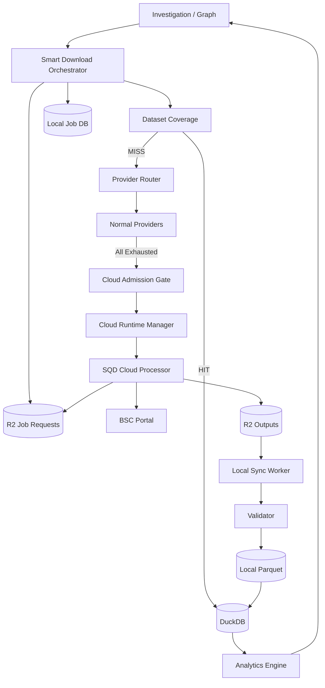

# SQD Cloud Emergency Provider Phase 4
# Job Worker + R2/S3 Production Export + Cloud Single-Chunk Verification

> **目标项目**
>
> - 本地控制面：`E:\codex\etl`
> - SQD Cloud Worker：`E:\Code\Processor-only`
>
> **前置阶段状态**
>
> - Smart Download Orchestrator 已接入 `sqd_cloud`
> - `sqd_cloud` 固定 Tier 100，应急兜底
> - Cloud Admission Gate 已完成
> - Provider Health / Circuit Breaker 已完成
> - Cloud Runtime Manager 已完成
> - 本地 / cloud / mock 三种 Runtime 模式已完成
> - 常规 Provider 全耗尽 → Cloud Admission → Cloud Job 落盘 → Worker 启动链路已验证
> - 当前本机到 `portal.sqd.dev` 存在 DNS/TLS 网络层阻断
> - 真实 SQD Cloud Processor + Portal 管线此前已验证成功
>
> **本阶段目标**
>
> 将当前“本地启动 Processor 的验证模式”升级为真正生产可用的：
>
> ```text
> Smart Download Orchestrator
> → Cloud Admission
> → SQD Cloud Worker
> → Job Queue / Lease
> → BSC Portal
> → R2/S3 Parquet
> → Manifest / Checkpoint / _SUCCESS
> → Local Sync
> → Validator
> → DuckDB
> → Investigation / Graph
> ```
>
> 版本：Phase 4 / V1.0  
> 日期：2026-08-07

---

# 1. 当前阶段结论

当前系统已经解决：

```text
何时启用 Cloud
如何保证 Cloud 最后优先
如何自动启动 / 回收 Worker
如何避免单次 503 直接切 Cloud
如何记录 Provider Attempts
如何审计 Cloud 使用
```

但生产数据面仍缺：

```text
1. 真正部署在 SQD Cloud 中的 Job-driven Worker
2. Worker 动态领取 Chunk，而不是依赖固定环境变量
3. R2/S3 持久化
4. Remote Checkpoint
5. Remote Manifest
6. Local Sync
7. Cloud 单 Chunk 实链闭环验证
```

因此当前状态应该定义为：

```text
Control Plane: PASS
Routing Plane: PASS
Emergency Admission: PASS
Runtime Skeleton: PASS

Production Cloud Data Plane: PARTIAL
```

---

# 2. 最重要的架构修正

当前本机存在：

```text
portal.sqd.dev
→ TCP 可达
→ DNS/TLS/握手层失败
```

因此正式生产不能依赖：

```text
本地启动 Processor
→ 本地直接访问 Portal
```

正式 Cloud 模式必须：

```text
Local Backend
→ sqd deploy
→ SQD Cloud Processor
→ portal.sqd.dev
```

也就是说：

```text
local runtime mode
```

只能用于：

```text
开发
测试
mock
本地逻辑验证
```

正式 Provider：

```text
SQD_CLOUD_EXPORT
```

必须使用：

```text
cloud runtime mode
```

---

# 3. 最终生产架构



---

# 4. Worker 从固定参数改成 Job-driven

当前 Worker 已支持：

```text
FROM_BLOCK
TO_BLOCK
WATCH_ADDRESSES
```

这适合 Smoke Test。

正式版本禁止每个 Job：

```text
改 env
→ 改 squid.yaml
→ deploy
```

必须改为：

```text
固定 Worker Release
+
动态 Job Queue
```

Worker 启动后：

```text
poll pending jobs
→ lease job
→ execute
→ write checkpoint
→ upload parquet
→ manifest
→ success
→ next job
```

---

# 5. Worker Job Polling

新增：

```text
E:\Code\Processor-only\src\
├── job-poller.ts
├── job-runner.ts
├── lease.ts
├── checkpoint.ts
├── manifest.ts
├── object-store.ts
└── datasets\
    └── token-transfer.ts
```

Worker 主循环：

```typescript
while (!shutdownRequested) {
    const job = await jobPoller.acquire()

    if (!job) {
        await sleep(POLL_INTERVAL)
        continue
    }

    await jobRunner.run(job)
}
```

推荐：

```text
POLL_INTERVAL = 5~10 秒
```

不要：

```text
100ms
500ms
1s 高频轮询
```

---

# 6. Job Queue 推荐方案

V1 推荐：

```text
Local Backend
→ 写 R2 pending job
→ Cloud Worker 轮询 R2
```

目录：

```text
sqd-cloud/
└── jobs/
    ├── pending/
    ├── leased/
    ├── completed/
    └── failed/
```

Job：

```text
pending/job_xxx/chunk_xxx/request.json
```

---

# 7. Job Request Schema

```json
{
  "schema_version": 1,

  "job_id": "job_20260807_000001",
  "chunk_id": "chunk_000128",

  "chain_id": 56,
  "chain_key": "bsc",

  "dataset": "token_transfer",

  "addresses": [
    "0xaaa...",
    "0xbbb..."
  ],

  "from_block": 90000000,
  "to_block": 90049999,

  "attempt": 1,

  "priority": 90,

  "created_at": "2026-08-07T00:00:00Z"
}
```

---

# 8. Job Lease

即使当前：

```text
max_concurrent_workers = 1
```

也必须支持 Lease。

Lease：

```json
{
  "job_id": "job_...",
  "chunk_id": "chunk_...",

  "worker_id": "sqd-worker-v1",

  "leased_at": "...",
  "lease_expires_at": "...",

  "heartbeat_at": "..."
}
```

Lease TTL：

```text
建议 5~10 分钟
```

Worker 每：

```text
30~60 秒
```

刷新。

---

# 9. Lease 防重复原则

获取 Job 时：

```text
pending
→ atomic lease
→ leased
```

同一个：

```text
job_id + chunk_id
```

不得同时被两个 Worker 领取。

---

# 10. Job 幂等

Worker 开始前检查：

```text
completed/<job>/<chunk>/_SUCCESS
```

若存在：

```text
SKIP
```

不要重复跑。

---

# 11. R2 / S3 对象存储

正式版本推荐：

```text
Cloudflare R2
```

也保留：

```text
AWS S3
S3-compatible
```

统一接口：

```typescript
interface ObjectStore {
    get(path: string): Promise<Buffer>
    put(path: string, body: Buffer): Promise<void>
    exists(path: string): Promise<boolean>
    delete(path: string): Promise<void>
    list(prefix: string): Promise<ObjectInfo[]>
}
```

---

# 12. Secret

Cloud Worker Secret：

```text
R2_ENDPOINT
R2_BUCKET
R2_ACCESS_KEY_ID
R2_SECRET_ACCESS_KEY
```

Local Backend：

```text
SQD_DEPLOY_KEY
R2_ENDPOINT
R2_BUCKET
R2_ACCESS_KEY_ID
R2_SECRET_ACCESS_KEY
```

不得：

```text
写入 Git
写入 request.json
写入 manifest.json
写入前端响应
```

---

# 13. 对象目录

推荐：

```text
sqd-cloud/
└── bsc/
    └── jobs/
        └── job_20260807_000001/
            ├── request.json
            ├── status.json
            ├── checkpoint.json
            ├── manifest.json
            ├── chunks/
            │   └── chunk_000128/
            │       ├── request.json
            │       ├── status.json
            │       ├── checkpoint.json
            │       ├── token_transfers/
            │       │   ├── part-000001.parquet
            │       │   └── part-000002.parquet
            │       └── _SUCCESS
            └── _SUCCESS
```

---

# 14. Worker Status

Chunk status：

```text
PENDING
LEASED
RUNNING
EXPORTING
VERIFYING
COMPLETED
FAILED
RETRYABLE
```

status.json：

```json
{
  "job_id": "...",
  "chunk_id": "...",

  "status": "RUNNING",

  "worker_id": "...",

  "started_at": "...",

  "current_block": 90024000,

  "rows_written": 382922,

  "last_progress_at": "..."
}
```

---

# 15. Remote Checkpoint

当前本地：

```text
data\status.txt
```

仅限 smoke。

正式：

```text
R2 checkpoint.json
```

结构：

```json
{
  "schema_version": 1,

  "job_id": "...",
  "chunk_id": "...",

  "from_block": 90000000,
  "to_block": 90049999,

  "last_completed_block": 90024000,

  "rows_written": 382922,

  "files": [
    "part-000001.parquet"
  ],

  "updated_at": "..."
}
```

---

# 16. Checkpoint 频率

不要每一行上传。

推荐：

```text
每 5,000~20,000 blocks
或
每 30~60 秒
```

取先到者。

---

# 17. Worker 重启

Worker 重启：

```text
读取 leased / retryable jobs
→ 判断 lease 是否过期
→ 读取 checkpoint
→ 从 last_completed_block + 1 继续
```

---

# 18. Parquet Schema

Phase 4 只做：

```text
token_transfer
```

Schema：

```text
chain_id
block_number
block_timestamp
transaction_hash
log_index
token_address
from_address
to_address
value_raw
```

唯一键：

```text
chain_id
block_number
transaction_hash
log_index
```

---

# 19. 地址过滤

当前已有：

```text
WATCH_ADDRESSES
```

正式改为：

```text
job.addresses
```

需要支持：

```text
from_address in addresses
OR
to_address in addresses
```

如果 Portal Filter 支持 topic address 过滤：

```text
优先服务端过滤
```

否则：

```text
Portal 查询 Token Transfer
→ Worker 本地过滤
```

必须记录：

```text
filter_mode
```

---

# 20. Chunk 大小

不要写死一个永久值。

V1 推荐：

```text
address group = 25
block window = 50,000
```

但配置化：

```yaml
sqd_cloud:
  chunking:
    addresses_per_chunk: 25
    blocks_per_chunk: 50000
```

后续根据：

```text
latency
row count
memory
Portal response
```

自适应。

---

# 21. Flush 修复

当前 smoke 逻辑：

```text
isHead
→ setForceFlush(true)
```

正式删除。

改为：

```text
文件达到 target size
或
区块累计达到 threshold
或
flush interval 到期
```

推荐：

```yaml
parquet:
  target_file_mb: 128
  max_blocks_per_file: 50000
  force_flush_interval: 15m
```

---

# 22. Manifest

Chunk 完成后：

```json
{
  "schema_version": 1,

  "job_id": "...",
  "chunk_id": "...",

  "provider": "SQD_CLOUD_EXPORT",

  "chain_id": 56,
  "dataset": "token_transfer",

  "from_block": 90000000,
  "to_block": 90049999,

  "address_count": 25,

  "row_count": 328471,

  "unique_key_count": 328471,

  "files": [
    {
      "path": ".../part-000001.parquet",
      "bytes": 9023712,
      "rows": 328471,
      "sha256": "..."
    }
  ],

  "started_at": "...",
  "completed_at": "...",

  "completed": true
}
```

---

# 23. `_SUCCESS`

写入顺序必须：

```text
1. parquet
2. checkpoint final
3. manifest
4. _SUCCESS
```

`_SUCCESS` 最后写。

Local Sync：

```text
只有看到 _SUCCESS
才开始正式同步
```

---

# 24. Remote Validation

Worker 在写 `_SUCCESS` 前至少验证：

```text
Parquet footer 可读
row count > 0 或允许 0
所有文件存在
SHA256 已计算
Manifest files 与实际文件一致
```

---

# 25. 0 行 Chunk

地址在该窗口可能无交易。

因此：

```text
row_count = 0
```

不等于失败。

仍应：

```text
completed = true
_SUCCESS
```

并登记 Coverage。

---

# 26. Local Sync Worker

本地：

```text
E:\codex\etl\internal\datasetsync
```

或复用现有模块。

流程：

```text
scan completed manifests
→ reserve local sync
→ download .partial
→ Range Resume
→ sha256
→ rename
→ validator
→ dataset registry
→ DuckDB
```

---

# 27. Local Download Resume

输出：

```text
part.parquet.partial
```

成功后：

```text
atomic rename
→ part.parquet
```

---

# 28. Local Validator

验证：

```text
SHA256
Parquet footer
Schema
Row Count
Min Block
Max Block
Unique Key
Duplicate
```

---

# 29. Duplicate

由于多个地址可能同时命中同一 Transfer：

```text
Cloud output 可以产生重复
```

但最终 Dataset：

```text
duplicate after dedupe = 0
```

---

# 30. Dataset Registry

Cloud 文件入库后：

```text
provider = SQD_CLOUD_EXPORT
```

与现有：

```text
SQD Public
RPC
AWS
Browser
```

统一。

---

# 31. Coverage

成功 Chunk：

```text
即使 0 rows
```

也要登记：

```text
address/group + dataset + range = complete
```

否则系统会不停重复下载“没有交易”的窗口。

---

# 32. Cloud Runtime 生产模式

Runtime：

```text
mock
local
cloud
```

正式：

```text
cloud
```

Cloud mode：

```text
EnsureWorker
→ sqd list
→ missing?
→ sqd deploy
→ wait Ready
→ return
```

---

# 33. `SQD_DEPLOY_KEY`

只能：

```text
环境变量
或现有 Secret Store 注入
```

禁止：

```text
配置文件明文
数据库明文
前端
日志
```

---

# 34. Organization

当前已验证：

```text
supreme
```

配置：

```yaml
sqd_cloud:
  organization: supreme
```

不需要用户每次输入。

---

# 35. Worker Release

不要每 Job Build。

使用：

```text
固定 release
```

例如：

```text
bsc-emergency-worker
slot v2
```

Worker 逻辑变化时：

```text
才 deploy 新 release
```

---

# 36. Deployment Build

已确认 Cloud image：

```text
Node 20
```

以及原生 `lzo` 问题。

继续使用：

```text
npm ci --ignore-scripts
```

且：

```text
compression = GZIP
```

---

# 37. `.squidignore`

必须排除：

```text
node_modules/
data/
logs/
builds/
lib/
*.parquet
*.tar.gz
```

避免部署包再次超过 52 MB。

---

# 38. Cloud Worker Idle

Runtime Manager 已支持：

```text
20 分钟 Idle Remove
```

Phase 4 需要将 Idle 条件改为：

```text
没有 running job
AND
没有 leased job
AND
pending emergency queue = 0
AND
last_job_finished > 20m
```

才 Remove。

---

# 39. Cloud Runtime 与 Job Queue 联动

错误：

```text
Admission
→ Worker Ready
→ 立即认为任务成功
```

正确：

```text
Admission
→ EnsureWorker
→ enqueue job
→ wait/poll job status
→ remote completed
→ local sync
```

---

# 40. 调度器 ProviderJob

建议：

```go
type ProviderJob struct {
    Provider     string
    RemoteJobID  string
    RemoteChunkID string
    Status       string
    ManifestPath string
}
```

---

# 41. SQD Cloud Provider Submit

```go
func (p *Provider) Submit(
    ctx context.Context,
    chunk Chunk,
) (ProviderJob, error) {
    // 1 Ensure worker
    // 2 write R2 request
    // 3 return remote job handle
}
```

不要同步阻塞直到整个历史窗口完成。

---

# 42. Provider Status

```go
func (p *Provider) Status(
    ctx context.Context,
    job ProviderJob,
) (ProviderJobStatus, error)
```

读取：

```text
status.json
manifest.json
_SUCCESS
```

---

# 43. Provider Cancel

V1：

```text
写 cancel marker
```

例如：

```text
cancel_requested
```

Worker 在批次边界：

```text
检测
→ checkpoint
→ CANCELLED
```

---

# 44. Cloud Failure

Cloud Job 失败：

```text
保留：
request
status
checkpoint
logs ref
error
```

进入：

```text
RETRYABLE
```

而不是删除证据。

---

# 45. Cloud Job Retry

Retry：

```text
沿用原 chunk_id
attempt + 1
```

不要新建完全无关联 Job。

---

# 46. ProviderAttempts

Phase 4 继续写：

```text
provider = SQD_CLOUD_EXPORT
```

附：

```text
remote_job_id
remote_chunk_id
manifest_path
```

---

# 47. Cloud Usage Audit

当前已有：

```text
E:\codex\bsc_analytics\sqd-cloud\cloud_usage.json
```

正式可继续保留，同时建议进入结构化存储。

字段：

```text
deploy_started_at
ready_at
first_job_at
last_job_at
remove_at
runtime_seconds
jobs
chunks
rows
bytes
```

---

# 48. API

现有：

```text
GET /api/scheduler/providers/health
GET /api/scheduler/cloud/runtime
```

新增建议：

```text
GET /api/scheduler/cloud/jobs
GET /api/scheduler/cloud/jobs/{id}
GET /api/scheduler/cloud/usage
```

---

# 49. Frontend

现有：

```text
☁ 应急兜底
```

Phase 4 增加：

```text
Cloud Worker：ABSENT / DEPLOYING / READY / BUSY / IDLE
Emergency Queue：N
Current Job：...
Current Chunk：...
Rows Exported：...
R2 Sync：...
```

---

# 50. 不向用户暴露 Deployment Key

API：

```text
deployment_key_configured = true/false
```

只能返回 Boolean。

禁止：

```text
value
prefix
last4
```

---

# 51. 本机 Portal 网络阻断处理

当前本地：

```text
portal.sqd.dev TLS/DNS handshake failure
```

这不应阻塞 Cloud Mode。

需要调整测试：

```text
Local mode integration test
→ 可以因为本地网络失败而 SKIP / EXPECTED_FAIL

Cloud mode integration test
→ 必须作为生产验收
```

---

# 52. 单 Chunk Cloud 真实验证

Phase 4 最关键的真实测试：

```text
1 个地址组
25 addresses 以下

dataset:
token_transfer

block range:
5,000~50,000 blocks
```

流程：

```text
Normal Provider Fault Injection
→ All Exhausted
→ Cloud Admission
→ Cloud Worker Deploy
→ Worker lease Chunk
→ BSC Portal
→ R2
→ manifest
→ _SUCCESS
→ Local Sync
→ Validator
→ DuckDB
→ Graph/Investigation visible
→ Normal Provider Recover
→ Cloud Idle Remove
```

---

# 53. 测试禁止事项

不要：

```text
真实轰击 RPC 制造 429
真实轰击 Portal 制造 503
真实制造 WAF 风控
```

继续使用：

```text
Fault Injection
```

只让：

```text
Cloud Data Plane
```

走真实链。

---

# 54. Cloud 单 Chunk验收标准

必须：

```text
Cloud Admission = APPROVED

sqd_cloud Worker:
DEPLOYING
→ READY
→ BUSY

Portal:
真实返回

R2:
request exists
parquet exists
manifest exists
_SUCCESS exists

Local:
download complete
sha256 PASS
parquet PASS

DuckDB:
rows queryable

ProviderAttempts:
完整

Cloud Usage:
完整

Idle:
20m 后 remove
```

---

# 55. Network-independent 验收

由于本机 Portal 网络异常：

```text
最终生产验收不能依赖本机直接 Portal
```

必须证明：

```text
Cloud Processor 在 SQD Cloud 网络内完成 Portal 请求
```

这是本阶段核心。

---

# 56. 调查联动验收

用户调查一个地址。

当 Normal Provider Fault Injection 全失败：

```text
Investigation
→ DataRequirement
→ Orchestrator
→ Cloud
→ R2
→ DuckDB
→ Investigation Result
```

不得：

```text
要求用户手工触发 Cloud
```

---

# 57. Graph 联动验收

Graph：

```text
Expand Downstream
```

Normal Provider 全失败：

```text
Cloud 自动兜底
```

数据入库：

```text
DATASET_INDEXED
```

Graph：

```text
自动增量添加节点和边
```

---

# 58. Recovery 回切

测试：

```text
Cloud 正在处理 chunk A
Normal Provider 恢复
```

预期：

```text
A 自然完成
chunk B → Normal Provider
Cloud 不再领取新 Job
Idle → remove
```

---

# 59. Budget Guard

现有 Admission 已有 Budget。

Phase 4 必须将真实：

```text
Worker Runtime
```

反馈到预算。

不能只记录：

```text
Job duration
```

Cloud Runtime：

```text
DEPLOYING + STARTING + READY + BUSY + IDLE
```

都属于可能产生资源用量的时间。

---

# 60. Runtime Crash Recovery

本地 Backend 重启：

```text
读取 cloud runtime persistent state
→ sqd list --org supreme
→ 对账实际 Worker
```

如果：

```text
DB = ABSENT
Cloud = DEPLOYED
```

应：

```text
RECOVER READY/IDLE
```

不是重新 deploy。

---

# 61. Orphan Worker Reconciliation

服务启动：

```text
CloudRuntimeManager.Reconcile()
```

执行：

```text
sqd list --org supreme
```

查：

```text
managed squid / slot
```

并恢复状态。

---

# 62. Runtime Ownership

必须用标签或固定：

```text
name
slot
organization
```

识别自己的 Worker。

不要误删其他 Squid。

---

# 63. Remove Safety

删除前检查：

```text
organization == supreme
name == configured managed worker
slot == managed slot
```

禁止：

```text
模糊删除整个 org
```

---

# 64. Worker Logs

需要保留：

```text
remote job_id
chunk_id
from_block
to_block
address_count
rows
files
duration
```

禁止输出：

```text
R2 Secret
Deployment Key
```

---

# 65. Structured Logging

建议 Worker：

```json
{
  "event": "chunk_progress",
  "job_id": "...",
  "chunk_id": "...",
  "block": 90024000,
  "rows": 382922
}
```

Local Backend 可解析。

---

# 66. `SQD_DEBUG`

Smoke 时：

```text
sqd:*
```

正式：

```text
INFO 默认
```

不要长期打印所有 HTTP headers。

仅故障排查：

```text
临时 DEBUG
```

---

# 67. Timeout

建议：

```text
deploy timeout = 10m
worker ready timeout = 10m
chunk no-progress timeout = 10m
manifest sync timeout = configurable
```

---

# 68. No Progress

若：

```text
last_progress > 10m
```

Worker：

```text
DEGRADED
```

Runtime：

```text
记录
→ 尝试恢复
```

避免无限 BUSY。

---

# 69. Cloud Job Heartbeat

Worker 每：

```text
30~60 sec
```

更新：

```text
heartbeat_at
current_block
rows
```

---

# 70. Worker Shutdown

收到 remove/cancel 前：

```text
停止领取新 Job
→ 完成当前 batch
→ 写 checkpoint
→ flush
→ graceful exit
```

---

# 71. V1 不做的事情

Phase 4 不做：

```text
ETH
Base
Arbitrum
Transaction Dataset
Trace Dataset
NFT
多 Worker 自动扩容
复杂 Cost Optimizer
AI 动态 Provider 预测
```

只做：

```text
BSC Token Transfer
1 Worker
完整生产闭环
```

---

# 72. 代码目录：本地 Backend

建议增量修改：

```text
E:\codex\etl\internal\providers\sqdcloud\
├── provider.go
├── r2_queue.go
├── status.go
└── cancel.go

E:\codex\etl\internal\cloudruntime\
├── manager.go
├── reconcile.go
├── idle_reaper.go
└── usage.go

E:\codex\etl\internal\datasetsync\
├── r2_sync.go
├── resume.go
└── validator.go
```

---

# 73. Worker 代码目录

```text
E:\Code\Processor-only\src\
├── main.ts
├── config.ts
├── job-poller.ts
├── job-runner.ts
├── lease.ts
├── portal-source.ts
├── parquet-writer.ts
├── checkpoint.ts
├── manifest.ts
├── object-store.ts
├── health.ts
└── datasets\
    └── token-transfer.ts
```

---

# 74. 配置示例

本地：

```yaml
sqd_cloud:
  enabled: true

  runtime_mode: cloud

  organization: supreme

  worker:
    name: bsc-emergency-worker
    slot: v2

  idle_remove_after: 20m

  poll_interval: 5s

  no_progress_timeout: 10m

  r2:
    endpoint: ${R2_ENDPOINT}
    bucket: ${R2_BUCKET}
```

---

# 75. Worker 配置

```yaml
worker:
  poll_interval: 5s
  lease_ttl: 10m
  heartbeat_interval: 30s

  parquet:
    compression: gzip
    target_file_mb: 128
    force_flush_interval: 15m
    max_blocks_per_file: 50000
```

---

# 76. Unit Tests

必须新增：

```text
Job Poller
Lease
Lease Expiry
Idempotency
Checkpoint
Manifest
_SUCCESS order
0-row chunk
R2 failure
Upload resume
Worker restart
Cancel
```

---

# 77. Backend Tests

必须新增：

```text
Cloud Submit writes request
Cloud Status reads remote status
Cloud completed triggers sync
Sync validates hash
Coverage registered
Cloud runtime reconcile
Orphan worker detected
Idle remove safety
```

---

# 78. Integration Tests

Mock R2：

```text
PASS
```

真实 R2：

```text
PASS
```

真实 SQD Cloud：

```text
至少 1 个单 Chunk PASS
```

---

# 79. Failure Injection

必须覆盖：

```text
R2 upload timeout
R2 download timeout
manifest missing
_SUCCESS missing
bad sha256
worker crash
lease expiry
portal 503
local backend restart
```

---

# 80. 生产验收总表

## Routing

- [ ] Normal Provider 可用 → Cloud 0 次。
- [ ] All Normal Exhausted → Cloud Admission。
- [ ] Cloud Budget 生效。

## Runtime

- [ ] Cloud Worker 自动 Deploy。
- [ ] 单实例。
- [ ] Backend 重启可 Reconcile。
- [ ] Idle 自动 Remove。

## Worker

- [ ] Job-driven。
- [ ] Lease。
- [ ] Heartbeat。
- [ ] Checkpoint。
- [ ] Idempotent。

## R2

- [ ] request。
- [ ] parquet。
- [ ] manifest。
- [ ] checkpoint。
- [ ] `_SUCCESS`。

## Local

- [ ] Resume Download。
- [ ] SHA256。
- [ ] Parquet Validator。
- [ ] Dataset Registry。
- [ ] Coverage。
- [ ] DuckDB。

## UI / Investigation / Graph

- [ ] Cloud 状态可见。
- [ ] 不泄露 Secret。
- [ ] Investigation 自动继续。
- [ ] Graph 自动增量更新。
- [ ] Normal Provider 恢复后回切。

---

# 81. Codex 执行顺序

```text
Phase 4.1
R2 ObjectStore + Secret
```

```text
Phase 4.2
Worker Job Poller + Lease
```

```text
Phase 4.3
Job Runner + Token Transfer
```

```text
Phase 4.4
Remote Checkpoint + Manifest + _SUCCESS
```

```text
Phase 4.5
Local R2 Sync + Validator
```

```text
Phase 4.6
Dataset Registry + Coverage
```

```text
Phase 4.7
Cloud Runtime Reconcile
```

```text
Phase 4.8
Real SQD Cloud Single Chunk
```

```text
Phase 4.9
Investigation / Graph E2E
```

```text
Phase 4.10
Idle Remove + Provider Recovery
```

---

# 82. Codex 最终执行指令

```text
当前 Smart Download Orchestrator 的 SQD Cloud Tier 100 应急路由、Admission Gate、
Circuit Breaker、Runtime Manager、Provider Attempts、Cloud Usage Audit 已经完成并通过测试。

不要重做这些模块。

当前真正缺口是 Production Cloud Data Plane。

请实施 Phase 4：

1. 将 E:\Code\Processor-only 从固定 env smoke worker 改造成 Job-driven Worker。
2. Worker 使用 R2/S3 轮询 pending Job，不允许每个 Job 修改 squid.yaml 后重新 Deploy。
3. 实现 Lease / Heartbeat / Checkpoint / Manifest / _SUCCESS。
4. 第一阶段只支持 BSC Token Transfer。
5. 修复链头逐块 setForceFlush(true)，正式输出按文件大小/区块/时间 Flush。
6. Cloud 输出必须写 R2/S3，不能依赖 Cloud 临时 ./data。
7. Local Backend 的 sqd_cloud Provider Submit 只负责 EnsureWorker + enqueue Job。
8. Provider Status 通过 remote status / manifest / _SUCCESS 判断。
9. Local Sync 支持 .partial + Range Resume + SHA256。
10. Validator 校验 Schema / Row Count / Unique Key / Duplicate。
11. 成功后登记 Dataset Registry / Coverage。
12. Backend 重启必须通过 sqd list --org supreme Reconcile 已存在 Worker。
13. Idle Remove 前必须保证 pending/leased/running Job 均为 0。
14. 当前本机 portal.sqd.dev DNS/TLS 异常不得作为生产阻塞；真实验收必须在 SQD Cloud Processor 内访问 Portal。
15. 使用 Fault Injection 让所有 Normal Provider Exhausted，然后完成真实 Cloud 单 Chunk E2E：
    Admission → Deploy → Lease → Portal → R2 → Manifest → Local Sync → DuckDB → Graph/Investigation。
16. Normal Provider 恢复后，新 Chunk 自动回切；正在运行 Cloud Chunk 自然完成。
17. 完成后输出 PHASE4_IMPLEMENTATION_REPORT.md。

必须继续保证：
- SQD Cloud 固定 Tier 100；
- Normal Provider 可用时 Cloud 调用次数为 0；
- Deployment Key / R2 Secret 不进日志、前端、Git；
- 不重构掉现有 Browser/SQD Public/RPC/AWS Provider。
```

---

# 83. 本阶段完成定义

Phase 4 完成后，才可以把系统状态从：

```text
Cloud Emergency Routing Ready
```

升级为：

```text
Production Cloud Emergency Data Plane Ready
```

最终应真正做到：

```text
所有常规下载方式失败
→ 自动启用 SQD Cloud
→ Cloud 内完成真实 Portal 数据获取
→ R2/S3 持久化
→ 本地自动同步
→ DuckDB
→ 智能调查 / 关系图继续执行
→ 常规 Provider 恢复
→ 自动回切
→ Cloud 空闲删除
```
