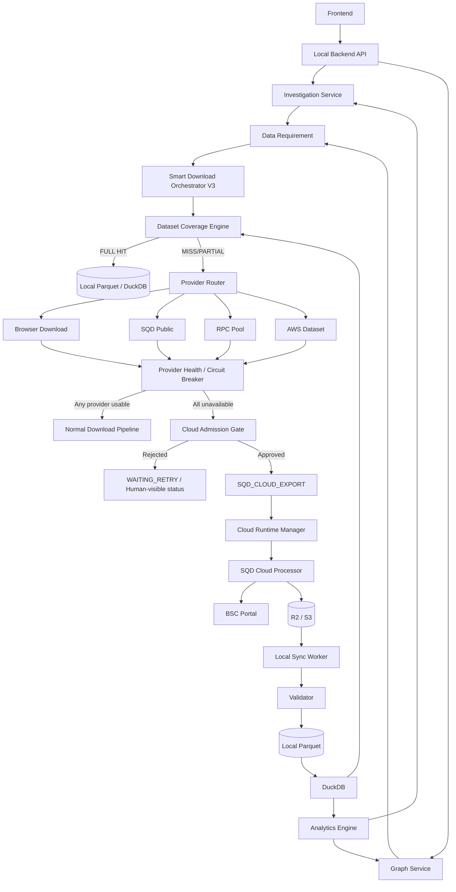

# Smart Download Orchestrator V3.0
# SQD Cloud 最终兜底 Provider 接入设计与实施方案

> **用途**：供 Codex 直接实施  
> **项目目标**：在现有链上分析工具中接入 `SQD_CLOUD_EXPORT`，但将其严格定位为**最后一级兜底数据源**。  
> **Cloud Worker 项目目录**：`E:\Code\Processor-only`  
> **本地链上分析项目**：沿用现有项目目录与模块，不改变既有主架构  
> **目标链**：优先 BSC，保留 ETH / Base / Arbitrum 扩展能力  
> **核心原则**：**优先复用现有下载方式；只有现有下载方式全部不可用、被限流、被风控或无法在合理时间内完成时，才启用 SQD Cloud。**
>
> 文档版本：V3.0  
> 日期：2026-08-07

---

# 0. Codex 必须遵守的最高优先级规则

Codex 实施时必须严格遵守：

```text
1. 不替换现有下载体系。
2. 不将 SQD Cloud 设置为默认 Provider。
3. 不因为 SQD Cloud 当前测试稳定，就提高到第一优先级。
4. 所有现有数据源优先尝试。
5. 只有现有数据源均进入不可用状态后，才能启动 SQD Cloud。
6. SQD Cloud 只负责补齐缺失数据，不重复下载本地已有数据。
7. SQD Cloud Worker 不允许 24/7 无条件常驻。
8. Cloud Worker 必须支持按需启动、任务复用、空闲自动删除。
9. Deployment Key 不允许进入前端、Git、日志、R2/S3 Manifest。
10. Cloud 失败不能导致整个 Investigation 直接失败。
11. Cloud 恢复后也不能长期抢占现有低成本 Provider。
12. 所有 Provider 必须统一经过 Smart Download Orchestrator。
13. 智能调查和地址关系图不允许直接调用 SQD Cloud。
14. Graph Expand 必须复用同一 Provider Router 与 Dataset Coverage。
15. C: 盘不得作为项目数据目录。
```

---

# 1. 设计目标

当前系统已经存在多种下载方式：

```text
LOCAL_DATASET
BROWSER_DOWNLOAD
SQD_PUBLIC
RPC
AWS_DATASET
```

现新增：

```text
SQD_CLOUD_EXPORT
```

但新的 Cloud Provider 不是正常优先级 Provider，而是：

```text
LAST_RESORT_PROVIDER
FINAL_FALLBACK
EMERGENCY_EXPORT_CHANNEL
```

最终策略：

```text
优先：
本地已有数据
    ↓
当前正常工作的下载方式
    ↓
其他低成本/已有 Provider
    ↓
Provider 重试 + 退避 + 切换
    ↓
全部现有 Provider 均不可用
    ↓
SQD_CLOUD_EXPORT
```

---

# 2. 最终 Provider 优先级

推荐默认优先级：

```text
P0  LOCAL_DATASET
P1  BROWSER_DOWNLOAD
P2  SQD_PUBLIC
P3  RPC
P4  AWS_DATASET
P9  SQD_CLOUD_EXPORT
```

注意：

```text
P9 ≠ 永远最后执行一次

P9 表示：
只有 P0~P4 均不能满足当前 Data Requirement，
才有资格进入 Cloud Admission Gate。
```

不同数据类型允许稍微调整 P1~P4 的排序。

例如：

## Token Transfer 历史数据

```text
LOCAL_DATASET
→ SQD_PUBLIC
→ RPC
→ AWS_DATASET
→ BROWSER_DOWNLOAD（如有可用导出）
→ SQD_CLOUD_EXPORT
```

## 交易所 CSV / 浏览器可直接导出数据

```text
LOCAL_DATASET
→ BROWSER_DOWNLOAD
→ RPC / API
→ SQD_PUBLIC
→ AWS
→ SQD_CLOUD_EXPORT
```

## 最新余额 / 最新区块

```text
LOCAL_CACHE
→ RPC
→ 备用 RPC
→ SQD_PUBLIC（若适用）
→ SQD_CLOUD_EXPORT 不建议用于实时余额
```

Cloud Provider 必须根据数据类型判断：

```text
supports(dataset_type) == true
```

不允许为了“最后兜底”而强行承接不适合 Cloud Export 的数据类型。

---

# 3. 总体架构



---

# 4. 核心变化：增加 Cloud Admission Gate

不能写成：

```go
if currentProviderFailed {
    useSQDCloud()
}
```

必须变成：

```go
if allNormalProvidersUnavailable &&
   cloudEligible &&
   budgetAllowed &&
   noDuplicateCoverage &&
   cloudWorkerHealthy {
    useSQDCloud()
}
```

新增：

```text
CloudAdmissionGate
```

职责：

```text
判断当前任务是否真的需要启用付费 Cloud Provider。
```

---

# 5. Cloud 启用必须同时满足的条件

只有以下条件全部满足，才能启动 Cloud。

## 条件 A：Dataset Coverage 存在真实缺口

```text
requested_range
-
local_covered_range
=
missing_range
```

必须：

```text
missing_range > 0
```

禁止：

```text
本地已经完整覆盖
→ 仍启动 Cloud
```

---

## 条件 B：当前数据类型适合 SQD Cloud

例如：

```text
token_transfer     YES
logs               YES
transactions       YES
trace              YES
nft_transfer       YES
```

例如：

```text
实时余额            NO / RPC 优先
单个 tx receipt     NO / RPC 优先
token metadata     通常 API/RPC 优先
```

---

## 条件 C：所有正常 Provider 都不可用

所谓“不可用”不能只判断一次失败。

Provider 必须达到：

```text
CIRCUIT_OPEN
RATE_LIMITED
RISK_CONTROLLED
AUTH_BLOCKED
SERVICE_UNAVAILABLE
CAPABILITY_MISMATCH
DEADLINE_UNSATISFIABLE
```

才视为当前不可用。

---

# 6. Provider 状态模型

统一：

```go
type ProviderState string

const (
    ProviderHealthy       ProviderState = "HEALTHY"
    ProviderDegraded      ProviderState = "DEGRADED"
    ProviderRateLimited   ProviderState = "RATE_LIMITED"
    ProviderRiskControlled ProviderState = "RISK_CONTROLLED"
    ProviderCircuitOpen   ProviderState = "CIRCUIT_OPEN"
    ProviderAuthBlocked   ProviderState = "AUTH_BLOCKED"
    ProviderUnavailable   ProviderState = "UNAVAILABLE"
    ProviderUnsupported   ProviderState = "UNSUPPORTED"
)
```

---

# 7. 什么叫“被限流”

以下信号归类：

```text
HTTP 429
Retry-After
quota exhausted
rate limit exceeded
too many requests
provider throttle
request capacity exceeded
```

进入：

```text
RATE_LIMITED
```

---

# 8. 什么叫“被风控”

Browser/API/RPC 可能遇到：

```text
403
Cloudflare challenge
captcha
bot detected
access denied
IP banned
security verification
account temporarily restricted
WAF blocked
anti-abuse
```

进入：

```text
RISK_CONTROLLED
```

必须与普通 500 区分。

---

# 9. 什么叫“服务不可用”

例如：

```text
500
502
503
504
521
522
523
DNS failure
connection reset
connection refused
long timeout
no available workers
```

按照错误分类进入：

```text
DEGRADED
→ CIRCUIT_OPEN
```

而不是立即永久不可用。

---

# 10. Provider 健康评分

每个 Provider 保存：

```text
success_rate_5m
success_rate_30m
success_rate_24h

p50_latency
p95_latency

http_429_rate
http_403_rate
http_503_rate

timeout_rate
dns_error_rate
connection_reset_rate

throughput_rows_sec
throughput_bytes_sec

consecutive_failures
last_success_at
last_failure_at

circuit_state
cooldown_until
```

---

# 11. 熔断规则

建议默认参数：

```yaml
provider_circuit_breaker:
  consecutive_failures_to_degrade: 3
  consecutive_failures_to_open: 6

  error_rate_window: 20
  error_rate_to_open: 0.70

  rate_limit_open_after: 3
  risk_control_open_after: 1

  cooldown:
    rate_limit: 120s
    service_503: 60s
    timeout: 60s
    dns: 120s
    risk_control: 900s
```

解释：

### 503

```text
第一次
→ Retry

多次
→ DEGRADED

连续达到阈值
→ CIRCUIT_OPEN
```

### 403 / 风控

通常没必要疯狂重试：

```text
403/CAPTCHA
→ RISK_CONTROLLED
→ 长冷却
```

防止继续轰击导致封禁升级。

---

# 12. Retry Policy

普通 Provider：

```text
attempt 1
→ 2s

attempt 2
→ 5s

attempt 3
→ 10s

attempt 4
→ 30s

attempt 5
→ 60s
```

加：

```text
±20% jitter
```

禁止所有 Chunk 同时重试。

---

# 13. 正常 Provider 的 Exhaustion 判定

一个 Provider 只有满足以下之一才算“耗尽”：

```text
Circuit = OPEN
或
Rate Limited 且 cooldown 未结束
或
Risk Controlled
或
数据能力不匹配
或
认证不可用
或
预计无法在当前 Job Deadline 内完成
```

不能因为：

```text
一次 timeout
一次 503
一次下载慢
```

就算 Provider Exhausted。

---

# 14. All Providers Exhausted

新增函数：

```go
func (r *ProviderRouter) AllNormalProvidersExhausted(
    req DataRequirement,
) bool
```

逻辑：

```text
遍历所有非 Cloud Provider
    ↓
过滤 supports(req.dataset)
    ↓
检查 Coverage 可用性
    ↓
检查 Provider State
    ↓
只要还有一个 HEALTHY / DEGRADED但可用
    ↓
返回 false

全部 OPEN / LIMITED / CONTROLLED / UNSUPPORTED
    ↓
返回 true
```

---

# 15. Cloud Admission Gate 详细规则

```go
type CloudAdmissionDecision struct {
    Allowed bool
    Reason  string
    MissingCoverage MissingCoverage
    EstimatedCost EstimatedCost
}
```

伪代码：

```go
func CanUseSQDCloud(req DataRequirement) CloudAdmissionDecision {
    if coverage.FullHit(req) {
        return Reject("LOCAL_COVERAGE_FULL")
    }

    if !sqdCloud.Supports(req.Dataset) {
        return Reject("CLOUD_UNSUPPORTED_DATASET")
    }

    if !router.AllNormalProvidersExhausted(req) {
        return Reject("NORMAL_PROVIDER_AVAILABLE")
    }

    if budget.CloudDisabled {
        return Reject("CLOUD_DISABLED")
    }

    if budget.DailyLimitExceeded() {
        return Reject("CLOUD_BUDGET_EXCEEDED")
    }

    if runtime.IsInFailureCooldown() {
        return Reject("CLOUD_RUNTIME_COOLDOWN")
    }

    return Allow()
}
```

---

# 16. 强制 Cloud 最后优先

推荐为 Provider 增加：

```go
type ProviderTier int

const (
    TierLocal ProviderTier = 0
    TierNormal ProviderTier = 10
    TierFallback ProviderTier = 20
    TierEmergencyCloud ProviderTier = 100
)
```

SQD Cloud：

```text
Tier = 100
```

路由器不得仅按：

```text
latency
health_score
```

排序。

否则 Cloud 速度快时可能自动跑到前面。

正确排序：

```text
Tier
→ Capability
→ Health
→ Cost
→ Throughput
```

Tier 永远优先。

---

# 17. Cloud 不允许参加普通竞速

禁止：

```text
SQD Public
RPC
SQD Cloud
三路 race
谁先回来用谁
```

Cloud 只能在：

```text
Normal Provider Pool = exhausted
```

后进入候选。

---

# 18. Job 级 Provider 路由

一个 Job 可以拆成：

```text
Chunk 1 → SQD Public
Chunk 2 → RPC
Chunk 3 → AWS
```

只针对无法完成的 Chunk：

```text
Chunk 17
Chunk 39
Chunk 52
```

进入 Cloud。

不要：

```text
任意一个 Chunk 失败
→ 整个 Job 全部切 Cloud
```

---

# 19. Cloud 只补洞

例如：

```text
100,000 地址
总计 2,000 chunks
```

现有 Provider 已完成：

```text
1,850 chunks
```

失败：

```text
150 chunks
```

Cloud 必须只执行：

```text
150 missing chunks
```

禁止重新执行全部 2,000 chunks。

---

# 20. Dataset Coverage 是 Cloud 成本控制核心

必须先建设：

```text
DatasetRegistry
AddressCoverage
ChunkCoverage
```

每个 Chunk 完成后立即登记。

推荐表：

```sql
CREATE TABLE dataset_chunk_coverage (
    chain_id BIGINT NOT NULL,
    dataset_type VARCHAR NOT NULL,
    chunk_key VARCHAR NOT NULL,

    address_group_hash VARCHAR,
    from_block BIGINT NOT NULL,
    to_block BIGINT NOT NULL,

    provider VARCHAR NOT NULL,

    status VARCHAR NOT NULL,

    row_count BIGINT,
    file_path VARCHAR,
    sha256 VARCHAR,

    completed_at TIMESTAMP,

    PRIMARY KEY (
        chain_id,
        dataset_type,
        chunk_key
    )
);
```

---

# 21. Provider Attempt History

新增：

```sql
provider_attempts
```

字段：

```text
attempt_id
job_id
chunk_id

provider
started_at
finished_at

result

http_status
error_class
error_code
error_message

retry_after_seconds

bytes_received
rows_received

latency_ms
```

Cloud Admission Gate 根据真实历史判断，而不是猜。

---

# 22. Chunk 生命周期

```text
PLANNED
→ CACHE_CHECK
→ PROVIDER_SELECT
→ DOWNLOADING
→ VERIFYING
→ COMPLETED
```

失败：

```text
DOWNLOADING
→ RETRY_PENDING
→ PROVIDER_SELECT
```

所有普通 Provider Exhausted：

```text
PROVIDER_SELECT
→ CLOUD_ADMISSION
→ CLOUD_QUEUED
```

---

# 23. Job 状态机

```text
CREATED
    ↓
COVERAGE_CHECK
    ↓
PLANNING
    ↓
NORMAL_PROVIDER_RUNNING
    ↓
NORMAL_PROVIDER_RETRY
    ↓
NORMAL_PROVIDER_FALLBACK
    ↓
ALL_NORMAL_PROVIDERS_EXHAUSTED
    ↓
CLOUD_ADMISSION
    ↓
WAITING_CLOUD_WORKER
    ↓
CLOUD_RUNNING
    ↓
CLOUD_EXPORTING
    ↓
REMOTE_VERIFY
    ↓
LOCAL_SYNC
    ↓
LOCAL_VERIFY
    ↓
DUCKDB_INDEX
    ↓
ANALYSIS
    ↓
GRAPH_UPDATE
    ↓
COMPLETED
```

错误状态：

```text
WAITING_RETRY
PARTIAL
DEGRADED
CANCELLED
FAILED
BUDGET_BLOCKED
```

---

# 24. SQD Cloud Worker 模式

推荐：

```text
Warm Worker
```

流程：

```text
Cloud Admission 产生第一条 Job
    ↓
CloudRuntimeManager.EnsureWorker()
    ↓
Worker 是否存在？
    ├── READY → 使用
    └── ABSENT → Deploy
                    ↓
                  STARTING
                    ↓
                   READY
```

任务完成：

```text
BUSY
→ IDLE
```

若：

```text
15~30 分钟无新的 Cloud Job
```

自动：

```text
sqd remove
```

---

# 25. 为什么不能每个 Chunk Deploy

禁止：

```text
一个 Chunk
→ Deploy
→ 下载
→ Remove
```

否则：

```text
Cloud Control Plane 压力
Build 时间
Deploy 时间
失败概率
费用统计复杂
```

Worker 应在一个 Emergency Batch 内复用。

---

# 26. 为什么不能 24/7 常驻

Cloud 被设计成最后兜底。

正常情况下：

```text
本地 / SQD Public / RPC / AWS
```

应承担大部分任务。

因此：

```text
没有 Emergency Job
→ 不应该有 Running Cloud Processor
```

---

# 27. Cloud Runtime Manager

本地新增：

```text
internal/cloudruntime/
```

文件：

```text
manager.go
sqd_cli.go
worker_state.go
idle_reaper.go
health.go
lock.go
```

接口：

```go
type RuntimeManager interface {
    EnsureWorker(ctx context.Context) error
    Status(ctx context.Context) WorkerStatus
    RemoveWorker(ctx context.Context) error
    MarkBusy()
    MarkIdle()
}
```

---

# 28. 避免重复 Deploy

必须实现单实例锁：

```text
sqd-cloud-worker-lock
```

当 20 个 Chunk 同时进入 Cloud：

```text
Chunk 1：发现 ABSENT → 开始 Deploy
Chunk 2~20：看到 DEPLOYING → 等待
```

禁止：

```text
同时发起 20 次 sqd deploy
```

---

# 29. Worker 状态

```text
ABSENT
DEPLOYING
STARTING
READY
BUSY
IDLE
DEGRADED
FAILED
REMOVING
```

---

# 30. Worker Health

检查：

```text
sqd list
Processor state
最近日志
最后进度时间
最近成功 Portal 请求
连续失败数
```

建议：

```text
last_progress_age > 10m
→ DEGRADED
```

```text
restart loop
→ FAILED
```

---

# 31. Deployment Key 安全

Deployment Key 只允许：

```text
本地 Backend Secret Store
```

建议：

```text
DPAPI + AES-GCM
```

本地配置表只保存：

```text
encrypted_value
```

禁止：

```text
前端获取
日志打印
API 回传
Manifest 写入
R2 上传
Git 提交
```

---

# 32. Cloud Worker 不能直接接前端

禁止：

```text
Browser
→ Cloud Worker
```

必须：

```text
Browser
→ Local Backend
→ Orchestrator
→ Cloud Runtime
```

---

# 33. Cloud Job Queue

推荐放在对象存储或本地控制面。

建议 V1：

```text
本地 Job DB
+
R2 Job Manifest
```

任务：

```json
{
  "job_id": "job_...",
  "chunk_id": "chunk_...",
  "chain_id": 56,
  "dataset": "token_transfer",
  "addresses": [
    "0x..."
  ],
  "from_block": 90000000,
  "to_block": 90049999,
  "attempt": 1
}
```

---

# 34. Cloud Worker 输出

Cloud 不返回大 JSON。

输出：

```text
Parquet
Manifest
Checkpoint
_SUCCESS
```

---

# 35. R2 / S3 结构

```text
sqd-cloud/
└── bsc/
    └── jobs/
        └── job_xxx/
            ├── request.json
            ├── status.json
            ├── checkpoint.json
            ├── manifest.json
            ├── token_transfers/
            │   ├── chunk_0001/
            │   │   ├── part-0001.parquet
            │   │   └── _SUCCESS
            │   └── ...
            └── _SUCCESS
```

---

# 36. Remote Manifest

```json
{
  "job_id": "job_xxx",
  "provider": "SQD_CLOUD_EXPORT",

  "chain_id": 56,
  "dataset": "token_transfer",

  "from_block": 90000000,
  "to_block": 90049999,

  "requested_address_count": 25,

  "row_count": 328471,

  "files": [
    {
      "path": "token_transfers/chunk_0001/part-0001.parquet",
      "bytes": 9023712,
      "rows": 328471,
      "sha256": "..."
    }
  ],

  "completed": true
}
```

---

# 37. Cloud Checkpoint

Checkpoint 必须放对象存储。

不能依赖 Cloud Processor 本地：

```text
./data/status.txt
```

正式版本：

```text
R2 checkpoint.json
```

例如：

```json
{
  "job_id": "job_xxx",
  "chunk_id": "chunk_001",

  "last_completed_block": 90024000,

  "updated_at": "..."
}
```

---

# 38. Cloud Worker Flush 改造

冒烟版本存在：

```text
isHead
→ setForceFlush(true)
```

正式版本禁止每块 Flush。

推荐：

```text
目标文件 64~256 MB
或
10~30 分钟 Flush
或
固定区块阈值
```

例如：

```yaml
cloud_export:
  parquet:
    target_file_mb: 128
    force_flush_interval: 15m
    max_blocks_per_file: 50000
```

---

# 39. Local Sync Worker

新增：

```text
internal/datasetsync/
```

负责：

```text
读取 manifest
→ 下载 part 文件
→ .partial
→ Range Resume
→ SHA256
→ rename
→ Validator
```

---

# 40. 本地文件目录

不得使用 C:。

例如：

```text
E:\Code\data\
└── bsc\
    └── sqd-cloud\
        └── job_xxx\
```

如果现有项目已有统一数据根目录：

```text
必须复用现有配置
```

不要另建第二套数据资产路径。

---

# 41. Dataset Validator

必须执行：

## 文件

```text
exists
size > 0
sha256
```

## Parquet

```text
footer
schema
row groups
```

## 数据

```text
row_count
distinct unique key
duplicate_count
min_block
max_block
```

---

# 42. Token Transfer 唯一键

继续使用：

```text
chain_id
+
block_number
+
transaction_hash
+
log_index
```

最终：

```text
duplicate_count after dedupe = 0
```

---

# 43. Local Dataset Registry

Cloud 下载完成后必须登记：

```text
provider = SQD_CLOUD_EXPORT
```

且与其他 Provider 数据统一管理。

禁止建立：

```text
Cloud 数据单独一套查询系统
```

---

# 44. DuckDB

Cloud 数据进入：

```text
同一个 Dataset Registry
同一个 DuckDB 查询层
```

Graph 和 Investigation 不关心数据来自：

```text
RPC
SQD Public
AWS
Cloud
```

它们只查询标准化数据。

---

# 45. Investigation 联动

Investigation Planner：

```text
不允许直接：
call SQD Cloud
```

它只生成：

```text
DataRequirement
```

例如：

```json
{
  "chain_id": 56,
  "addresses": ["0x..."],
  "datasets": [
    "token_transfer"
  ],
  "range": {
    "from": 90000000,
    "to": 114000000
  }
}
```

Orchestrator 决定：

```text
本地
→ Public
→ RPC
→ AWS
→ Cloud
```

---

# 46. Graph 联动

用户在关系图点击：

```text
向下扩展
```

Graph：

```text
POST /api/graph/expand
```

后端生成 Data Requirement。

如果本地有：

```text
直接 DuckDB
```

如果缺：

```text
Normal Providers
```

Normal Providers 全失败：

```text
Cloud
```

因此用户完全不需要知道具体用了哪个数据源。

---

# 47. Graph Progressive Update

不要等整个三年 Job 完成才画图。

每个 Chunk：

```text
VALIDATED
→ DUCKDB_INDEXED
→ emit DATASET_INDEXED
```

Graph：

```text
增量增加 Nodes / Edges
```

这样：

```text
下载过程中关系图逐步出现
```

---

# 48. Cloud 费用保护

必须有：

```text
CloudBudgetGuard
```

配置：

```yaml
cloud_budget:
  enabled: true

  max_runtime_per_job_minutes: 360

  max_daily_runtime_minutes: 720

  max_concurrent_workers: 1

  idle_remove_after_minutes: 20
```

第一阶段：

```text
max_concurrent_workers = 1
```

禁止自动拉多个 Cloud Processor。

---

# 49. Cloud 使用审计

每次启用 Cloud 记录：

```text
为什么启用
哪些 Provider 已失败
各 Provider 错误
Cloud 开始时间
Cloud 结束时间
Runtime
处理 Chunk 数
Row 数
输出 Bytes
```

表：

```sql
cloud_usage_audit
```

---

# 50. Cloud Admission Reason

例如：

```json
{
  "reason": "ALL_NORMAL_PROVIDERS_EXHAUSTED",

  "providers": {
    "SQD_PUBLIC": "CIRCUIT_OPEN_503",
    "RPC_1": "RATE_LIMITED",
    "RPC_2": "RATE_LIMITED",
    "AWS": "DOWNLOAD_BLOCKED",
    "BROWSER": "RISK_CONTROLLED"
  }
}
```

这对后续判断 Cloud 是否被过度使用很重要。

---

# 51. Cloud 回切策略

Cloud 启用后，也不应该永远继续跑。

比如：

```text
SQD Public cooldown 到期
```

Health Probe：

```text
试探请求成功
→ HALF_OPEN
→ 连续成功
→ HEALTHY
```

新 Chunk：

```text
重新优先使用 SQD Public
```

Cloud 只完成：

```text
已经领取的 Chunk
```

然后：

```text
IDLE
→ remove
```

---

# 52. 不做正在运行 Chunk 的强制抢占

禁止：

```text
Cloud 正在写 Parquet
→ Public 恢复
→ 强杀 Cloud Chunk
```

正确：

```text
当前 Cloud Chunk 完成
后续 Chunk 回到 Normal Provider
```

---

# 53. Provider Recovery Probe

Circuit OPEN：

```text
cooldown 到期
→ HALF_OPEN
```

发送少量探测：

```text
1~3 requests
```

成功：

```text
HEALTHY
```

失败：

```text
OPEN
```

---

# 54. 风控恢复

对于：

```text
403 / captcha / WAF
```

不要每分钟 Probe。

建议：

```text
15~60 分钟
```

根据 Provider 设置。

---

# 55. Provider Router 伪代码

```go
func RouteChunk(
    ctx context.Context,
    chunk Chunk,
) ProviderDecision {

    if coverage.IsComplete(chunk) {
        return ProviderDecision{
            Provider: LOCAL_DATASET,
        }
    }

    normal := router.NormalProvidersFor(chunk)

    for _, p := range normal {
        if !p.Supports(chunk) {
            continue
        }

        state := health.State(p)

        if state == HEALTHY ||
           state == DEGRADED ||
           state == HALF_OPEN {

            return ProviderDecision{
                Provider: p.Name(),
            }
        }
    }

    cloudDecision := cloudGate.Admit(chunk)

    if cloudDecision.Allowed {
        return ProviderDecision{
            Provider: SQD_CLOUD_EXPORT,
        }
    }

    return ProviderDecision{
        Provider: NONE,
        Status: WAITING_RETRY,
    }
}
```

---

# 56. Provider 排序

推荐：

```go
sort.Slice(providers, func(i, j int) bool {
    if providers[i].Tier != providers[j].Tier {
        return providers[i].Tier < providers[j].Tier
    }

    if providers[i].HealthScore != providers[j].HealthScore {
        return providers[i].HealthScore > providers[j].HealthScore
    }

    return providers[i].EstimatedCost < providers[j].EstimatedCost
})
```

Cloud：

```text
Tier = 100
```

确保健康分再高也不能提前。

---

# 57. 配置中心

前端数据源管理中心新增：

```text
SQD Cloud Emergency Provider
```

显示：

```text
Enabled
Worker State
Cloud Admission Enabled
Daily Runtime
Current Runtime
Last Activated
Last Activation Reason
Cloud Chunks
Cloud Rows
```

---

# 58. Cloud 开关

前端可以提供：

```text
启用 SQD Cloud 最终兜底
```

默认：

```text
ON
```

但实际启用仍由 Gate 自动判断。

无需每次询问用户。

符合当前 Smart Download Orchestrator：

```text
系统自动决策
实在无法判断才交给 Agent
```

---

# 59. 不需要用户确认

Cloud Admission 符合规则后：

```text
自动启动
```

不要弹：

```text
是否启用 Cloud？
```

但前端需要明确显示：

```text
所有常规数据源当前不可用
已自动切换到 SQD Cloud 应急数据通道
```

---

# 60. Agent 只用于不确定决策

Agent 不应该决定：

```text
429 要不要 Cloud
503 要不要 Cloud
```

这些由规则引擎决定。

Agent 只处理：

```text
数据源能力不明确
浏览器下载可否替代
当前任务 SLA 与成本权衡不明确
新 Provider 未建规则
```

---

# 61. 下载调度页面

建议状态：

```text
当前任务
Token Transfer

本地覆盖：
82%

当前 Provider：
RPC-2

Provider 状态：
SQD Public    Circuit Open
RPC-1         Rate Limited
RPC-2         Running
AWS           Healthy
Browser       Available
SQD Cloud     Standby
```

如果全部失败：

```text
SQD Cloud
Standby → Starting → Ready → Running
```

---

# 62. Cloud 最终兜底 UI

不要把 Cloud 放在普通 Provider 第一屏突出推荐。

建议：

```text
高级 / 应急数据源
```

显示：

```text
SQD Cloud
模式：最后兜底
状态：Standby
本日用量：32 min
最近启动原因：All normal providers exhausted
```

---

# 63. API

## Provider Health

```http
GET /api/download/providers/health
```

## Provider Attempts

```http
GET /api/download/jobs/{jobId}/attempts
```

## Cloud State

```http
GET /api/download/cloud/runtime
```

## Cloud Usage

```http
GET /api/download/cloud/usage
```

## Job

```http
POST /api/download/jobs
GET  /api/download/jobs/{jobId}
```

---

# 64. Internal Events

```text
PROVIDER_RATE_LIMITED
PROVIDER_RISK_CONTROLLED
PROVIDER_CIRCUIT_OPEN
ALL_NORMAL_PROVIDERS_EXHAUSTED
CLOUD_ADMISSION_APPROVED
CLOUD_WORKER_DEPLOYING
CLOUD_WORKER_READY
CLOUD_JOB_RUNNING
CLOUD_JOB_COMPLETED
NORMAL_PROVIDER_RECOVERED
CLOUD_WORKER_IDLE
CLOUD_WORKER_REMOVED
```

---

# 65. 数据源事件日志

建议：

```json
{
  "event": "ALL_NORMAL_PROVIDERS_EXHAUSTED",
  "job_id": "...",
  "chunk_id": "...",
  "timestamp": "...",

  "states": {
    "sqd_public": "CIRCUIT_OPEN",
    "rpc_1": "RATE_LIMITED",
    "rpc_2": "RATE_LIMITED",
    "aws": "UNAVAILABLE",
    "browser": "RISK_CONTROLLED"
  }
}
```

---

# 66. Cloud Provider Health

Cloud 本身也要熔断。

例如：

```text
Cloud Processor Ready
但 Portal 连续 503
```

则：

```text
SQD_CLOUD_EXPORT = DEGRADED / OPEN
```

如果所有 Provider 包括 Cloud 都失败：

```text
WAITING_RETRY
```

不要死循环重新 Deploy。

---

# 67. Cloud Failure Cooldown

例如：

```yaml
sqd_cloud:
  runtime_failure_cooldown: 15m
  portal_failure_cooldown: 5m
  deploy_failure_cooldown: 10m
```

---

# 68. Cloud 部署失败

如果：

```text
npm build error
manifest error
deployment failure
```

进入：

```text
CLOUD_RUNTIME_FAILED
```

不允许立即无限：

```text
deploy
deploy
deploy
```

---

# 69. Cloud Build 资产固定化

当前 `E:\Code\Processor-only` 已经完成 Cloud 冒烟验证。

正式接入时不要每次动态改 Worker 源码。

推荐：

```text
固定 Worker Release
+
Job 参数驱动
```

例如：

```text
version = v2
```

后续 Job 通过：

```text
request.json
```

改变地址、区块、Dataset。

---

# 70. Cloud Worker 项目改造

当前：

```text
E:\Code\Processor-only
```

建议：

```text
src/
├── main.ts
├── config.ts
├── job-poller.ts
├── job-runner.ts
├── portal-source.ts
├── datasets/
│   ├── token-transfer.ts
│   ├── transaction.ts
│   └── trace.ts
├── parquet-writer.ts
├── checkpoint.ts
├── manifest.ts
├── object-store.ts
└── health.ts
```

V1 只启用：

```text
token-transfer.ts
```

---

# 71. 不允许 Job 参数写入 squid.yaml 后重新 Deploy

错误方式：

```text
每个 Job 修改：
TOKEN_CONTRACT
FROM_BLOCK
TO_BLOCK

然后 deploy 新 Slot
```

正确：

```text
Worker 是固定程序
Job 参数从 R2 / Job API 动态读取
```

---

# 72. Worker Polling

推荐：

```text
每 5~10 秒
```

轮询：

```text
pending job
```

不要小于 1 秒。

---

# 73. Worker 领取任务

需要 Lease：

```json
{
  "worker_id": "...",
  "leased_at": "...",
  "lease_expires_at": "..."
}
```

防止未来多 Worker 重复处理。

V1 虽然：

```text
max_workers = 1
```

也建议保留 Lease 模型。

---

# 74. Job 幂等

唯一：

```text
job_id + chunk_id
```

Cloud 输出前检查：

```text
_SUCCESS
```

存在则：

```text
skip
```

---

# 75. Provider Router 与 Graph 扩展

Graph 扩展场景：

```text
用户点一个新地址
```

如果：

```text
本地没数据
```

Router 仍然：

```text
Browser / SQD Public / RPC / AWS
```

优先。

只有全部失败：

```text
Cloud
```

禁止 Graph 特殊通道绕过规则。

---

# 76. 调查任务优先级

Job Priority：

```text
Interactive Graph Expand     100
Investigation Active         90
Manual Download              70
Prefetch                     40
Background Cache Fill        20
```

Cloud Emergency Queue 优先：

```text
Interactive / Active Investigation
```

后台预取不建议触发 Cloud。

---

# 77. 非关键后台任务禁止触发 Cloud

例如：

```text
Prefetch
Cache Warmup
全链背景扫描
低优先级统计
```

默认：

```text
cloud_eligible = false
```

避免付费资源被背景任务消耗。

---

# 78. Cloud Eligibility

DataRequirement 增加：

```go
CloudEligible bool
```

默认：

```text
用户主动调查       true
Graph Expand       true
手动下载           true
后台预取           false
统计刷新           false
```

---

# 79. 任务 SLA

可以增加：

```text
deadline_at
```

如果 Normal Provider 虽然可用，但速度：

```text
预计 14 小时
```

用户当前调查 Deadline：

```text
1 小时
```

可判定：

```text
DEADLINE_UNSATISFIABLE
```

允许 Cloud。

但 V1 建议：

```text
先只使用明确失败触发
```

等有真实数据后再启用 SLA 预测。

---

# 80. V1 Cloud 启用条件建议

V1 简化：

```text
1. Local coverage miss
2. CloudEligible = true
3. 所有支持当前 Dataset 的 Normal Provider：
   - OPEN
   - RATE_LIMITED
   - RISK_CONTROLLED
   - UNAVAILABLE
   - UNSUPPORTED
4. Cloud daily budget 未超限
5. Cloud 不在 cooldown
```

满足后：

```text
auto admit
```

---

# 81. V2 再加入预测调度

后续：

```text
ETA
Cost
Historical Throughput
Provider Queue
```

做动态选择。

V1 不要过度复杂。

---

# 82. 默认配置示例

```yaml
smart_download:
  cloud_fallback:
    enabled: true

    provider: SQD_CLOUD_EXPORT

    tier: 100

    require_all_normal_providers_exhausted: true

    eligible_priorities:
      - interactive
      - investigation
      - manual

    idle_remove_after: 20m

    deploy_timeout: 10m

    runtime_failure_cooldown: 15m

    max_concurrent_workers: 1

    retry:
      max_attempts: 5
      backoff:
        - 2s
        - 5s
        - 10s
        - 30s
        - 60s

  circuit_breaker:
    failure_to_degrade: 3
    failure_to_open: 6

    cooldown:
      rate_limit: 120s
      service_error: 60s
      timeout: 60s
      risk_control: 900s
```

---

# 83. Provider 配置

```yaml
providers:
  local:
    tier: 0

  browser:
    tier: 10

  sqd_public:
    tier: 10

  rpc:
    tier: 10

  aws:
    tier: 10

  sqd_cloud:
    tier: 100
    emergency_only: true
```

---

# 84. 当前 SQD Cloud 已验证能力

当前 Cloud Smoke Test 已验证：

```text
Professional Organization
Dedicated small Processor
BSC Portal
USDT Transfer
约 5 万区块历史追赶
实时跟链
HTTP 200
Processor 正常运行
Cloud 资源可创建
Cloud 资源可删除
```

正式接入不需要重新证明基础可部署性。

下一阶段重点：

```text
Job 驱动
R2 持久化
Warm Worker
Cloud Admission Gate
本地自动同步
```

---

# 85. 实施 Phase 1：Provider Router 改造

目标：

```text
加入 Tier
加入 ProviderState
加入 AllNormalProvidersExhausted
加入 CloudAdmissionGate
```

验收：

```text
Cloud 不会在正常 Provider 可用时被选中。
```

---

# 86. Phase 2：Provider Health / Circuit Breaker

目标：

```text
429
403
503
timeout
DNS
```

分类。

验收：

```text
单次 503 不切 Cloud。
连续错误达到阈值才熔断。
```

---

# 87. Phase 3：Cloud Runtime Manager

实现：

```text
EnsureWorker
Deploy
Status
IdleReaper
Remove
```

验收：

```text
多个 Cloud Job 只部署一个 Worker。
```

---

# 88. Phase 4：Worker Job 化

把：

```text
固定 USDT / 固定 Block
```

改为：

```text
动态 request.json
```

V1：

```text
Token Transfer only
```

---

# 89. Phase 5：R2/S3

实现：

```text
Parquet
Manifest
Checkpoint
_SUCCESS
```

验收：

```text
删除 Cloud Worker 后数据仍存在。
```

---

# 90. Phase 6：Local Sync + Validator

实现：

```text
Range Resume
SHA256
Parquet Validation
Dataset Registry
```

---

# 91. Phase 7：DuckDB / Graph / Investigation

Cloud 数据与其他 Provider：

```text
完全同标准
```

不能有 Cloud 专属分析路径。

---

# 92. Phase 8：Cloud 回切

普通 Provider 恢复：

```text
新 Chunk 回到普通 Provider
```

Cloud 空闲：

```text
20m
→ remove
```

---

# 93. 单元测试

必须覆盖：

### Test 1

```text
LOCAL HIT
```

预期：

```text
不会调用任何 Provider
```

### Test 2

```text
SQD Public Healthy
```

预期：

```text
使用 SQD Public
Cloud = 0 calls
```

### Test 3

```text
SQD Public 503
RPC Healthy
```

预期：

```text
RPC
Cloud = 0
```

### Test 4

```text
SQD Public Open
RPC Rate Limited
AWS Healthy
```

预期：

```text
AWS
Cloud = 0
```

### Test 5

```text
所有 Normal Provider Open
```

预期：

```text
SQD Cloud Admission
```

### Test 6

```text
所有 Normal Provider Open
Cloud Budget Exceeded
```

预期：

```text
WAITING_RETRY
Cloud = 0
```

### Test 7

```text
Cloud Running
SQD Public Recovery
```

预期：

```text
当前 Cloud Chunk 完成
新 Chunk → SQD Public
```

### Test 8

```text
Cloud Idle 20m
```

预期：

```text
sqd remove
```

---

# 94. 集成测试

真实 BSC：

```text
1. 正常 SQD Public
2. 人工模拟 Public Open
3. 人工模拟 RPC 429
4. 人工模拟 AWS unavailable
5. 验证 Cloud 自动启动
6. Cloud 导出一个 Chunk
7. R2 下载
8. DuckDB 入库
9. Graph 更新
10. 普通 Provider 恢复
11. 新 Chunk 回切
12. Cloud Idle Remove
```

---

# 95. 不允许通过真实轰击制造风控

测试：

```text
429 / 403 / 503
```

优先：

```text
Fault Injection
Mock Provider
Test Adapter
```

不要为了测试：

```text
疯狂请求真实 Provider
```

导致真实账户/IP 被封。

---

# 96. Fault Injection

Provider Dev Mode 支持：

```yaml
fault_injection:
  sqd_public:
    force_503: false

  rpc:
    force_429: false

  aws:
    force_timeout: false

  browser:
    force_403: false
```

生产：

```text
disabled
```

---

# 97. 监控指标

新增：

```text
download_provider_selection_total

provider_rate_limited_total
provider_risk_controlled_total
provider_circuit_open_total

all_normal_providers_exhausted_total

cloud_admission_total
cloud_rejected_total

cloud_worker_deploy_total
cloud_worker_remove_total
cloud_worker_runtime_seconds

cloud_export_rows_total
cloud_export_bytes_total

cloud_fallback_ratio
```

---

# 98. 关键 KPI

长期目标：

```text
cloud_fallback_ratio 尽可能低
```

如果：

```text
> 20%
```

说明：

```text
Normal Provider 层设计存在问题
或 Provider 质量差
```

Cloud 不应该成为常态。

---

# 99. 事件审计

任何 Cloud 启动都必须能回答：

```text
为什么启动？
谁失败了？
失败多久？
处理了什么？
花了多久？
何时删除？
```

---

# 100. Codex 代码实施要求

Codex 必须：

```text
1. 先阅读现有 Smart Download Orchestrator。
2. 不重写现有下载器。
3. 使用 Adapter 接入。
4. 新增 SQD_CLOUD_EXPORT。
5. Cloud Provider Tier 固定为 emergency。
6. 所有 Normal Provider Exhausted 才进入 Cloud Admission。
7. Cloud 不参加 normal race。
8. 增加 ProviderState / CircuitBreaker。
9. 增加 Dataset Coverage。
10. 增加 provider_attempts。
11. 增加 cloud_usage_audit。
12. 实现 Runtime Manager 单实例锁。
13. Worker 空闲自动删除。
14. Key 使用现有 Secret 管理。
15. 前端禁止返回 Secret。
16. 所有关键操作记录事件。
17. 增加 Fault Injection 测试。
18. 完成真实 BSC 单 Chunk Cloud fallback 验证。
```

---

# 101. 推荐本地后端目录

```text
internal/downloadorchestrator/
├── orchestrator.go
├── router.go
├── planner.go
├── state_machine.go
└── events.go

internal/providerhealth/
├── health.go
├── classifier.go
├── breaker.go
└── recovery.go

internal/providers/
├── local/
├── browser/
├── sqdpublic/
├── rpc/
├── aws/
└── sqdcloud/
    ├── provider.go
    ├── admission.go
    ├── job.go
    └── health.go

internal/cloudruntime/
├── manager.go
├── cli.go
├── state.go
├── lock.go
└── idle_reaper.go

internal/datasetregistry/
├── registry.go
├── coverage.go
└── chunks.go

internal/datasetsync/
├── sync.go
├── downloader.go
└── checkpoint.go

internal/datasetvalidator/
├── parquet.go
├── integrity.go
└── dedupe.go
```

---

# 102. Cloud Worker 目录

```text
E:\Code\Processor-only
├── src/
│   ├── main.ts
│   ├── config.ts
│   ├── job-poller.ts
│   ├── job-runner.ts
│   ├── lease.ts
│   ├── portal-source.ts
│   ├── parquet-writer.ts
│   ├── checkpoint.ts
│   ├── manifest.ts
│   ├── object-store.ts
│   ├── health.ts
│   └── datasets/
│       └── token-transfer.ts
├── squid.yaml
├── package.json
├── package-lock.json
└── tsconfig.json
```

---

# 103. 数据库迁移

推荐增加：

```text
provider_health
provider_attempts
dataset_registry
dataset_chunk_coverage
cloud_runtime_state
cloud_usage_audit
```

---

# 104. API 返回 Provider 路由过程

任务详情可返回：

```json
{
  "current_provider": "SQD_CLOUD_EXPORT",

  "provider_history": [
    {
      "provider": "SQD_PUBLIC",
      "result": "CIRCUIT_OPEN"
    },
    {
      "provider": "RPC",
      "result": "RATE_LIMITED"
    },
    {
      "provider": "AWS_DATASET",
      "result": "UNAVAILABLE"
    },
    {
      "provider": "SQD_CLOUD_EXPORT",
      "result": "RUNNING"
    }
  ]
}
```

但不返回 Secret。

---

# 105. 前端提示语

正常：

```text
正在使用常规数据源获取链上数据
```

切 Cloud：

```text
常规数据源当前均不可用，系统已自动启用应急 Cloud 数据通道。
```

恢复：

```text
常规数据源已恢复，后续数据将自动切回常规通道。
```

---

# 106. 与用户交互原则

当前架构属于：

```text
Autonomous Provider Routing
```

因此：

```text
不需要逐次询问用户
```

只有：

```text
Cloud Budget Blocked
需要超出预算
```

才需要暴露用户处理入口。

---

# 107. 第一阶段 Cloud Budget

建议保守：

```text
max_workers = 1
idle_remove = 20m
```

是否设置更严格 Runtime 上限，应使用你实际 Cloud 费用数据后再决定。

---

# 108. Cloud 不是唯一容灾

最终仍然是：

```text
Local
Browser
SQD Public
RPC
AWS
SQD Cloud
```

Cloud 只是最后一级。

---

# 109. 最终数据路径

```text
用户发起调查
       ↓
Data Requirement
       ↓
Coverage
       │
       ├── FULL HIT
       │      ↓
       │    DuckDB
       │
       └── MISS
              ↓
       Normal Provider Router
          ↓       ↓       ↓
       Public    RPC     AWS/Browser
          │
          ├── 成功
          │    ↓
          │  Validate
          │
          └── 全部 Exhausted
                   ↓
            Cloud Admission Gate
                   ↓
           SQD_CLOUD_EXPORT
                   ↓
             Warm Processor
                   ↓
                BSC Portal
                   ↓
               R2 Parquet
                   ↓
              Local Sync
                   ↓
               Validate
                   ↓
                DuckDB
                   ↓
          Investigation / Graph
                   ↓
             Normal Provider 恢复
                   ↓
              自动回切
                   ↓
          Cloud Idle → Remove
```

---

# 110. 最终验收标准

## Provider 优先级

- [ ] Local Coverage 永远第一。
- [ ] Normal Provider 可用时 Cloud 调用次数为 0。
- [ ] 单次 503 不触发 Cloud。
- [ ] 普通 Retry / Fallback 完成后仍失败才允许 Cloud。
- [ ] Cloud 不参与 Normal Provider Race。

## Cloud Admission

- [ ] 所有 Normal Provider Exhausted 才允许。
- [ ] 非 CloudEligible Job 不允许。
- [ ] Budget Guard 生效。
- [ ] Cloud 在自身 cooldown 时不允许。

## Cloud Runtime

- [ ] 同时最多一个 Worker。
- [ ] 并发 Job 不重复 Deploy。
- [ ] Worker 可复用。
- [ ] Idle 20 分钟自动 Remove。
- [ ] Deployment Key 无泄漏。

## 数据

- [ ] Cloud 只补缺失 Chunk。
- [ ] Parquet 持久化在 R2/S3。
- [ ] Checkpoint 可恢复。
- [ ] Manifest 完整。
- [ ] SHA256 校验。
- [ ] 重复最终为 0。
- [ ] Dataset Registry 正确登记。

## 联动

- [ ] Investigation 自动使用统一 Orchestrator。
- [ ] Graph Expand 自动使用统一 Orchestrator。
- [ ] Graph 增量更新。
- [ ] Provider 恢复后自动回切。
- [ ] Cloud 被删除后任务历史仍可审计。

---

# 111. Codex 最终交付物

必须提交：

```text
1. Smart Download Orchestrator V3 源码改造
2. Provider Tier 实现
3. Provider Health + Circuit Breaker
4. Cloud Admission Gate
5. SQD Cloud Provider Adapter
6. Cloud Runtime Manager
7. Worker Job 化改造
8. R2/S3 输出
9. Dataset Sync
10. Validator
11. Dataset Coverage
12. 数据库 Migration
13. Frontend Provider 状态面板
14. Fault Injection Tests
15. Unit Tests
16. Integration Tests
17. 真实 BSC Cloud Fallback 测试
18. Cloud Idle Remove 验证
19. Provider Recovery 回切验证
20. IMPLEMENTATION_REPORT.md
```

---

# 112. Codex 最终实施指令

将以下要求作为 Codex 的执行约束：

```text
基于现有 Smart Download Orchestrator 实施，不得重构掉现有 Provider。

SQD Cloud 必须是最后一级 Provider：
只有 LOCAL、Browser、SQD Public、RPC、AWS 等当前支持该数据类型的正常 Provider 全部进入不可用、限流、风控、熔断或能力不匹配状态后，才能启用 SQD_CLOUD_EXPORT。

单次 429/503/timeout 不得直接触发 Cloud。

Cloud 只补缺失 Chunk，不允许重新下载已完成 Chunk。

Cloud Worker 使用 Warm Worker：
第一条应急 Job 到来后部署；
并发应急 Job 复用同一个 Worker；
空闲 20 分钟自动删除。

Deployment Key 必须使用现有 Secret 体系加密保存，不得进入前端、日志、Git、数据库明文字段、Job Manifest 或 R2。

Cloud Processor 输出必须改为 R2/S3 Parquet + Manifest + Checkpoint，不得依赖 Cloud 临时 ./data。

智能调查和地址关系图禁止直接调用任何 Provider，必须通过 Smart Download Orchestrator。

Graph Expand 如遇本地缺失，也必须先走 Normal Provider，再在全部失败后使用 Cloud。

实现 Provider Recovery：
正常 Provider 恢复后，新 Chunk 自动回切正常 Provider；
正在运行的 Cloud Chunk允许自然完成；
Cloud 无任务后自动 Remove。

第一阶段只实现 BSC Token Transfer 的完整闭环，其他 Dataset 保留接口，不要同时扩展。

所有新增代码必须包含单元测试、故障注入测试、真实 BSC 集成测试和实施报告。
```

---

# 113. 最终设计定位

SQD Cloud 在整个系统中的最终角色是：

```text
Emergency Capacity
Last Resort Provider
Paid Fallback
```

不是：

```text
Default Downloader
Primary Provider
Always-on Backend
```

目标是：

```text
正常情况下尽量不用 Cloud。

当所有常规数据源都被限流、风控、503、
网络阻断或其他问题影响时，
系统仍然有最后一条可以自动恢复调查任务的数据通道。
```

这才是 SQD Cloud 对现有链上分析工具最合适的定位。
